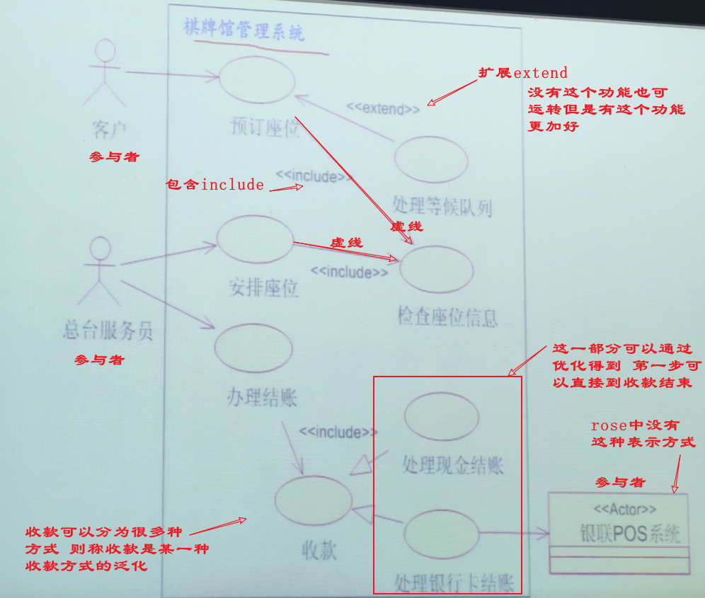
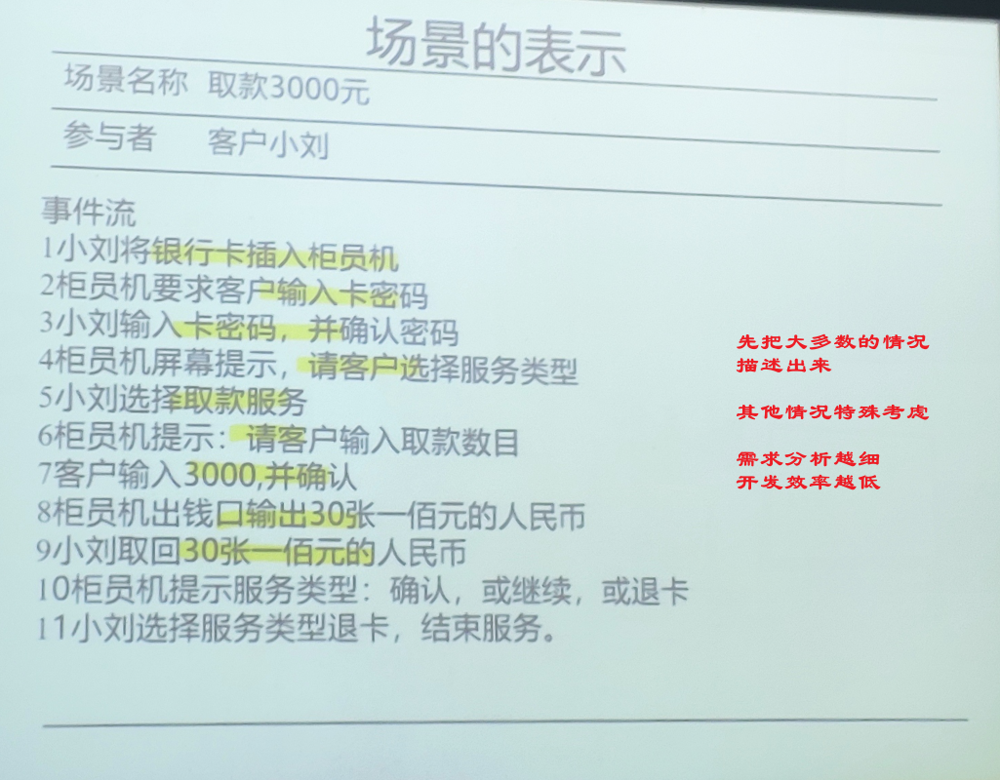
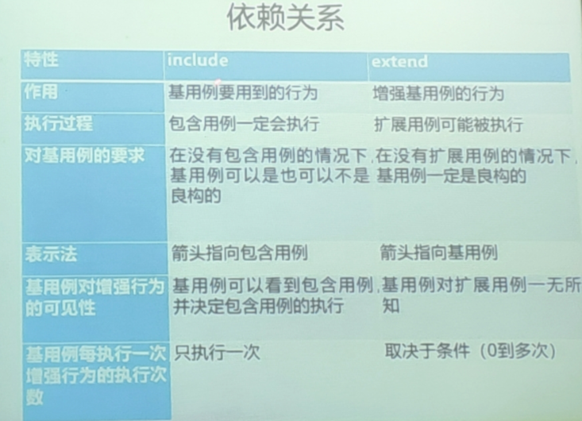
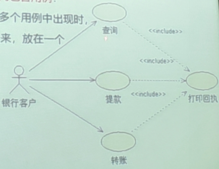

# UML与Rose建模实用教程 课程笔记

授课形式: UML模型图 分类介绍

作业形式: 分组设计模型(3-4人/组)

考核形式大作业

## 第一节课

软件工程的历史与发展过程

- 软件危机的产生
- 软件工程的出现和发展

软件工程的目标:

- 使软件开发成本能够控制在预计合理范围内
- 使软件产品 的各项功能和性能能够满足用户需求
- 提高软件产品质量
- 提高软件产品可靠性
- 使生产出来的产品易于移植维护升级和使用
- 使软件产品的开发周期能够控制在预计的合理时间范围内

什么是面向对象方法(OOM)

自由方法使代码混乱 面向对象编程代码重用性很高

万物皆可对象

对象抽象出类 进行封装 泛化

优势: 更符合人类思维习惯 稳定性 复用性 改善软件结构 增强扩展性 支持迭代式开发

什么是UML : Unified Modeling Language 用来对软件密集系统进行可视化建模的一种语言

UML为面向对象开发系统的产品进行说明,可视化和编制文档的一种标准语言

UML是非专利第三代建模和规约语言 最佳实践表现对大规模复杂系统进行操作 被OMG(对象管理组织)采纳作为业界标准

OMG: 一个国际协会 一个国际性的非盈利组织

UML可以贯穿软件开发周期中的每一个阶段

UML最适用于数据建模 业务建模 对象建模 组件建模

UML作为一种模型语言它使开发人员专注于建立产品的模型和结构 当模型建立后,模型可以被UML工具转化为指定程序的语言代码

Rose和Visio都可以作为UML工具

IBM--最伟大的IT企业

## 第二节课

5.  用例图基本概念
    1.  用例图
        
        
        -   用例图是表示一个系统中用例与参与者关系之间的图
        -   描述了系统中相关的用户和系统对不同用户提供的功能和服务
        -   相当于从用户的视角来描述和建模整个系统 分析系统的功能和行为
        -   元素包含 参与者 用例以及元素之间的关系 还可以包含注解和约束 也可是模块
        -   画法
            -   实现箭头表示用例供参与者使用 (使用者->用例)
            -   虚线箭头表示用例与用例之间 (还有用例之间的关系: 包含include-没有功能则残缺 扩展extend-有了这个功能可以增强,但是不是必须)
            -   大模块先定 再考虑小模块
    2.  参与者
        -   参与者是系统主题交互与外部实体的类元 描述了一个或一组与系统产生交互的外部用户与外部事物
        -   参与者位于系统边界外 不是系统的一部分
        -   参与者是从现实世界中抽象出来的一个形式,却不一定对应现实中的某个特定对象
        -   重点是参与者如何与系统进行交互 进一步确定系统的边界	(快递小哥是不是参与者 具体分析)
        -   参与者决定了系统需求的完整性
        -   以下角度进行分析:
            -   为系统提供输入的人或物
            -   接收系统输出的人或物
            -   需要接入第三方系统与设备
            -   时间是否会触发某些条件
            -   负责支持或维护系统中的人
        -   分类:
            -   主要业务参与者: 从用例的执行中获得好处的关联人员	(淘宝的卖家和买家)
            -   主要系统参与者: 直接同系统交互以发起或触发业务或系统事件的关联人员  (淘宝客服)
            -   外部服务参与者: 响应来自用例的请求的关联人员  (淘宝的快递小哥)
            -   外部接收参与者: 用例中接收默写价值或输出的非主要关联人员
        -   泛化关系;
            -   当系统中的几个参与者既扮演自身的角色 同时也有更一般化的角色 可以通过建立泛化关系来进行描述
            -   与java类相似 父参与者是可以抽象的(不能创建也给父参与者的直接实例) 这要求属于抽象父参与者的外部对象一定能够输入其子参与者之一
    3.  用例
        -   用例是 类元提供的一个内聚的功能单元 表明系统与一个或 多个参与者之间信息交换的顺序 也表明系统执行的动作
        -   用例就是某一个参与者在系统做某件事情从开始到结束的一系列活动的集合以及结束时应该返回可观测有意义的..
        -   用例与场景(类与对象的关系)
            -   用例是一组场景共同特征的抽象 先从对象(场景)开始考虑
            -   系统中按照某一个顺序执行的一系列相关的动作后,实现了某汇总功能,把完成这一功能的操作集合为场景
            -   场景就是用户使用系统的一个实际特定的场面
                -   一个场景就是描述用户与系统之间的一系列交互活动 描述了系统一次具体的执行路径
                    
            -   某些场景可能需想象得到
        -   用例与参与者
            -   一个用例可以隶属一个或多个参与者 一个参与者也可参与一个或多个用例
            -   用例与参与者之间存在关联关系
            -   主参与者与次参与者 通常主参与者是用例重要对象 次参与者处于协作地位
            -   确定用例可以通过参与者入手寻找用例:
                -   参与者主要任务
                -   参与者需要系统什么信息
                -   参与者可以提供什么信息
                -   系统需要通知参与者发生的变化和事件吗
                -   参与者需要通知系统发生的变化和事件吗
        -   用例的特征:
            -   用例(事件,借阅图书)一般是动宾短语
            -   用例是相对独立的
            -   用例是需要参与者启动的
            -   用例要有可观测的执行结果
            -   一个用例是一个单元
        -   用例的粒度:
            -   用例粒度指用例组织信息的方式和细化程序
                -   修改信息(粗)  -->  添加信息(中)  -->  添加电话信息(细)
            -   用例粒度与所处的阶段有关;
                -   概述级
                    -   参与者把整个系统看作一个用例
                    -   在业务建模阶段 用例的粒度以某一个用例能描述一个完整的事情流为宜 (买家购买商品)
                -   用户目标级 
                    -   常用功能描述至此
                    -   对概述级进一步细化
                    -   在概念建模阶段 用例的粒度以某一个用例能描述一个完整的事件流为宜 (操作购物车 订单结算)
                -   子功能级
                    -   对目标级的进一步细化
                    -   在系统建模阶段 用例的粒度以某一个用例能够描述参与者与计算机的一次完整交互为宜 (加入购物车)
    4.  泛化关系
        -   用例的泛化关系将特化用例与一般化的用例联系起来
        -   子用例继承了父用例的属性,操作和行为序列 并且可增加属于自己的附加属性和操作
        -   箭头指向父用例(同样可以定义为抽象用例)
    5.  依赖关系
        
        -   包含
            
            -   包含指一个用例(基用例) 可以包含其他用例(包含用例)具有的行为 其中包含用例中//////
            -   包含关系的箭头是从基用例指向包含用例
            -   只有当某个事件流片段在多个用例中出现时,才将这个事件流片段抽取出来 放在一个单独的用例中,把这个用例用作包含用例
        -   扩展
            -   扩展指一个用例(扩展用例) 对另一个用例(基用例)行为的增强
            -   扩展用例包含了一个或多个片段 每一个片段都可以插入到基用例中的一个单独位置上,而基用例对扩展的存在时不知情的.使用扩展用例就可以在不改变基用例的同时根据需要添加功能
                -   扩展用例的使用包括四个部分
                    -   基用例: 需要被扩展的用例
                    -   扩展用例: 提供所添加的行为序列的用例
                    -   扩展关系: 使用虚线箭头表示 箭头指向基用例
                    -   扩展点: 基用例的一个或多个位置,表示在该位置根据某条件决定是否中断基用例的执行从而执行扩展用例中的片段