# Verilog 学习

## Verilog快速掌握1-程序设计

### verilog快速掌握系列课程

1.  课程内容
    1.  程序设计
    2.  运算符
    3.  模块设计
    4.  复杂模块设计
    5.  流水灯设计
2.  课程目的
    1.  用最简单的方法 最简洁的方式 设计出最易读最健壮最高效的Verilog代码

### 电路设计的语法

1.  设计不用的语法
    1.  initial	设计不用 仿真使用
    2.  task/function 设计不用 仿真少用
    3.  for/while/repeat/forever 设计不用 仿真少用
    4.  integer 设计不用
    5.  模块内部不能又X态,Z态 内部不能又三态接口
    6.  casex/casez 设计和仿真都不用
    7.  force/wait/fork 设计不用 仿真少用
    8.  #5 设计不用 仿真使用
2.  设计使用的语法
    1.  reg/wire 变量定义 parameter 描述参数
    2.  assign 建议改名的时候进行使用 always 常用
    3.  只允许if-else和case条件语句
    4.  算术运算符 
    5.  赋值运算符(时序逻辑用<= 组合逻辑用= 其他情况不存在)
    6.  关系运算符
    7.  逻辑运算符
    8.  位运算符
    9.  以为运算符
    10.  拼接运算符

电路设计的结构

1.  电路设计的三种结构
    1.  组合逻辑
        
    2.  时序逻辑
        1.  同步(与时钟同步)复位的时序电路 
            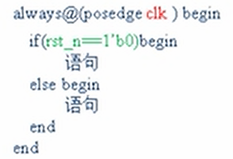
        2.  异步(与时钟无关)复位的时序电路
            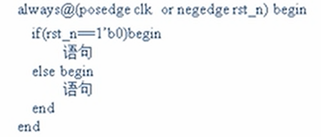
2.  电路举例(分别使用if和case进行举例)
    1.  组合逻辑
        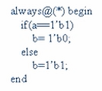                                                      
    2.  同步逻辑-同步复位的时序电路
        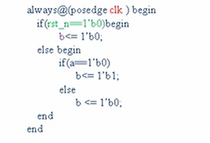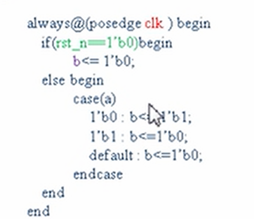
    3.  异步复位的时序电路
        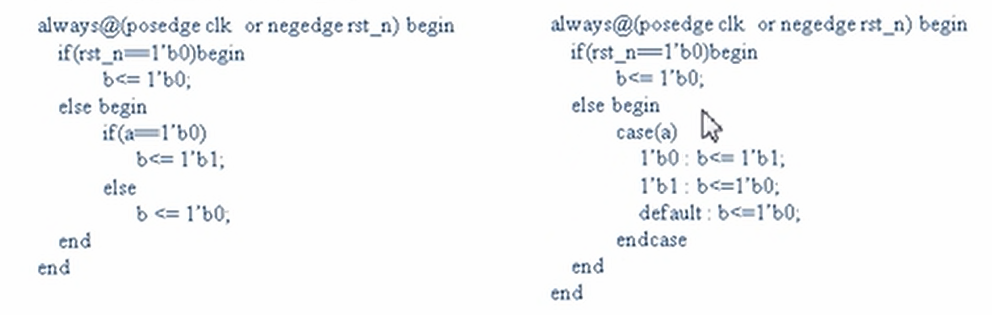

### 电路设计要点

1.  一个always只产生(考虑)一个信号 代码规范,方便查错
    1.  错误例子
        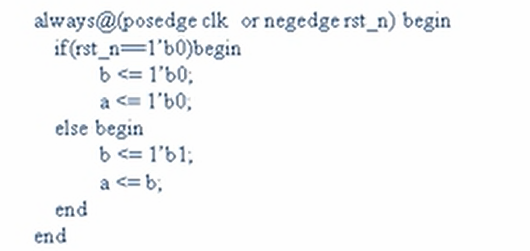
    2.   正确写法
        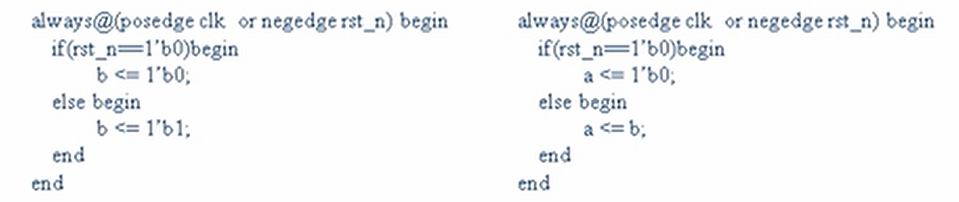
2.  一个信号只能在一个always产生(不允许两个电路中都处理同一个信号,.这两段代码在同一区域)
    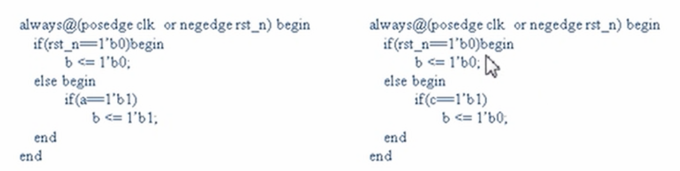
3.  always是描述一个信号产生的方法.(在各种情况下,信号值为多少,考虑全部情况)
    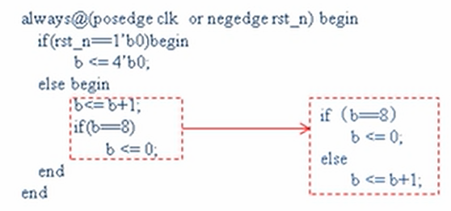
4.  条件判断只允许使用if-else和case,其他全部不用
5.  含有posedge或者negedge的一定是D触发器,是时序电路
6.  设计时如果想立即有结果则使用组合逻辑 如果想延时一拍有结果则使用时序逻辑

### 课程总结

1.  本节学习了在《明德扬规范》下的代码设计基础知识 主要有设计语法,结构,要点三部分
    1.  重点
        1.  三种电路(组合,同步复位,异步复位)
        2.  两种条件(if-else,case)
        3.  一一法则(一对一)

## Verilog快速掌握之模块例化

### 课程内容

1.  什么是例化
2.  例化方法
3.  参数例化

### 什么是例化

1.  例化方法
    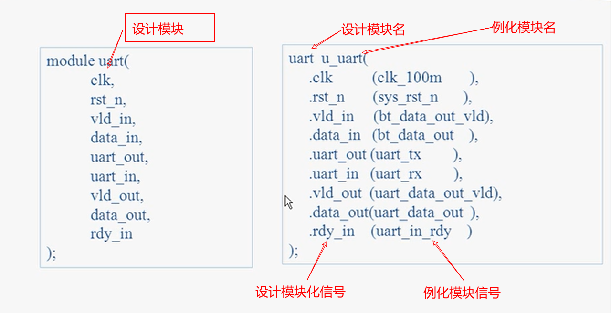
2.  参数例化 可以提高仿真速度
    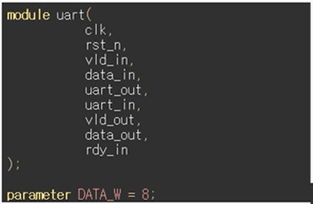   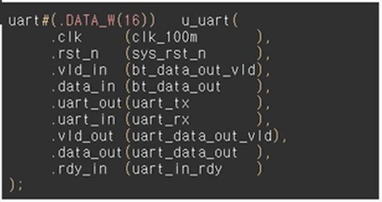

### 课程总结

1.  本节课学习了例化的定义 方法和参数例化
2.  后面练习会大量使用到例化

## Verilog快速掌握之运算符

### 课程内容

1.  信号类型reg/wire
2.  参数parameter
3.  算术运算符 + - * / %
4.  赋值运算符 = <= 时序逻辑用<= 组合逻辑用= 其他情况不存在
5.  关系运算符 > < >= <=
6.  逻辑运算符 && || !
7.  位运算符 ~ | ^ &
8.  移位运算符<< >>
9.  拼接运算符 { }

### 运算符详解

1.  信号类型reg/wire
    1.  设计代码仅用reg和wire
    2.  设计代码: 由本模块产生且是用always产生的信号 使用reg
    3.  测试代码: 用initial产生的信号(一般是对测模块的输入) 用reg类型
    4.  其他都用wire
    5.  reg类型的信号 不一定产生寄存器
2.  参数parameter
    1.  将整个模块内的所有变量进行替换 类似C语言中的define
    2.  要求参数使用大写
3.  算术运算符 + - * / %
    1.  尽量多用+ - * 少用 / %
4.  赋值运算符 = <= 时序逻辑用<= 组合逻辑用= 其他情况不存在 (看always中有时钟信号的则是时序逻辑)
5.  关系运算符 > < >= <= ==
    1.  一般用于条件判断
6.  逻辑运算符 && || !
    1.  一般两边都是1bit的信号 用于条件判断
    2.  可以两边不是1bit的信号 不常用
    3.  
7.  位运算符 ~ | ^ &
    1.  一般用于赋值
8.  移位运算符<< >>
    1.  一般用于乘除运算
9.  拼接运算符 { }
    1.  高级用法
        

### 课程总结

-   运算符相对简单 通过练习熟能生巧

## Verilog快速掌握2-模块设计说明

### 练习要求说明

-   掌握两种写法
-   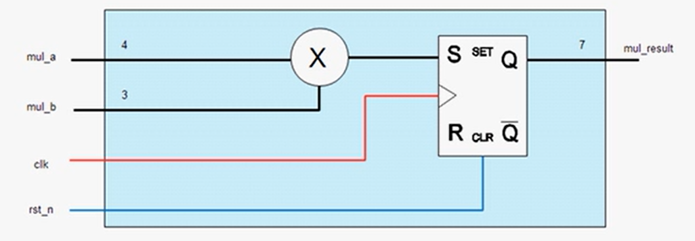

-   按照要求 编写模块(module)文件:    异步复位电路

    1.  模块名为mul_module
    2.  参数化mul_a/mul_b和mul_result的位宽 其中mul_result是mul_a和mul_b之和
    3.  编写完成进行答案对照

## Verilog快速掌握2-模块设计

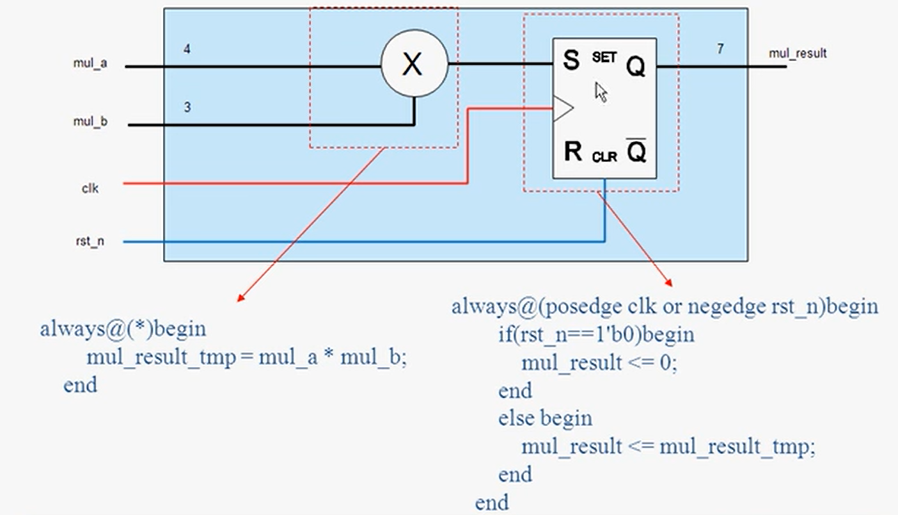

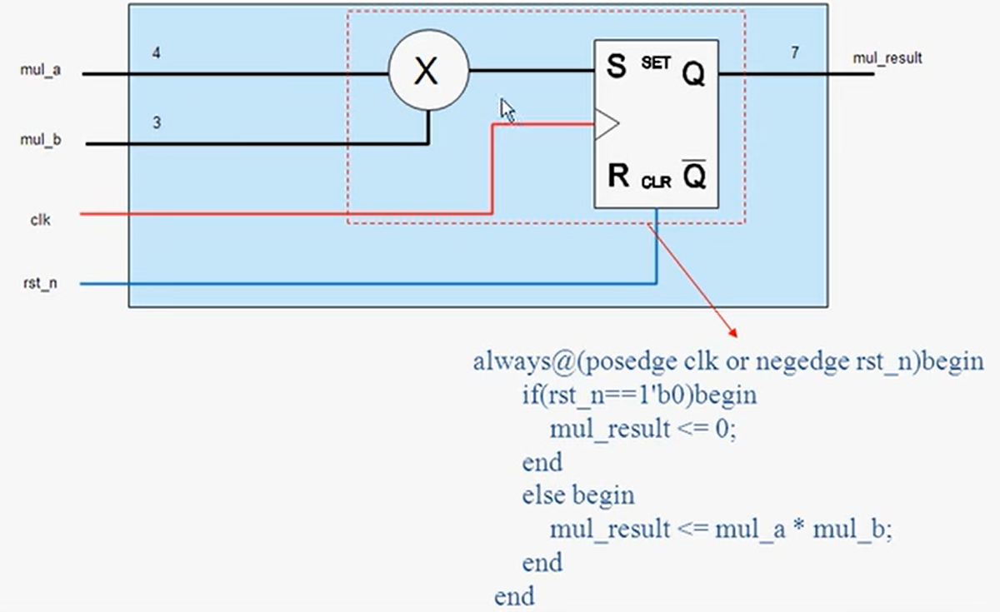

-   按照图片设计电路 编写module文件
    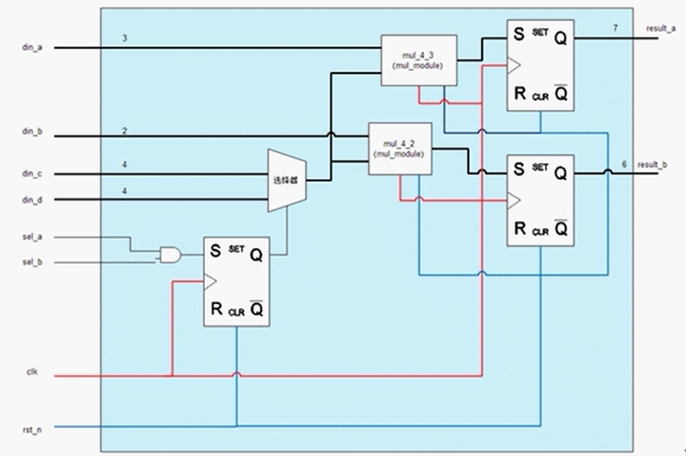
    -   模块名为mul2port
    -   mul_module是verilog快速掌握之模块设计的模块
    -   编写完成对照答案
    -   给中间的线路编写信号变量
        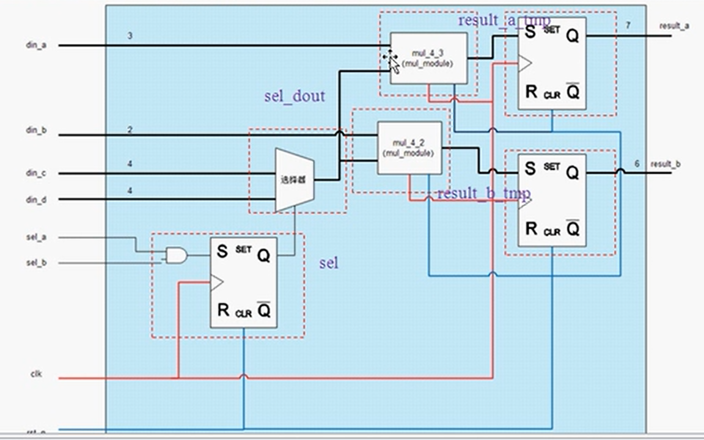

## 明德扬设计规范

### 目录

1.  时序逻辑和组合逻辑的写法
2.  阻塞赋值和非阻塞赋值
3.  always写法规范
4.  begin end 以及信号对齐
5.  信号大小写规范
6.  时钟及复位信号问题
7.  reg wire 的使用规范
8.  输入输出的指令
9.  特色指令
10.  课程总结

-   时序逻辑和组合逻辑的写法
    -   时序逻辑敏感信号必须是(posedge clk or negedge rst_n)
        -   多信号 少信号 无用信号 等都是错误写法
        -   分别指明上升沿和下降沿
    -   组合逻辑的写法always @ (*)
        -   *代表的是与这个always相关的信号 信号改变触发此always
    -   注意
        -   组合逻辑不能作为时钟/复位信号
        -   组合逻辑一定要写else 避免生成锁存器
-   阻塞赋值和非阻塞赋值
    -   时序逻辑里使用非阻塞赋值 即<=
    -   组合逻辑里使用组合赋值 即=
    -   非阻塞赋值必须根据时钟沿触发 阻塞赋值是无视时钟的
-   always写法规范
    -   只允许使用always 不用assign
    -   一个always里面只允许设计一个输出 但可以有多个输入 (通常习惯)
-   begin end 以及信号对齐
    -   always 条件之间 必须使用begin和end
    -   begin统一在括号后面 end与begin一行对齐 内部内容进行缩进
    -   模块的信号定义必须对其 包括类型 位宽定义 信号名称等
-   信号大小写规范
    -   参数 宏定义 必须大写 信号必须小写
-   时钟及复位信号问题
    -   一个模块只能使用一个时钟, 该模块中,任何时序逻辑敏感信号中的时钟必须为该时钟 默认名称为clk
    -   禁止用计数器分频后的信号做其他模块的时钟 而要改成时钟使能的方式
    -   复位信号默认低电平有效 名称为rst_n
-   reg wire 的使用规范
    -   reg常用来表示always模块内指定信号的类型 常代表触发器
    -   在always里面赋值的信号都必须定义为reg类型
    -   wire类型信号表示线 常用于模块例化等
    -   reg类型在代码综合后可能综合成时序逻辑 也可能是组合逻辑
-   输入输出的指令
    -   输出信号必须是寄存器直接输出 不能使用wire类型数据作为的数据
    -   输入输出信号声明 一行只能写一个
    -   信号经一拍后再进行输出
-   特色指令
    -   shixu
    -   zuhe
    -   module
    -   test
-   课程总结

## 一个always只涉及一个信号

-   一个always只涉及一个信号的好处
    -   仅需考虑一个信号 设计思路更加清晰
    -   信号与信号之间不会造成干扰

## 测试文件编写技巧

-   认识测试文件
    -   测试文件(testbench)是一种验证手段
    -   任何设计都是由输入和输出的 但是在软件环境中没有激励输入也不能对你的设计做出正确性进行评估
    -   需要一种模拟实际环境的输入激励和输出校验的一种虚拟平台的产生 可以对设计从软件层面上分析和校验
    -   testbench是写输入激励的
-   测试文件编写流程
    -   定义时间标尺
        -   格式: 'timescale 仿真时间单位 / 时间精度
        -   举例: 'timescale 1ns / 100ps    表示 实验单位1ns 时延精度为100ps
        -   注意: 时间单位>=时间精度
    -   定义信号类型
        -   原模块的输入信号都定义为reg类型 原模块的输出信号都定义为wire类型
    -   例化.v文件
    -   编写输入信号驱动
-   常用信号的编写方法
    -   时钟信号的固定写法
    -   复位信号的固定写法
    -   其他信号的固定写法
        -   输入信号都1个时间单位的延时
-   总结

## 明德杨模板

-   条件: GVIM按照要求正确安装
-   获取命令test
-   模板内容介绍
-   能够提高开发效率

## D触发器及其代码

-   总结要点
    -   时钟上升沿才变化
    -   时钟上升沿的时候,将输入D信号赋值给输出Q信号 即有上升沿才有信号变化

## FPGA设计思维

-   总结要点
    -   一个信号就是一个元器件
    -   一个always/模块就是一个元器件
    -   设计思路: 逐个定义好每一个信号/元器件的功能,然后连接起来

