# 安装ArchLinux

-   简介

    -   本教程记录了VMware下 ArchLinux的下载和安装

-   目录

    1.  下载 ArchLinux
    2.  下载 VMware
    3.  安装镜像
    4.  配置环境

-   步骤

    1.  下载 ArchLinux

        -   从Arch官网下载ArchLinux镜像 教程使用2021版本
        -   官网地址: https://archlinux.org/
            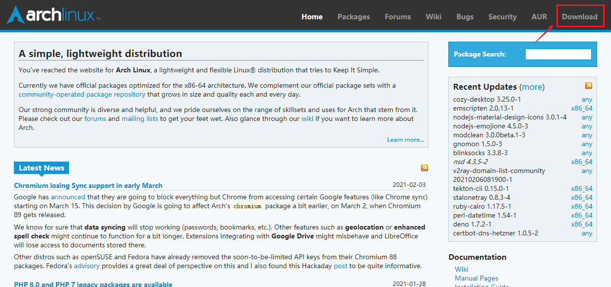
        -   下载地址: https://archlinux.org/download/ 选择国家进行下载
            
            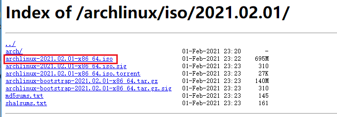

    2.  下载Vmware

        -   教程使用VMware 16 Pro
        -   参考: https://jingyan.baidu.com/article/ff42efa91e19bd809e2202ee.html 百度经验

    3.  安装镜像

        -   启动VMware 新建虚拟机 选择对应镜像 启动虚拟机 选择第一项启动后 会进入命令行界面
            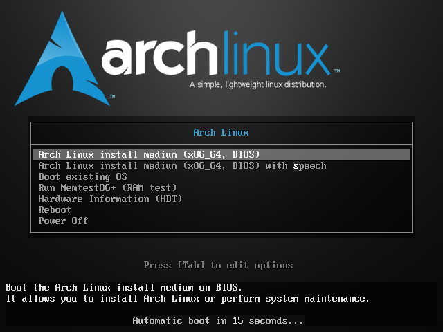

            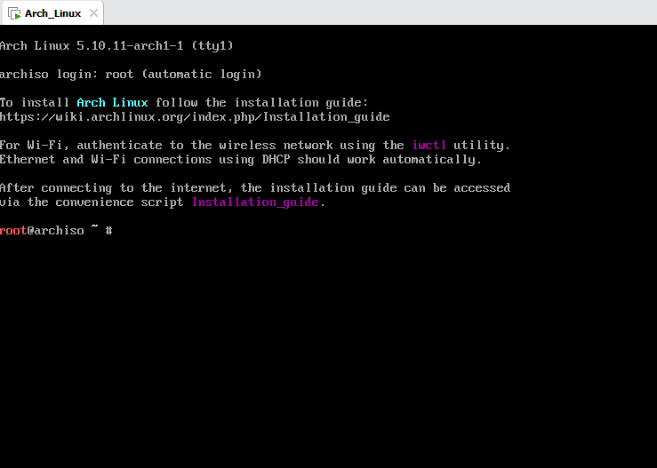

        -   设置字体
            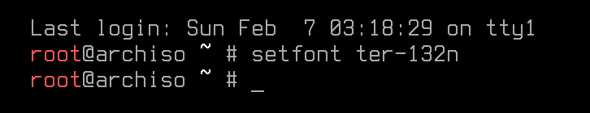

        -   验证启动模式 列出efivars目录
            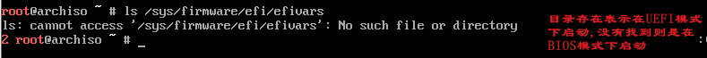

        -   验证网络环境 (有可用的网络)
            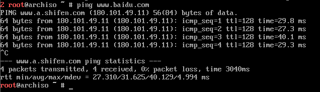

        -   更新系统时钟
            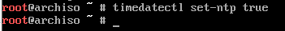

        -   查看当前磁盘分配
            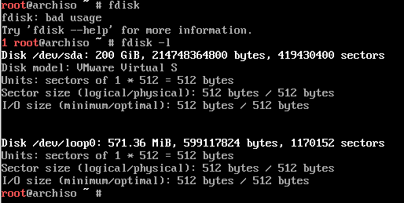

        -   进行分区以及格式化
            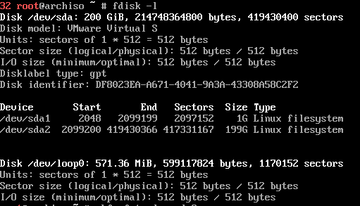
            
            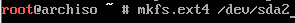

        -   安装文件系统 装载盘以及启动交换分区
            
            

        -   查看/编辑镜像源
            
            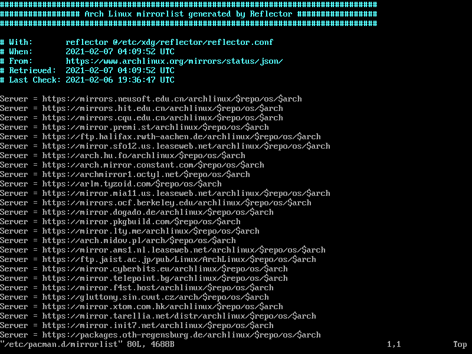

        -   安装基本包
            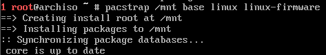
            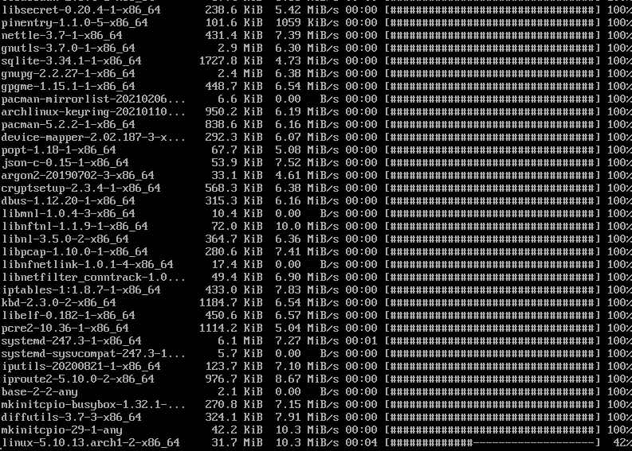

        -   安装基本软件 [自选]
            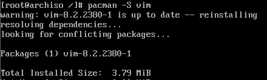

        -   配置系统

            -   生成fstab文件
                
            -   转到新系统中
                
            -   设置时区 这里上海为例
                
                
            -   设置语言
                -   编辑locale-gen文件 开启对应的语言
                    
                    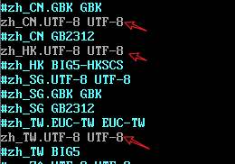
                    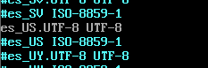
                -   设置语言
                    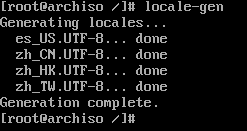
                -   设置区域语言
                    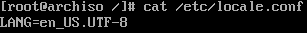
                -   设置键盘布局
                    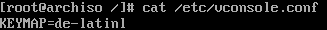
            -   网络配置
                -   设置主机名
                    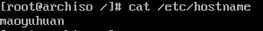
                -   添加host项目
                    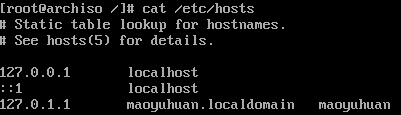
            -   配置root用户密码
                

        -   安装Bootloader

            -   安装grub
                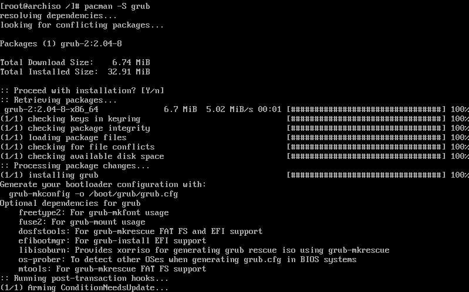
            -   

