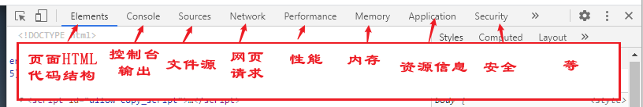

# 爬虫

## 第一章 爬虫基础

### 爬虫前奏

-   爬虫实际例子
    1.  搜索引擎: 百度 谷歌 360搜索等
    2.  伯乐在线
    3.  惠惠购物助手
    4.  数据分析研究
    5.  抢票软件等
-   什么是网络爬虫
    -   通俗解释: 模拟人请求网站行为的程序 可以自动请求网页并抓取一定规则下的有价值的数据
    -   专业介绍: [百度百科](https://baike.baidu.com/item/%E7%BD%91%E7%BB%9C%E7%88%AC%E8%99%AB/5162711?fromtitle=%E7%88%AC%E8%99%AB&fromid=22046949&fr=aladdin)
-   通用爬虫和聚焦爬虫
    -   通用爬虫: 搜索引擎抓取系统的重要组成部分,主要是将互联网上的网页下载到本地,形成一个互联网内容的镜像备份
    -   聚焦爬虫: 是面向 特定需求的一种网络爬虫程序,会对内容进行筛选和处理,尽量保证只抓取与需求相关的信息
-   使用语言: Python
    -   PHP: "世界上最好的语言" 但是PHP天生不是用于爬虫,且对多线程,异步支持不太友好,爬虫对速度和效率要求较高
    -   Java: 生态完善,但是Java代码量大,重构成本高,爬虫需要经常修改采集代码
    -   C/C++: 运行效率无敌 但是学习和开发成本高
    -   Python: 语法优美,开发效率高,模块化且支持模块多,对网页处理模块丰富 还带有框架众多
-   准备工具:
    -   Python开发环境
    -   Pycharm
    -   虚拟环境

### http协议和chrome抓包工具

-   什么是http和https协议

    -   http为超文本传输协议 一种发布和接收html页面的方式,默认为80端口
    -   https为http协议的加密版本,在http下加入了SSL层,使用443端口

-   浏览器发送http请求过程

    -   用户输入地址(URL)进行访问的时候,浏览器会发送http请求,主要分为get和post方式
    -   浏览器接收服务器发送的Response对象进行解析
    -   浏览器若发现Response对象中的HTML发现引用其他如Image/CSS/JS等文件,浏览器会再次发送请求进行获取
    -   最后浏览器对页面进行渲染并进行展示

-   URL详解

    -   URL为统一资源定位器的简写

        ```txt
        scheme:// host:port/path?query-string=xxx#anchor
        	scheme: 		代表访问协议,常用有http/https/ftp等
        	host: 			主机名,域名,比如 www.baidu.com
        	port:			端口号,访问端口,默认http为80
        	path: 			查找路径
        	query-string:	查询字符串 
        	anchor: 		锚点,前端页面用于定位
        ```

    -   在浏览器中请求 一个URL,浏览器会对URL进行统一编码,除了英文,数字和部分符号,其他都使用Unicode进行编码(百分号+十六进制字符)

-   常用请求方法

    -   在http协议中,定义了八种请求方法 最常用的有两种: get和post
        1.  get请求: 一般情况只从服务器获取数据,不对服务器端资源产生任何影响的时候采用get请求
        2.  post请求: 想服务器发送数据(登录等),上传文件等会对服务器资源产生影响的时候采用post请求
    -   具体采用哪种方式按照情况而定

-   请求头常用参数

    -   在HTTP协议中,向服务器发送一个请求,数据分为三部分,分别放在URL中,body(在post请求下)中,head中. 这里介绍几个常用参数
        1.  User-Agent: 浏览器名称,在网络爬虫中经常用到,服务器通过此参数知道请求由哪种浏览器发送.在爬虫请求时,需要设置为一些浏览器的值而伪装爬虫
        2.  Referer: 表明来源导向,从哪个URL过来的.部分服务器可以对非指定页面过来的不做对应响应
        3.  Cookie: http协议为无状态的,无法判断两次请求是否为同一人,故需要Cookie

-   常见状态响应码

    -   2xx 请求正常 服务器返回数据(不一定为真实的数据)
    -   3xx 重定向: 301 永久重定向 / 302 临时重定向
    -   4xx 资源问题
    -   5xx 服务器端错误
    -   参考: [常见状态响应码](https://blog.csdn.net/laishaohe/article/details/79052085?utm_medium=distribute.pc_relevant.none-task-blog-BlogCommendFromMachineLearnPai2-1.control&dist_request_id=f7ef6efa-b7f0-46a0-9637-33c1d6441672&depth_1-utm_source=distribute.pc_relevant.none-task-blog-BlogCommendFromMachineLearnPai2-1.control)

-   Chrome抓包工具

    -   Chrome为亲近开发者的浏览器 可以方便查看请求和发送的参数
    -   这里以[青柠起始页](a.maorx.cn)为例 页面如图
        
        -   工具介绍
            

### urllib库

-   urllib库是python中一个最基本的网络请求库,可以模拟浏览器的行为,向指定的服务器发送一个请求并保存返回的数据

-   urlopen函数

    -   在python3的urllib库中,所有和网络请求相关的方法都被集成到urllib.request库下

        -   使用urllib库访问百度并打印访问结果信息 获得的内容就是访问百度的页面内容

            ```python
            from urllib import request
            resp = request.urlopen('http://www.baidu.com')
            print(resp.read())
            ```

            -   url: 请求的url
            -   data: 请求的data 如果设置了这个值,访问将变为post请求
            -   返回值: 返回值为一个http.client.response对象,是一个类文件的句柄对象,有read(size),readline,readlines等方法

-   urlretrieve函数

    -   这个函数作用是方便将网页上的文件保存到本地

        -   使用以下函数可以将百度首页下载到本地

            ```python
            from urllib import request
            request.urlretrieve('http://www.baidu.com','baidu.html')
            ```

-   urlencode函数

    -   url中包含中午等其他特殊字符,需要进行编码,使用代码发送请求的时候选哟手动进行编码,则需要使用urlencode函数

        -   使用以下函数可以给字典数据转换为url编码的数据

            ```python
            from urllib import parse
            data = {'name': "爬虫基础", "greet": "Hello world", "age": 23}
            qs = parse.urlencode(data)
            print(qs) # 将转换好的编码输出 name=%E7%88%AC%E8%99%AB%E5%9F%BA%E7%A1%80&greet=Hello+world&age=23
            ```

-   parse_qs函数

    -   可以将编码后的url参数进行解码 和urlencode函数功能相反

        -   使用以下函数可以 将编码后的数据进行解码

            ```python
            from urllib import parse
            qs_str = "name=%E7%88%AC%E8%99%AB%E5%9F%BA%E7%A1%80&greet=Hello+world&age=23"
            print(parse.parse_qs(qs_str))
            ```

    -   如果不转码访问则会报错 除了英文,数字和部分符号外,其他字符都需要进行Unicode编码

        ```python
        from urllib import request, parse
        request_str = "https://www.baidu.com/s?"
        
        req_str = request_str + 'wd=你好李焕英'
        resp = request.urlopen(req_str)
        print(resp.read()) # 报错 不能访问
        
        req_str = request_str + parse.urlencode({"wd": "你好李焕英"})
        resp = request.urlopen(req_str)
        print(req_str)
        print(resp.read()) # 可以访问
        ```

-   urlparse和urlsplit

    -   拿到url后对url进行分割,需要使用urlparse或者urlsplit进行分割
    
        -   以下就是对url进行分割的代码
    
            ```python
            from urllib import request, parse
            url = 'http://www.baidu.com/s?username=zhiliao'
            # result = parse.urlsplit(url) # 可以直接进行打印查看结果
            result = parse.urlparse(url)  # 两种方式都是可以的
            print('scheme', result.scheme)
            print('netloc', result.netloc)
            print("path", result.path)
            print("query", result.query)
            ```
    
        -   scheme: 代表访问协议 一般为http https ftp等
        
        -   host: 代表主机名 比如www.baidu.com
        
        -   port: 代表端口号 浏览器默认访问使用的是80号端口
        
        -   path: 表示查找路径,跟在主机名后
        
        -   query-string: 代表查询字符串
        
        -   anchor: 代表锚点,一般不需要管 前端用于页面定位

### requests库

-   介绍: urllib库已经包含了许多功能,但是requests库使用起来更加简洁方便

-   安装: 利用pip进行安装 

    >   pip install requests

-   发送Get请求

    -   调用get方法进行请求

        ```python
        import requests
        response = requests.get("http://www.baidu.com/")
        print(response) # 打印访问结果的状态码
        ```

        

    -   添加headers和查询参数

        -   可以传入headers参数来增加请求头中的header信息.如果需要放在url中进行传递,则可以利用params参数

            ```python
            keywords = {"wd": "中国"}  # 设置查询字符串
            headers = {"User-Agent": "Mozilla/5.0 (Windows NT 10.0; Win64; x64) AppleWebKit/537.36 (KHTML, like Gecko) Chrome/88.0.4324.150 Safari/537.36"}  # 设置headers 的UA
            response = requests.get("http://www.baidu.com/s", params=keywords, headers=headers)  # 设置请求
            print(response) # 打印访问结果和状态码
            print(response.text) # 打印响应内容 返回Unicode格式的数据 (可以理解为字节数据进行初步解码所得结果) 机器猜测,可能乱码,可以使用decode方法进行编码选择
            print(response.content) # 打印响应内容 返回字节流数据
            print(response.url) # 打印访问URL 文本经过转码 第一次打印可能会转到webpass验证页面
            print(response.encoding) # 打印响应头字符编码
            print(response.status_code) # 打印状态码
            with open("baiduWithKeywords.html", 'w', encoding="utf-8") as fp: # 将结果保存为文件
                fp.write(response.content.decode("utf-8")) # 不能直接写为文件,需要进行转码
            ```

### 爬虫小demo-拉勾网数据获取

1.  导入需要的库以及对应的网站网址 查看network中第一个请求的路径,就是url

    >   ```python
    >   # 导入所需要的库
    >   from urllib import request, parse
    >   # 设置需要访问的网页
    >   url = "https://www.lagou.com/jobs/list_python?labelWords=&fromSearch=true&suginput="
    >   ```

2.  发现如果不设置User-Agent参数,会被直接返回一个简短的错误数据

    >   ```python
    >   # 不设置User-Agent直接访问网站 部分设置了反爬虫的网站会返回简短的信息而非原网页
    >   resp = request.urlopen(url)
    >   print(resp.read()) # 得到错误数据
    >   ```

3.  加入User-Agent参数并封装入request对象,可以进行对网页的访问

    ```python
    headers = {"User-Agent":"Mozilla/5.0 (Windows NT 10.0; Win64; x64) AppleWebKit/537.36 (KHTML, like Gecko) Chrome/88.0.4324.150 Safari/537.36"}
    req = request.Request(url,headers=headers) # 封装好request对象
    ```

4.  发现数据来源是JS通过向网页加入请求获取的数据而得到的,故寻找请求 发现一个数据请求 形成data_url

    ```python
    data_url = "https://www.lagou.com/jobs/positionAjax.json?city=%E6%9D%AD%E5%B7%9E&needAddtionalResult=false"
    ```

5.  设置data参数进行访问,参数参考网页请求时附带的参数 同时生成request对象

    ```python
    data = {"first": "true", "pn": 1, "kd": "python"}  # 设置请求参数
    req = request.Request(data_url, headers=headers, data=parse.urlencode(data).encode("utf-8"), method='POST') # 获取成功 可能返回操作过频繁错误
    ```

    -   第五点注意: 如果不进行编码,则会报错 需要使用encode进行编码

        ```python
        # req = request.Request(data_url, headers=headers, data=data, method='POST') # 这样请求会报错 "can't concat str to bytes" 需要urlencode
        # req = request.Request(data_url, headers=headers, data=parse.urlencode(data), method='POST') # 仍然报错,需要将unicode字符串转换为字节流(byte)
        req = request.Request(data_url, headers=headers, data=parse.urlencode(data).encode("utf-8"), method='POST') # 获取成功 可能返回操作过频繁错误 不是请求问题 而是程序被识别为爬虫而不给数据
        ```

    -   在打印的时候也可以使用decode函数进行解码

        ```python
        print(resp.read().decode("utf-8")) # decode方法可以将字节流 b' 转换为unicode字符
        ```

6.  在请求头中加入referer参数并设置前导网站网址

    -   从请求中获取到referer参数和值并添加到request对象

        ```python
        headers = {
            "User-Agent": "Mozilla/5.0 (Windows NT 10.0; Win64; x64) AppleWebKit/537.36 (KHTML, like Gecko) Chrome/88.0.4324.150 Safari/537.36",
            "referer": "https://www.lagou.com/jobs/list_python?labelWords=&fromSearch=true&suginput="
        }
        ```

    -   进行获取 但是好像获取不到

7.  成功获取(可是我获取不到???)

### 爬虫小demo-内涵段子数据获取

url链接: http://neihanshequ.com/bar/1   目标: 获得一页数据

1.  

### ProxyHandler处理器 (代理设置)

-   很多网站会检测某段时间某一个IP访问次数(通过流量统计.系统日志等方式),如果访问次数多并不像正常人,则会禁止这个IP的访问,所以我们可以使用代理服务器,每隔一段时间换一个IP地址,则我们可以通过更换IP地址的方式,进行持续获取数据

-   通过urllib库中的ProxyHandler来设置使用代理服务器

    ```python
    from urllib import request
    ```

-   常用的代理有

    >   西刺免费代理 http://www.xicidaili.com/
    >
    >   快代理 http://www.kuaidaili.com/
    >
    >   代理云 http://www.dailiyun.com/

-   

## 第二章 网络请求

## 第三章 数据解析

## 第四章 数据储存

## 第五章 爬虫进阶

## 第六章 Scrapy