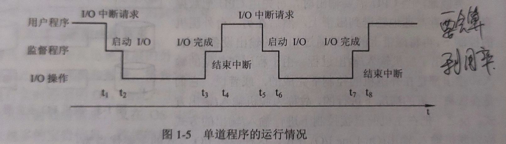
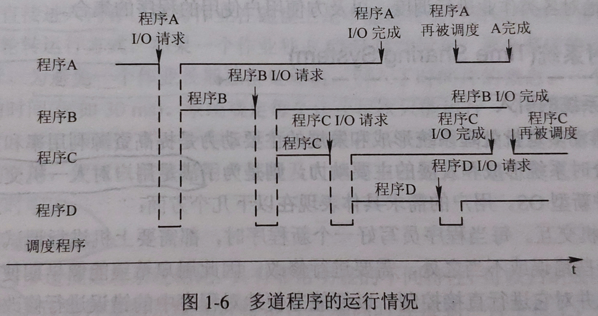

# 考研-计算机操作系统

>   重点使用 [重点] 进行标记  计算使用[计算]进行标记

## 目录

-   <a href="#p1">操作系统引论</a>
-   <a href="#p2">进程的描述与控制</a>
-   <a href="#p3">处理机调度与死锁</a>
-   <a href="#p4">存储器管理</a>
-   <a href="#p5">虚拟存储器</a>
-   <a href="#p6">输入输出系统</a>
-   <a href="#p7">文件管理</a>
-   <a href="#p8">磁盘存储器管理</a>
-   <a href="#p9">操作系统接口</a>
-   <a href="#p10">多处理器操作系统</a>
-   <a href="#p11">多媒体操作系统</a>
-   <a href="#p12">保护和安全</a>

## 知识点

-   第一章 操作系统引论 
    -   操作系统的目标和作用
        -   目标: 方便性 有效性 可扩充性 开放性
        -   作用: 作为用户和计算机硬件系统之间的接口 计算机系统资源的管理者 实现对计算机资源的抽象
    -   操作系统的发展过程
        -   未配置操作系统的计算机系统: 人工操作模式 脱机输入/输出方式
        -   单道批处理系统: 
            -   处理过程:
                
            -   缺点: 资源得不到充分利用 [计算]
                
        -   多道批处理系统
            -   多道程序设计基本概念: 用户将程序放入外存形成后备队列,有作业调度程序按一定算法进行调度进入内存,共享CPU等资源
                
            -   优缺点: 资源利用率高 系统吞吐量大 平均周转事件长 无交互能力
            -   需要解决的问题: 处理机争用问题 内存分配和保护 I/O设备分配 文件组织和管理 作业管理 用户与系统的接口交互
        -   分时系统
            -   引入: 满足用户对人机交互的需求  人机交互 共享主机(允许多个用户同时有自己的终端)
            -   关键问题: 
                -   及时接收(使用多路卡可以实现分时多路复用 每一个终端配置一个缓冲区,暂存用户输入) 
                -   及时处理(作业直接进入内存 采用轮转运行方式 为避免一个作业长期占用处理机,引入时间片概念)
            -   特征: 多路性 独立性 实时性 交互性
        -   实时系统
            -   使用例子: 工业(武器)控制系统 信息查询系统 多媒体系统 嵌入式系统
            -   实时任务类型: 周期性和非周期性任务(两者都有截止时间) 硬实时任务(明确截止时间绝对不能超过)和软实时任务(有截止时间,尽量不要超过)
            -   和分时系统的比较(多路性 独立性 及时性 交互性 可靠性 等)
        -   微机操作系统发展[略]
    -   操作系统基本特征 [重点]
        -   并发
            -   并行和并发: 并行指两个或多个事件在同一时刻发生(同时发生) 并发是指两个或多个事件在同一时间间隔内发生(可以不同时发生)
        -   引入进程
            -   进程: 
                -   进程是在系统中能独立运行并作为资源分配的基本单位 由一组机器指令,数据和堆栈等组成 能够独立运行的活动实体 
                -   进程是现在操作系统最重要的基本概念 多个进程之间可以并发执行和交换信息
-   第二章 进程的描述与控制 
-   第三章 处理机调度与死锁 
-   第四章 存储器管理 
-   第五章 虚拟存储器 
-   第六章 输入输出系统 
-   第七章 文件管理 
-   第八章 磁盘存储器管理 
-   第九章 操作系统接口 
-   第十章 多处理器操作系统 
-   第十一章 多媒体操作系统 
-   第十二章 保护和安全 

