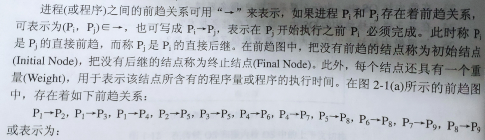
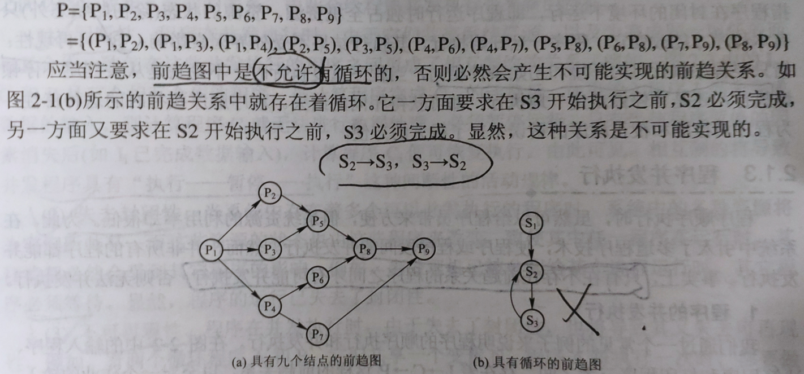
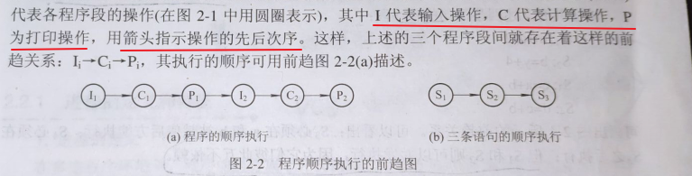
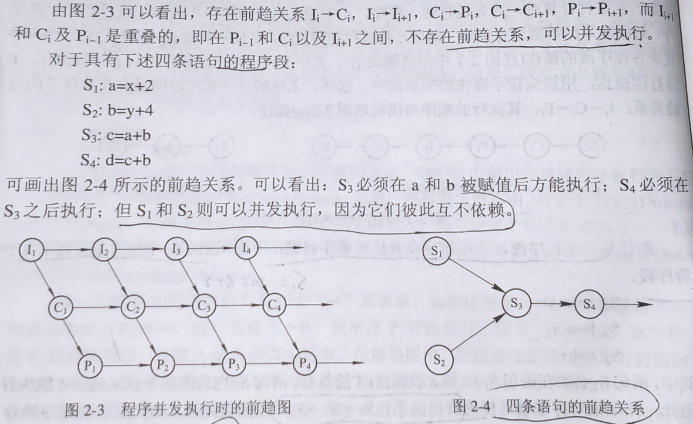
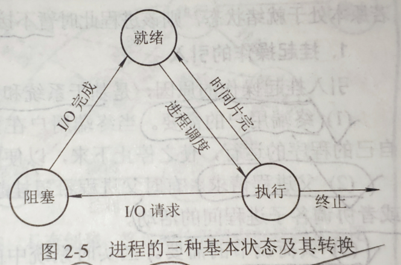
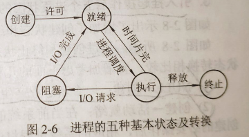
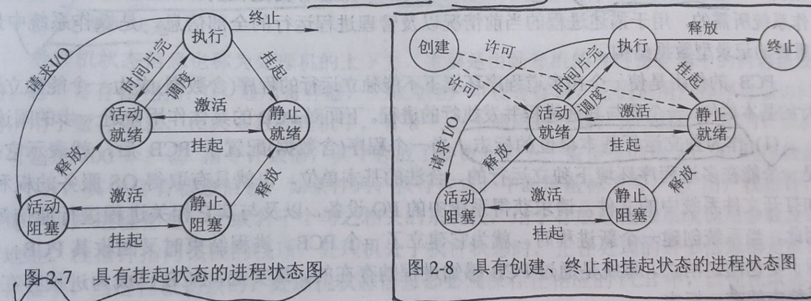
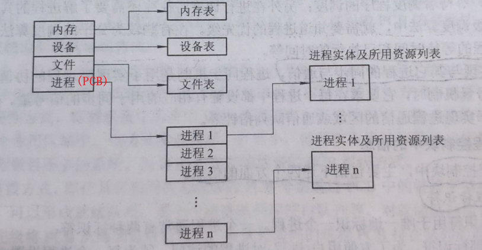
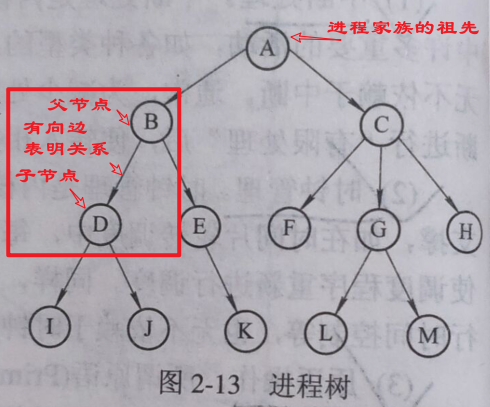
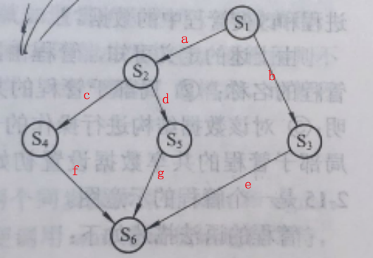

# 考研-计算机操作系统

>   重点使用 [重点] 进行标记  计算使用[计算]进行标记 未完成使用[未完成]标记

## 目录

-   <a href="#p1">操作系统引论</a>
-   <a href="#p2">进程的描述与控制</a>
-   <a href="#p3">处理机调度与死锁</a>
-   <a href="#p4">存储器管理</a>
-   <a href="#p5">虚拟存储器</a>
-   <a href="#p6">输入输出系统</a>
-   <a href="#p7">文件管理</a>
-   <a href="#p8">磁盘存储器管理</a>
-   <a href="#p9">操作系统接口</a>
-   <a href="#p10">多处理器操作系统</a>
-   <a href="#p11">多媒体操作系统</a>
-   <a href="#p12">保护和安全</a>


## 知识点

-   <span name="p1">第一章 操作系统引论</span> 
    -   操作系统的目标和作用
        -   目标: 方便性 有效性 可扩充性 开放性
        -   作用: 作为用户和计算机硬件系统之间的接口 计算机系统资源的管理者 实现对计算机资源的抽象
    -   操作系统的发展过程
        -   未配置操作系统的计算机系统: 人工操作模式 脱机输入/输出方式
        -   单道批处理系统: 
            -   处理过程:
                
            -   缺点: 资源得不到充分利用 [计算]
                
        -   多道批处理系统
            -   多道程序设计基本概念: 用户将程序放入外存形成后备队列,有作业调度程序按一定算法进行调度进入内存,共享CPU等资源
                
            -   优缺点: 资源利用率高 系统吞吐量大 平均周转事件长 无交互能力
            -   需要解决的问题: 处理机争用问题 内存分配和保护 I/O设备分配 文件组织和管理 作业管理 用户与系统的接口交互
        -   分时系统
            -   引入: 满足用户对人机交互的需求  人机交互 共享主机(允许多个用户同时有自己的终端)
            -   关键问题: 
                -   及时接收(使用多路卡可以实现分时多路复用 每一个终端配置一个缓冲区,暂存用户输入) 
                -   及时处理(作业直接进入内存 采用轮转运行方式 为避免一个作业长期占用处理机,引入时间片概念)
            -   特征: 多路性 独立性 实时性 交互性
        -   实时系统
            -   使用例子: 工业(武器)控制系统 信息查询系统 多媒体系统 嵌入式系统
            -   实时任务类型: 周期性和非周期性任务(两者都有截止时间) 硬实时任务(明确截止时间绝对不能超过)和软实时任务(有截止时间,尽量不要超过)
            -   和分时系统的比较(多路性 独立性 及时性 交互性 可靠性 等)
        -   微机操作系统发展[略]
    -   操作系统基本特征 [重点]
        -   并行
            -   并行指两个或多个事件在同一时刻发生(同时发生) 并发是指两个或多个事件在同一时间间隔内发生(可以不同时发生)
            -   进程: 
                -   进程是在系统中能独立运行并作为资源分配的基本单位 由一组机器指令,数据和堆栈等组成 能够独立运行的活动实体 
                -   进程是现在操作系统最重要的基本概念 多个进程之间可以并发执行和交换信息
        -   共享
            -   互斥共享方式 在一段时间内只允许一个进程访问的资源,称为"临界资源"
            -   同时共享方式 宏观是同时访问 微观上是进程对资源进行交替访问
        -   虚拟
            -   时分复用技术 空分复用技术
        -   异步
            -   进程不是一步完成,走走停停
        -   注意: 并行和共享是多用户操作系统的两个最基本特征
    -   操作系统主要功能
        -   处理机管理功能: 进程控制(作业分配进程和资源及管理) 进程同步(进程互斥方式 进程同步方式) 进程通信(进程间信息交换) 调度(作业调度 进程调度)
        -   存储器管理: 内存分配(为程序分配内存空间 提高存储器利用率 程序申请附加内存 分为静态和动态分配方式) 内存保护 地址映射 内存扩充(请求调入 置换功能)
        -   设备管理功能: 缓冲管理 设备分配 设备处理
        -   文件管理功能: 文件存储空间管理 目录管理 文件读写管理和保护
        -   操作系统与用户接口: 用户接口 程序接口
        -   现代操作系统新功能 [略]
    -   OS结构设计 [略]
-   <span name="p2">第二章 进程的描述与控制</span> 
    -   前趋图和程序执行
        -   前趋图
            -   前趋图是指一个有向无循环图(DAG,Directed Acyclic Graph) 
            
            -   前趋图用于描述进程之间的先后顺序 每一个结点表示一个进程或程序段甚至一条语句 结点之间的有向边表示结点之间的偏序或前趋关系 
            
                
                
            
        -   程序顺序执行
        
            -   程序顺序执行下的前趋图
                
            -   顺序执行的特征
                -   顺序性: 处理机严格按照程序规定顺序执行 即在下一个操作开始之前结束
                -   封闭性:程序在封闭环境下运行,程序运行独占整机资源 资源状态(除初始状态)只有本程序才可以改变,程序一旦执行,结果不受外界因素影响
                -   可再现性: 只要程序执行时的环境和初始条件相同,程序重复执行结果一致 (不论是否异步)
        
        -   程序的并发执行
        
            -   只有在不存在前趋关系的程序之间才有可能并发执行
                
            -   程序并发特征
                -   间断性(资源相互制约导致程序有暂停) 失去封闭性(系统存在多个可并发程序时,系统资源将共享) 不可再现性(因为失去封闭性)
        
    -   进程的描述

        -   进程定义和特征
            -   进程的多种定义
                -   进程是程序的一次执行 (进程是动态的 程序是静态的)
                -   进程是一个程序机器数据在处理机上顺序执行所发生的活动
                -   进程是具有独立功能的程序在一个数据集合上运行的过程,是系统进行资源分配调度的一个独立单位
            -   进程控制块(PCB, Process Control Block): 为进程配置的一个专门的数据结构,来描述进程的基本情况和活动过程,进而控制和管理进程
            -   程序段,相关数据段和PCB三部分构成进程实体(也称进程映像,简称进程) 创建进程即创建进程PCB,撤销进程实际上就是撤销进程PCB
            -   进程的特征: 动态性(程序只是有序指令的集合,进程有一定生命周期) 并发性 独立性(进程是系统调度基本单位) 异步性(异步方式运行)
        -   进程的基本状态及转换
            -   进程的三种基本状态
                -   就绪状态: 指进程已处于准备好运行的状态,等待CPU资源即可运行的状态 (系统按一定策略将许多就绪状态的进程排列为就绪队列)
                -   执行状态: 指进程已经获得CPU正在执行的状态 (单处理机中,只有一个进程处于执行状态,多处理机可以有多个进程处于执行状态)
                -   阻塞状态: 正在执行的进程由于发生某事件暂时无法继续执行的状态 (系统按一定策略将许多阻塞状态的进程排列为阻塞队列)
            -   三种基本状态的转换 [重要]
                
            -   创建状态和终止状态
                -   为满足PCB对数据和操作的完整性和灵活性要求,引入两种常见状态: 创建状态和终止状态 (形成五种状态的转换)
                    
                -   创建状态: 进程插入就绪队列过程中遇到所需资源尚不能得到满足,则创建过程尚未完成,进程无法正常调度运行,此时则为创建状态
                -   终止状态: 进程到达自然结束或出现无法客服的错误或被操作系统和其他有中止权的进程所终结,此时进程将进入终止状态,不再执行
        -   挂起操作和进程状态的转换
            
            -   引入原因: 
                -   终端用户的需要: 用户希望暂停程序运行,一边用户研究执行情况或者进行修改
                -   父进程请求: 父进程希望挂起子进程以便考查和修改子进程或者协调父子进程的活动
                -   负荷调节需要: 当实时系统种工作负荷较重以至于可能影响到对实时任务的控制时,可以将一些不重要进程挂起以保证系统正常运行
                -   操作系统需要: 操作系统希望挂起进程以检查资源情况或记账
            -   引入挂起原语Suspend和激活原语Active后进程状态的转换:
                -   活动就绪->静止就绪 就绪状态下默认为Readya,可以接收调度,经挂起到状态Readys,不可被调度执行
                -   活动阻塞->静止阻塞 当进程处于未被挂起就绪状态(活动就绪,Blockeda),当被挂起后则称为静止阻塞状态(Blockeds) 当所期待的事件发生后,将由静止阻塞变为静止就绪(Readys)状态
                -   静止就绪->活动就绪 处于进制就绪状态(Readys)进程用Active原语进行激活则转变为Readya状态
                -   静止阻塞->活动阻塞 处于静止阻塞状态(Blockeds)进程用Active原语进行激活则转变为Blockeda状态
            -   拥有创建/终止/挂起状态的进程转换
                -   Null->创建 一个进程产生的时候,该进程处于创建状态
                -   创建->活动就绪 当前系统条件允许,完成对进程创建必要操作后,进程进入就绪队列,处于活动就绪状态
                -   创建->静止就绪 系统条件未满足进程创建,系统将进程转换为静止就绪状态,安置在外存,不参与调度,创建工作没有完成
                -   执行->终止 进程完成任务或出现无法克服的错误或被系统或其他进程终结时,进程将状态改为终止状态
        -   进程管理中的数据结构
            -   操作系统中用于管理的数据结构
                -   主要分为4类: 内存表 设备表 文件表 用于进程管理的进程表(通常又称为进程控制块PCB)
                    
                -   进程控制块PCB的作用
                    -   作为独立运行基本单位的标志
                    -   能实现间断的运行方式 在多道程序环境下,程序异步性间断运行.当阻塞而暂停时,需要保存CPU现场信息
                    -   提供进程管理所需要的信息 操作系统总是根据PCB实施对进程的管理
                    -   提供进程调度所需要的信息 PCB中提供进程何时处于何种状态的信息
                    -   实现与其他进程的同步和通信 PCB进程中还具有用于实现进程通信的区域或者通信队列指针
                -   进程控制块PCB包含的信息
                    -   进程标识符: 外部标识符(由创建者提供 通常字母+数字组合) 内部标识符(每一个进程唯一的数字标识符)
                    -   处理机状态
                    -   进程调度信息
                    -   进程控制信息
                -   进程控制块PCB组织方式: 线性方式 链接方式 索引方式
        
    -   进程控制

        -   操作系统内核
            -   支撑功能: 中断处理 时钟管理 原语操作
            -   资源管理功能: 进程管理 存储器管理 设备管理
        -   进程层次结构: 操作系统允许一个进程(父进程)创建另一个进程(子进程) 众多进程合成一个进程家族(组)
            -   进程图: 为形象描述一个进程的家族关系引入进程图的概念: 由进程Pi指向进程Pj的有向边表明父子关系
                
        -   进程创建  [重要]
            -   创建条件: 系统每当出现创建新进程的请求,系统调用创建原语Create创建新进程
            -   引起进程创建的事件
                -   用户登陆 作业调度 提供服务 应用请求
            -   创建过程
                -   申请空白PCB,为进程获得唯一数字标识符(内部标识符) ,从PCB集合中索取一个空白PCB
                -   为新进程分配运行所需的资源 资源从操作系统或者父进程中获取
                -   初始化进程控制块PCB: 初始化标识信息 初始化处理机状态信息 初始化处理机控制信息
                -   将新进程放入就绪队列
        -   进程终止
            -   终止条件
                -   进程正常结束: 进程任务完成,准备退出运行
                -   异常结束: 越界错误 保护错误 非法指令 特权指令错误 运行超时 等待超时 运算错误 
                -   外界干预: 操作系统或操作员干预 父进程请求终止 父进程终止(也会引起子进程终止)
            -   终止过程
                -   检索进程的进程控制块PCB,读出进程状态
                -   如果进程正在被执行则立即终止并在终止后重新进行调度
                -   停止子孙进程
                -   资源归还给父进程或者系统
                -   将终止进程的PCB从所在队列或者链表中移出,等待后续处理
        -   进程的组合与唤醒 [未完成]
        -   进程的挂起与激活 [未完成]

    -   进程同步 [掌握四个原则]

        -   进程同步概念

            -   两种形式的制约关系: 

                -   间接相互制约关系(系统共享资源,多个进程只能互斥使用)
                -   直接相互制约关系(为完成某任务建立多个进程为完成同一任务而相互合作而受制约)

            -   临界资源

                ```java
                public class Test {		// 书上P49
                    // in输入指针的位置 out输出指针的位置 count缓冲队列当前大小
                	int in = 0, out = 0, count = 0; 	    // count应该成为临界资源(现在并没有)
                    // 用于存放的缓冲区 大小为n
                	item buffer[n];
                
                	void producer() {					  // 生产者
                		while (1){
                            produce an item in nextp;		// 生产者生产一个商品放入nextp队列
                            ...					
                            while (counter == n) ;			// 等待缓冲区非满
                            buffer[in] = nextp;			    // 放入缓冲区
                         	in = (in + 1) % n;			    // 输入指针后移 缓冲区为循环缓冲区
                            count++;					   // 缓冲区当前数量增加1
                		}
                	}
                    
                    void consumer(){
                        while(1){
                            while(count == 0) ;				// 如果缓冲队列为空则等待
                            nextc = buffer[out];			// 获取缓冲队列输出指针位置的item
                            out = (out + 1) % n;			// 获得下一个输出指针
                            count--;					   // 缓冲区当前数量减1
                            ...
                        }
                	}
                }
                
                ```

                

            -   临界区: 进程对系统临界资源必须互斥访问,每个进程中访问临界资源的代码称为临界区

                -   临界区前有进入区 临界区后有退出区

                -   临界区划分: 

                    ```java
                    while(True){
                        进入区 
                        临界区
                        退出区
                        剩余区
                    }
                    ```

            -   同步机制应该遵循的规则 [重要]

                -   空闲让进 当无进程处于临界区时(临界区空闲),应允许一个请求进入临界区的进程立即进入临界区
                -   忙则等待 当有进程进入临界区(临界区正在被访问),其他进程必须等待以实现对临界资源的互斥访问
                -   有限等待 对要求访问临界资源的进程,应保证在有限时间内能进入而避免陷入"死等"状态
                -   让权等待 当进程不能进入自己的临界区时,应该立即释放处理机,以免进程进入"忙等"状态

        -   硬件同步机制

            -   关中断

                -   实现互斥最简单方法之一 在进入锁之前关闭中断在完成锁开中断避免引发调度等进线程切换操作

            -   利用TS(Test-and-Set)指令实现互斥

                -   许多计算机都是用这个方式 这个过程是不可分割(也就是一条原语)

                -   指令如下 (*lock为FALSE表示资源空闲,反之为忙碌)

                    ```java
                    boolean TS(boolean *lock){
                        boolean old;
                        old = *lock;
                        *lock = TRUE;
                        return old;
                    }
                    ```

                -   使用上述指令的代码

                    ```java
                    do{
                        ...
                    	while TS(&lock) ; 	// 跳过
                        critical section;
                        lock = FALSE;
                        remainder section;
                    } while (TRUE)
                    ```

            -   利用Swap指令实现进程互斥

                -   该指令又称为对换指令,实现如下 用于交换两个字的内容

                    ```java
                    void swap(boolean *a, boolean *b){
                        boolean temp;
                        temp = *a;
                        *a = *b;
                        *b = temp;
                    }
                    ```

                -   利用Swap指令实现进程互斥描述如下

                    ```java
                    do{
                        key = TRUE;
                        do {
                            swap(&lock, &key);
                        } while (key != FALSE);
                        临界区操作...
                        lock = FALSE;
                        ...
                    } while(TRUE);
                    ```

        -   信号量机制: 广泛使用 [重要]

            -   整型信号量: 

                -   整型信号量定义为用于表示资源数目的整型量S

                -   除初始化外,只能通过标准原子操作wait和signal访问,这两个操作也被称为P/V操作

                -   wait和signal描述如下

                    ```java
                    wait (S){
                        while (S <= 0);		// 存在忙等的状态 不符合"让权等待"的准则
                        S--;
                    }
                    signal (S){
                        S++;
                    }
                    ```

            -   记录型信号量

                -   在信号量机制中,不存在"忙等"现象的进程同步准则 除了需要代表资源数目的整型变量value外,还需要进程链表指针list,用于链接所有等待进程

                -   记录型信号量描述如下

                    ```java
                    typedef struct{
                        int value;
                        struct process_control_block *list;		// 定义了一个PCB
                    } semaphore;
                    ```

                -   相应的wait和signal描述如下

                    ```java
                    wait(semaphore *S){
                        S->value--;
                        if (S->value < 0) block(S->list);		// 如果资源不足则阻塞,放弃处理机
                    }
                    signal(semaphore *S){
                        S->value++;
                        if(S->value <= 0) wakeup(S->list);		// 如果资源增加,则唤醒第一个等待进程
                    }
                    ```

            -   AND型信号量 [略]

            -   信号量集 [略]

        -   信号量应用

            -   利用信号量实现进程互斥

                -   为实现多个进程实现互斥访问资源,只需要为资源设置互斥信号量mutex=1,然后将各进程访问该资源的临界区设置wait和signal操作即可

                -   设置mutex为互斥信号量,取值范围为[-1, 0, 1],分别表示:有一个进程正在临界区运行另一个等待而阻塞,当前一个进程完成则进入临界区运行;有一个进程进入临界区另一个等待,挂入阻塞队列;两个进程都没有进入需要互斥的临界区.

                    ```java
                    semaphore mutex = 1;
                    Pa(){
                        while (1){
                            wait(mutex);
                            临界区
                            signal(mutex);
                            剩余区
                        }
                    }
                    Pb(){
                        while (1){
                            wait(mutex);
                            临界区
                            signal(mutex);
                            剩余区
                        }
                    }  
                    ```

                -   wait和signal操作必须成对出现,缺少wait则不能保证临界资源互斥访问,缺少signal则资源永不释放

            -   利用信号量实现前趋关系

                -   给不同的进程定义不同的信号量,实现前趋关系(见图)
                    

                    ```java
                    P1(){S1; signal(a); signal(b);}
                    P2(){wait(a); S2; signal(c); signal(d);}
                    P3(){wait(b); S3; signal(e);}
                    P4(){wait(c); S4; signal(f);}
                    P5(){wait(d); S5; signal(g);}
                    P6(){wait(f); wait(g); wait(e); S6;}
                    main(){
                        semaphore a, b, c, d, e, f, g;
                        a.value = b.value = c.value = d.value = e.value = f.value = g.value = 0;
                        cobegin		// cobegin和coend之间可以并发运行
                            p1(); P2(); P3(); P4(); P5(); P6();
                        coend
                    }
                    ```

            -   管程机制 [略]

        -   经典进程同步问题

            -   生产者-消费者问题 [利用AND信号量和管程机制解决该问题 略]

                -   假定在生产者和消费者之间的共用缓冲池中有n个缓冲区,这时可以利用互斥信号量mutex实现诸进程对缓冲区的互斥使用,利用empty和full标记缓冲池中的空缓冲区和满缓冲区数量,只要缓冲池未空则可以取出,未满则可以放入

                    ```java
                    int in = 0, out = 0;
                    item buffer[n];		//假设有一个大小为n的缓冲区
                    semaphore mutex = 1, empty = n, full = 0;
                    
                    void producer(){		// 生产者
                        do{
                            producer an item into nextp;
                            ...
                            wait(empty);		// 判断是否有空
                            wait(mutex);		// 请求访问权限
                            buffer[in] = nextp;		// 放入缓冲区
                            in = (in + 1) % n;		// 调整指针位置
                            signal(mutex);		// 释放访问权限
                            signal(full);		// 提示缓冲区多一个
                        } while(TRUE);
                    }
                    
                    void consumer(){		// 消费者
                        do{
                            wait(full);
                            wait(mutex);
                            nextc = buffer[out];		// 取出输出指针位置指向的量
                            out = (out + 1) % n;		// 计算下一个指针位置
                            signal(mutex);
                            signal(empty);
                        } while(TRUE);
                    }
                    
                    void main(){
                        cobegin
                            producer(); consumer();
                        coend
                    }
                    ```
		
                -   wait和signal操作必须成对出现,wait的顺序不可以颠倒,否则可能会引起进程死锁

            -   哲学家进餐问题

                -   桌子上筷子为临界资源 需要实现筷子的互斥使用,可以用一个信号量表示一只筷子 信号量构成一个数组
        
        -   解决代码如下;
        
                    ```java
                    semaphore chopstick[5] = {1, 1, 1, 1, 1};
                    
                    // 描述第i位哲学家活动
                    do{
                        wait(chopstick[i]);
                        wait(chopstick[(i + 1) % 5]);
                        ...
                        eat;		// 哲学家进行吃饭
                        ...
                        signal(chopstick[i]);
                        signal(chopstick[(i + 1) % 5]);
                        ...
                        think;		//  哲学家进行思考
                        ...
                    } while(TRUE);
                    ```
        
                -   当哲学家饿时则会先那左边筷子再拿右边筷子,成功便会进行就餐 但是存在死锁问题
        
                    -   解决方法: 最多只允许4个哲学家同时拿筷子 / 仅左右筷子都均可用才可用餐 / 规定奇数哲学家拿左边筷子偶数哲学家拿右边筷子
        
            -   读者-写者问题
        
                -   用记录型信号量机制解决
                    -   
                -   用信号量集机制解决
        
        -   进程通信
-   <span name="p3">第三章 处理机调度与死锁</span> 
-   <span name="p4">第四章 存储器管理</span> 
-   <span name="p5">第五章 虚拟存储器</span> 
-   <span name="p6">第六章 输入输出系统</span> 
-   <span name="p7">第七章 文件管理</span> 
-   <span name="p8">第八章 磁盘存储器管理</span> 
-   <span name="p9">第九章 操作系统接口</span> 
-   <span name="p10">第十章 多处理器操作系统</span> 
-   <span name="p11">第十一章 多媒体操作系统</span> 
-   <span name="p12">第十二章 保护和安全</span> 


## 课后习题

### 第一章

1.  设计现代OS主要目标是什么
2.  OS作用可以表现在哪些方面
3.  为什么收操作系统实现对计算机资源的抽象
4.  试说明推动多道批处理系统形成发展的主要动力
5.  何谓脱机I/O和联机I/O
6.  试说明推动分时系统形成和发展主要动力
7.  实现分时系统的关键问题是什么 如何解决
8.  为什么要引入操作系统
9.  什么是硬实时任务和软实时任务 举例说明
10.  试从交互性,及时性以及可靠性方面对比分时系统和实时系统
11.  OS有哪几大特征 基本特征是什么
12.  多道程序技术的OS环境下的资源共享与一般情况下的资源共享有何不同 对独占资源采取何种共享方式
13.  什么是时分复用技术 举例说明能提高资源利用率的根本原因
14.  什么原因使系统具有异步性
15.  处理机管理有哪些主要功能 主要任务是什么
16.  内存管理有哪些主要功能 主要任务是什么
17.  设备管理有哪些主要功能 主要任务是什么
18.  文件管理有哪些主要功能 主要任务是什么
19.  试说明推动传统OS演变为现代OS的主要因素是什么
20.  什么是微内核OS
21.  微内核操作系统具有哪些优点
22.  现代操作系统相较传统操作系统增加哪些优点
23.  微内核OS为什么要采用C-S模式
24.  基于微内核结构OS应用哪些新技术
25.  何为微内核技术 微内核通常提供哪些功能

