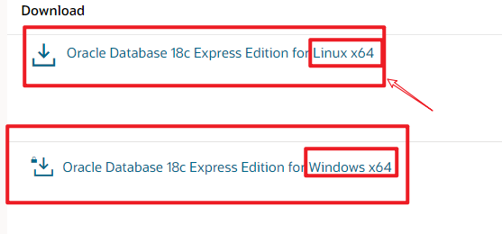

# 虚拟机中安装Oracle18c

-   前言
    -   实现在linux中安装Oracle数据库 故出此视频
    
    -   环境: Linux + Oracle18c
    
    -   教程地址: 
    
        >   https://blog.csdn.net/kiral07/article/details/87183986
-   步骤
    1.  安装虚拟机环境(VMware安装及Linux(选用CentOS7)安装省略)
    
    2.  从官网获取Linux版本的Oracle数据库,选用前者Linux (版本18c)
        
    
    3.  下载预安装软件
    
        >   curl -o oracle-database-preinstall-18c-1.0-1.el7.x86_64.rpm https://yum.oracle.com/repo/OracleLinux/OL7/latest/x86_64/getPackage/oracle-database-preinstall-18c-1.0-1.el7.x86_64.rpm
    
    4.  将文件移动至/opt目录 使用sudo
    
    5.  使用yum安装预安装rpm包
    
        >   sudo yum -y localinstall oracle-database-preinstall-18c-1.0-1.el7.x86_64.rpm
    
    6.  查看Oracle用户密码
	    >   id oracle
    
	7. 
	
	8. 