# 计算机组成原理 视频

## 计算机的基本结构

### 电子计算机的兴起

-   历史知识:
    -   电子计算机之父 冯·诺伊曼
    -   世界上第一台通用电子计算机 ECIAC 1946.02.14 美国宾夕法尼亚大学
    -   冯·诺依曼对ENIAC的分析:ENIAC的开关和转插线只不过代表着一些数字信息,完全可以像受程序管理的数据一样存放于主存储器中  ("存储程序"的概念)
    -   存储程序式计算机 冯诺依曼结构计算机 EDVAC 实现存储程序概念,提升任务效率 采用二进制,简化逻辑线路
    -   第一台实用的存储程序式计算机 EDSAC
    -   UNIVAC 总统选举一举成名

### 冯诺依曼结构的要点

-   历史知识:
    -   冯诺依曼撰写的《关于EDVAC的报告草案》描述了冯诺依曼计算机结构
    -   草案论述了两个重要设计思想: 存储程序(而非开关连线) 二进制(而非十进制)
    -   草案明确了计算机的五个部分: 运算器 控制器 存储器 输入设备 输出设备
    -   4001-ROM只读存储器 4002-RAM随机存储器 4003-I/O移位寄存器  4004-CPU微处理器
-   冯诺依曼结构的要点:
    -   计算机五大组成部分
        -   CA 运算器
        -   CC 运算器
        -   M 存储器
        -   I 输入设备
        -   O 输出设备
    -   数据和程序以二进制代码不加区别存放在存储器中,存放位置由存储器的地址确定
        
    -   计算机在工作时能够自动从存储器中取出指令并加以执行
        -   计算机执行一条指令的主要步骤
            -   取指
            -   译码
            -   执行
            -   回写
        -   计算机结构简化模型 模型机
            -   分为存储器和CPU 之间由控制总线 地址总线和数据总线相连接
                
            -   存储器
                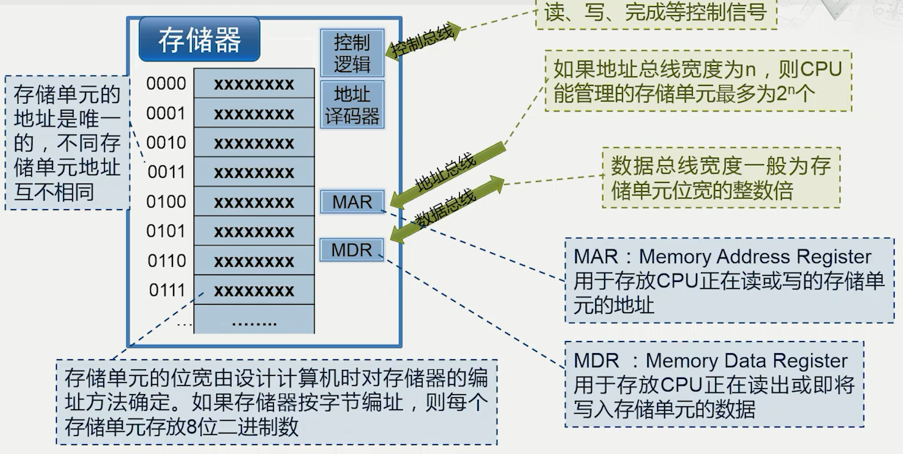
            -   控制器
                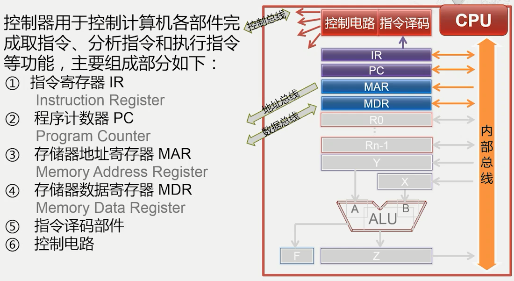
                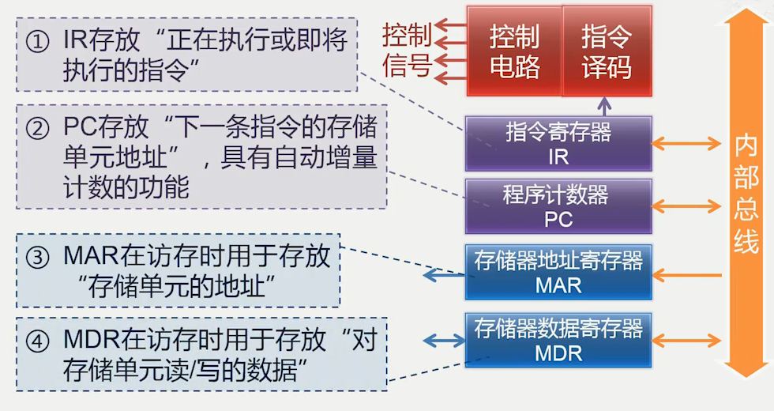
                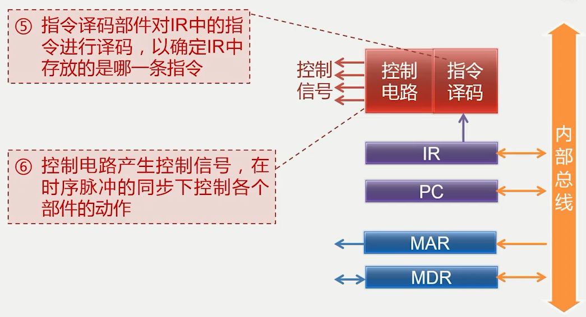
            -   运算器 主要分为算术运算和逻辑运算 通用寄存器传输数据通过内部总线
                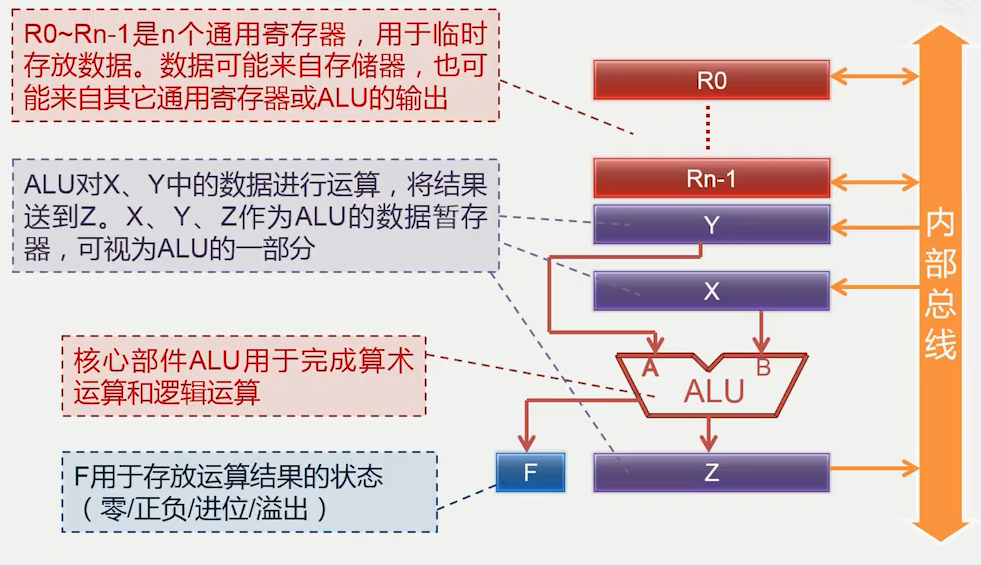
            -   模型机运转过程
                -   取指
                    -   控制器将指令的地址送往存储器
                    -   存储器按照给定的地址读出指令内容 送回控制器
                    -   步骤:
                        -   控制器发出信号将PC数据送到MAR中
                        -   MAR将地址送到地址总线 同时控制电路发出读数据信号 存储器读取信号
                        -   存储器通过地址译码器取出对应指令 反馈准备信号给控制电路并将数据存入数据总线
                        -   CPU将地址总线数据(指令)存入MDR 然后存入IR(指令寄存器)
                        -   将PC寄存器更新下一条指令的位置
                -   译码
                    -   控制器分析指令的操作性质
                    -   控制器向有关部件发出指令所需要的控制信号
                    -   步骤:
                        -   将IR指令寄存器中的数据(指令)送入指令译码器
                        -   控制电路发送相对应信号
                -   执行
                    -   控制器从通用寄存器或存储器中取出操作数
                    -   控制器命令运算器对操作数进行指令规定的运算
                    -   步骤:
                        -   取数据 类似译码取指过程,即从存储器中读取数据
                        -   根据指令进行操作
                -   回写
                    -   将运算结果写入通用寄存器或存储器
                    -   控制电路发出对应信号将ALU结果寄存器中的数据存储到对应位置
            -   输入输出设备
                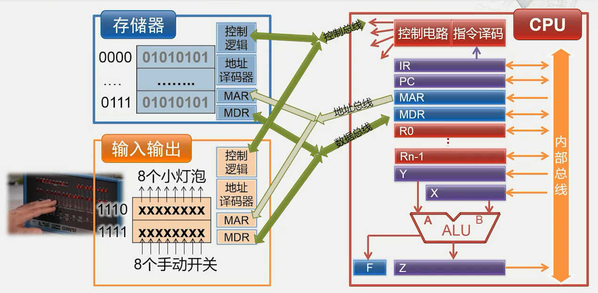
                -   输入
                    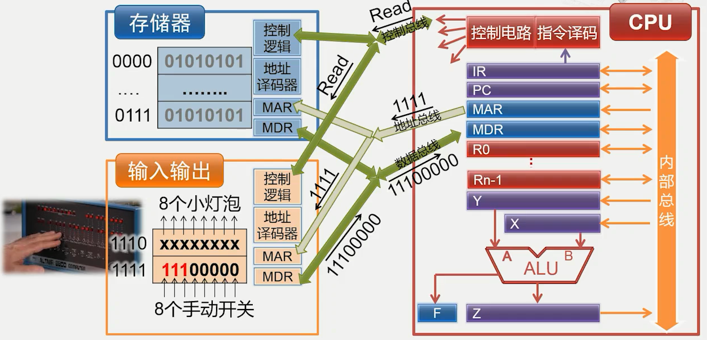
                -   输出
                    
    -   现今计算机与冯诺依曼结构对比
        -   CPU -- CA + CC
        -   南桥 -- I/O输入输出
        -   现今计算机启动过程
            -   CPU经过北桥经过南桥从BIOS(一种只读存储器)中读取启动所需要的代码
            -   根据启动代码检查主板上的各部件
            -   GPU(显卡的图形处理单元) 也会参与数据处理工作 充当运算器和控制器
        -   现今计算机演化过程
            -   南北桥架构 南桥控制I/O 北桥连接CPU/主存/显卡等
            -   北桥集成到CPU中 主板上留下南桥 
            -   系统芯片SoC 将计算机或其他电子系统集成为单一芯片的继承电路
            -   摩尔定律: 约18个月性能翻一倍

## 指令系统体系结构

-   简单的计算机指令系统
    -   指令分类
        -   运算类指令 加/减/乘/除
            -   ADD R, M  将R寄存器中的内容与M存储器中的内容相加后存储R寄存器
        -   传送类指令 加载/存储
            -   LOAD R, M  将M存储器中的内容存储R寄存器
            -   STORE M, R  将R寄存器中的内容放入M存储器中
        -   转移类指令 跳转
            -   JMP L  无条件转向L处
    -   指令格式
        -   每条指令等长 均为2个字节
        -   第一个字节的高四位为操作码
        -   第一个字节的第四位是寄存器号
        -   第二个字节是存储单元地址
    -   标志寄存器
        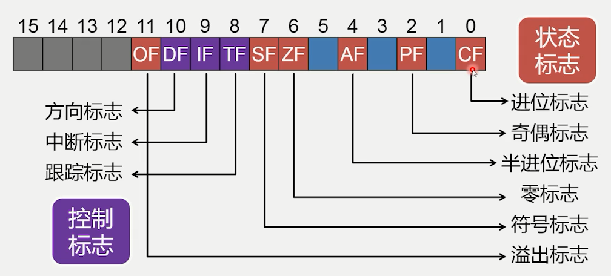
        -   flags寄存器中包含若干标志位 主要分为两大类
            -   状态标志 反映CPU的工作状态
            -   控制标志 对CPU运行起特定控制作用
    -   指令指针寄存器IP
        -   理论上 16位宽寻址能力只有2^16=64k字节单元 实际上有20位宽 使用了段寄存器
            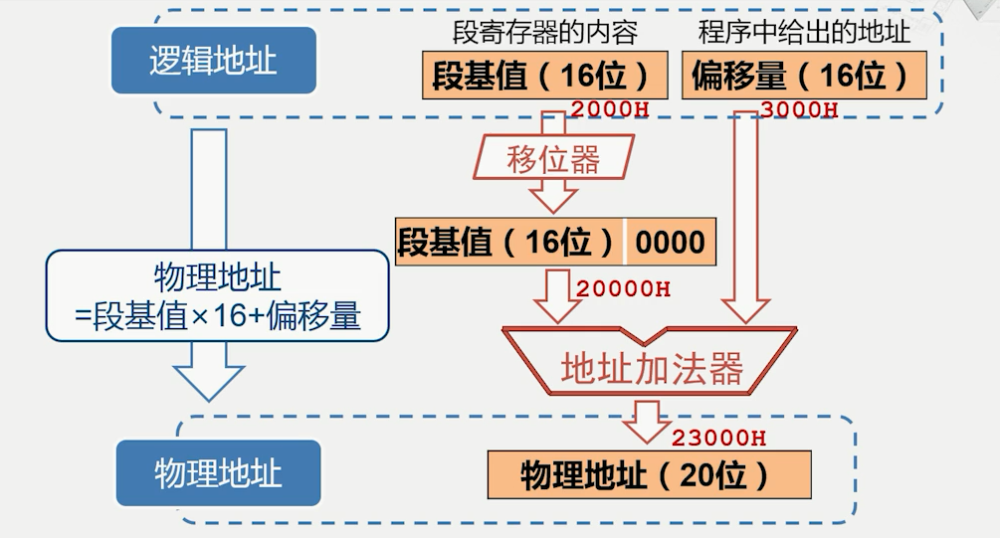
    -   Intel 80386 
        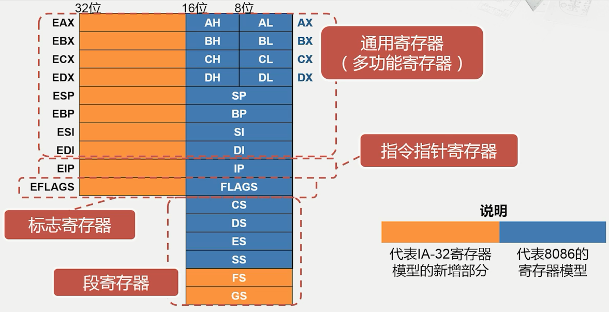
        -   80x86系列中第一款32位微处理器 可以寻址4G内存空间
        -   但是日后64位体系结构中 Intel提出的IA-64是独立于x86的一种新体系结构,不兼容IA-32
        -   x86-64寄存器模型
            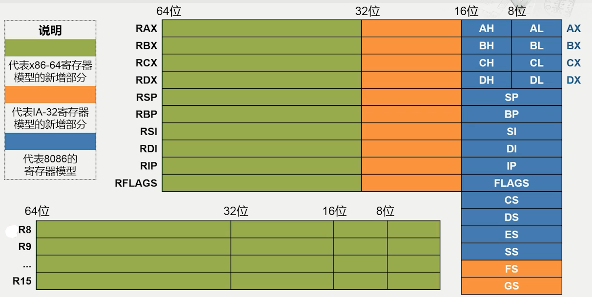