# 计算机网络 复习提纲

## 第一章 计算机网络概述

### 计算机网络物理组成和结构是什么

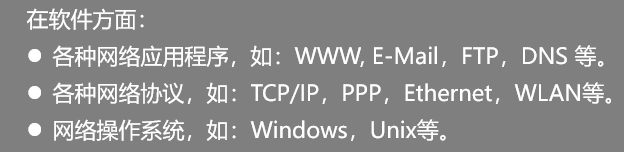
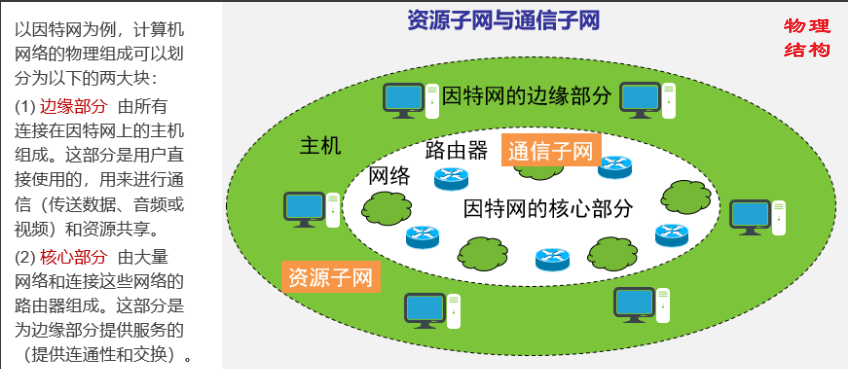

### 典型的计算机网络拓扑结构有哪些

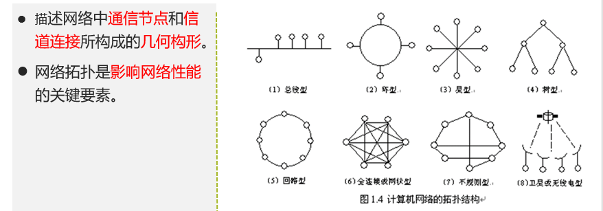

### 计算机网络分类有哪些

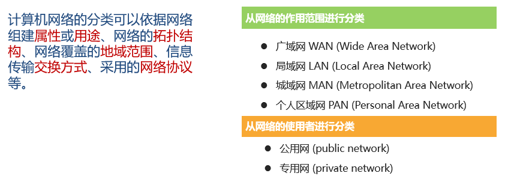

## 第二章 计算机网络协议和体系结构

### 计算机网络协议有哪些要素

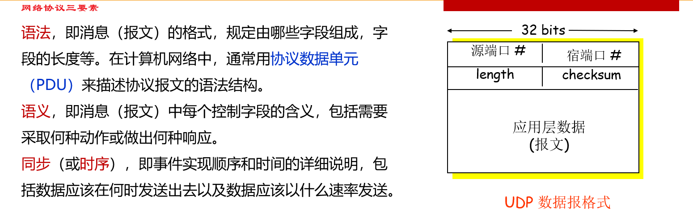

### 典型网络体系结构有哪些

OSI参考模型(法律规定,没有得到市场认可)  TCP/IP模型(广泛使用)

### TCP/IP协议体系模型分为哪几层

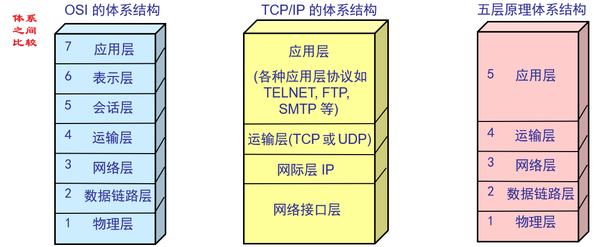
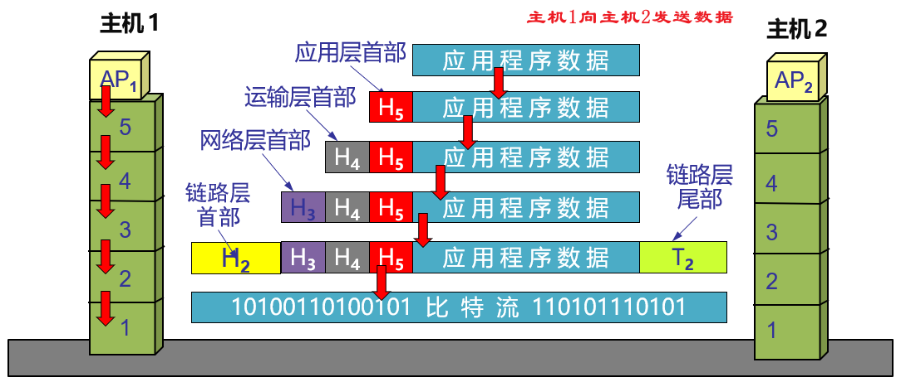

### IEEE 802局域网体系结构

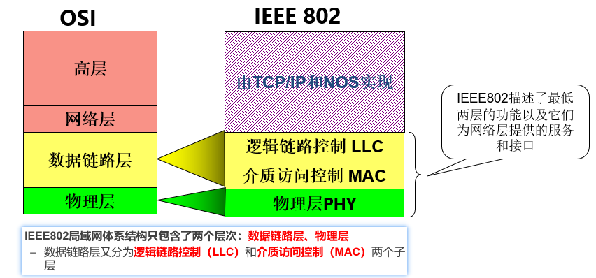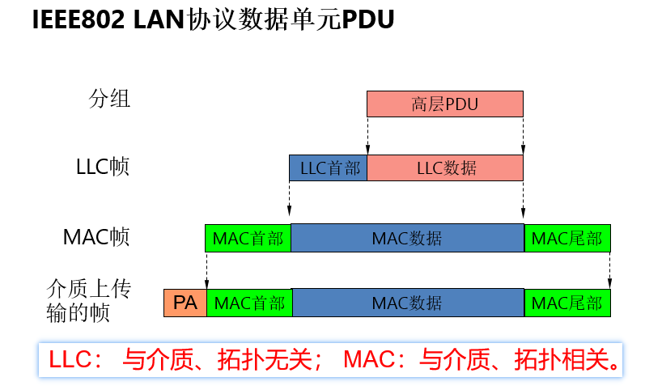

## 第三章 数据通信技术基础

### 如何估算信道的最大容量

>   https://blog.csdn.net/cainv89/article/details/50582967

奈氏准则: 在无噪声的情况下码元速率的极限值B与信道带宽W关系
香农定律: 在有高斯白噪声下的信道无差错传输极限速率

低通就比规定的频率低的信号可以通过些滤波zhi器，比规定频率高的信号就被滤掉
带通就是有一个上限频率和一个下限频率，高于和低于这两个频率的信号都将被滤掉
高通就是比规定频率高的信号可以通过，低于规定频率的信号就被滤掉

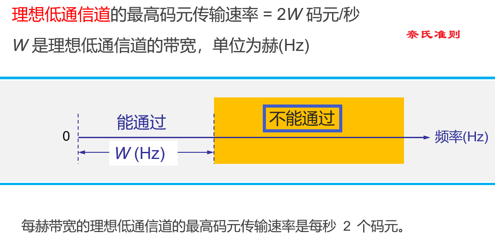

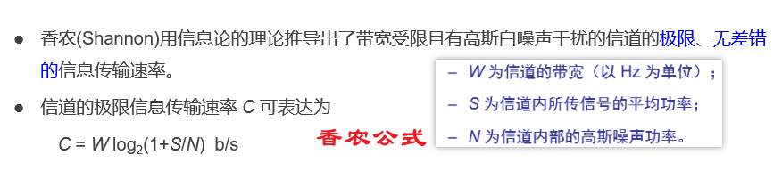

### 什么是波特率

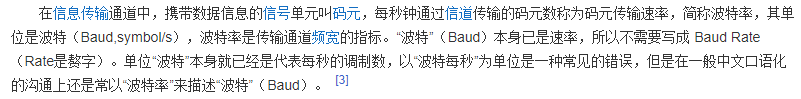

计算: 最高信息传输速率 = 最高码元传输速率 * 每个码元携带的信息量

### 信道复用技术有哪些

>   https://blog.csdn.net/guangod/article/details/107669698

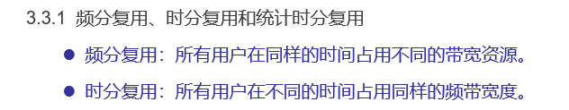

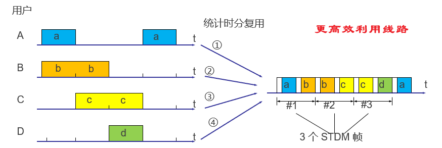
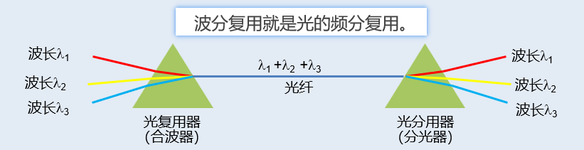
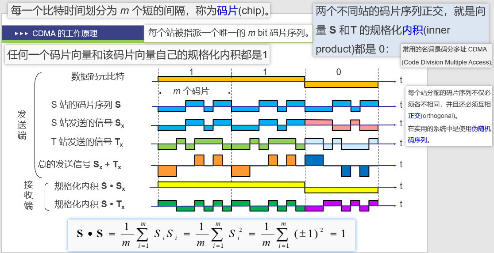

### 因特网采用哪种信道复用技术

(暂无答案)

### 数字数据/数字信号编码有哪几种 有何差异

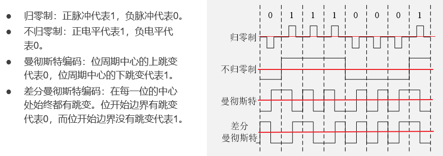

### 模拟数据/数字信号编码的编码过程

调制方法(将数字信号转换成模拟信号)
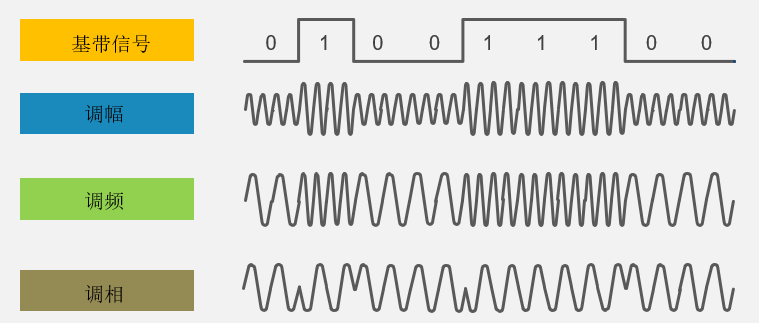
PCM编码技术 (采样 量化 编码)(模拟信号转换成数字信号)
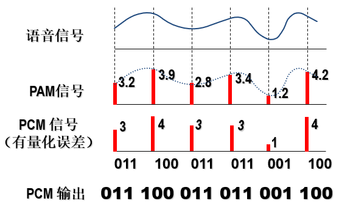

### 什么是分组交换

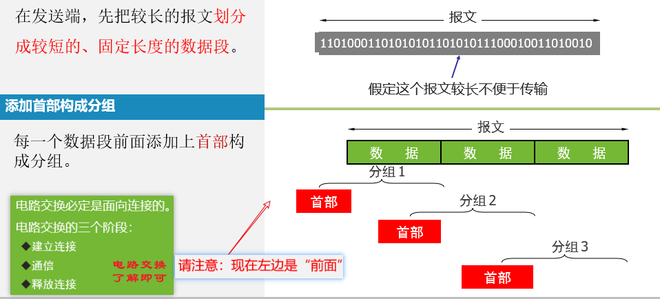
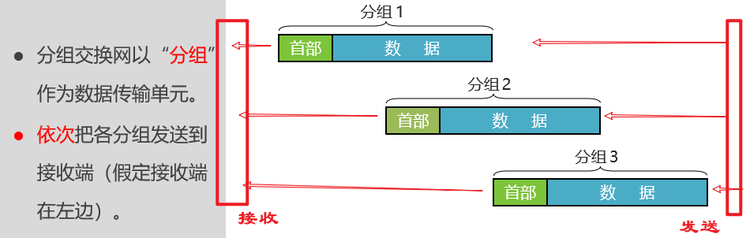

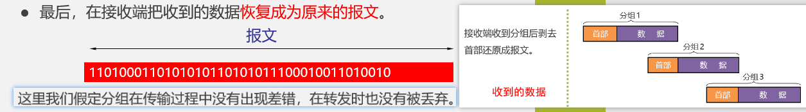

### 差错控制编码技术有哪几种

>   UDP校验和 循环冗余检测 三次握手 四次分手
>   https://b23.tv/BV1tf4y1e75S

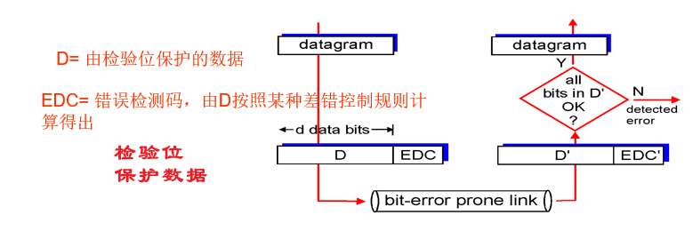

## 第四章 应用层

### 什么是DNS 主要功能

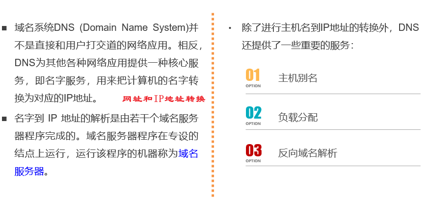

### DNS系统的主要组成 以及工作方式(域名只是一个逻辑概念)

-   ​	域名服务器 域名空间 地址请求转换程序
-   DNS使用的端口53 使用UDP进行连接

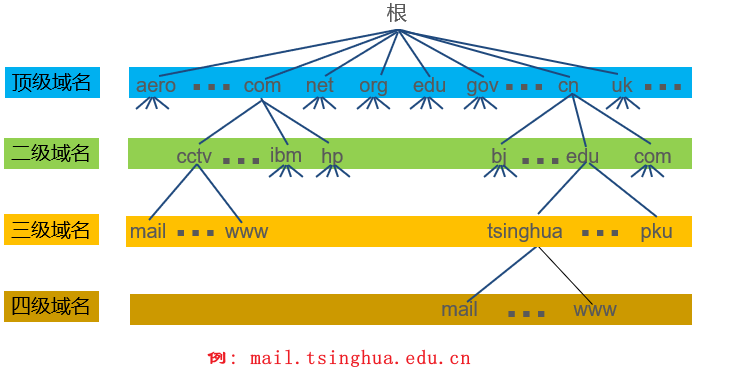

### 应用 应用层和运输层协议 服务器端口号

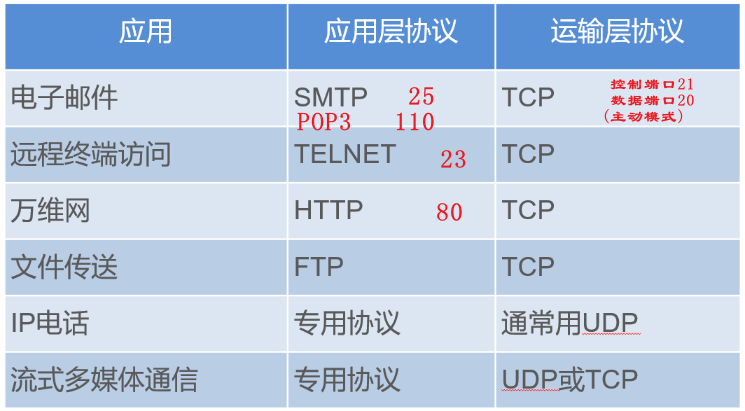

## 第五章 运输层 (重点)

### 运输层的功能

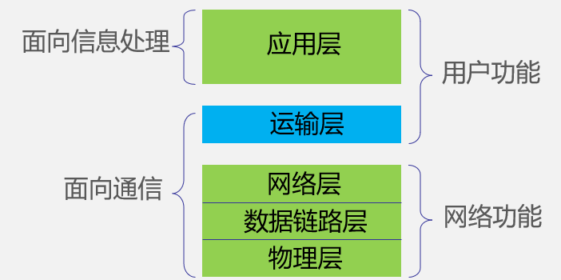

### 什么是停止-等待协议

-   最简单但也是最基础的数据链路层协议
-   基本思想:在发送方每发送完一个协议数据单元(PDU)后,停止发送,等待接收方的确认数据,并把发送过得数据副本保留下来.如果收到接收方成功信号则发送下一个PDU,如果收到的是否定结果则重新发送上次发送过的PDU.停等协议符合数据双向交替(半双工)的通信方式 

### 停止-等待协议优缺点

## 第六章 网络层(重点)

### 什么是数据报网络

### 什么是路由选择

### 路由选择算法有哪些分类

### 距离矢量路由算法是什么

### 如何计算距离表

### 链路状态路由算法是什么

### RIP路由协议的工作原理是什么  最大距离

### OSPF路由协议工作原理是什么

### IP地址有几种技术方案

### 如何确定网络地址和主机地址

### 什么是私有地址  以及范围

### 什么是CIDR地址

### 路由器使用CIDR地址，如何选择路由

### 什么是CIDR路由聚合   如何实现

## 第七章 数据链路层和局域网

### 什么是局域网

### 什么MAC地址

### 局域网协议体系结构分为哪几层

### MAC地址和IP地址有何区别 如何转换

### ARP协议如何工作

### 什么是CSMA/CD协议 以及工作原理

### 以太网交换机的原理

### 以太网技术规范有哪些

### 以太网数据帧格式

### 网络互联设备有哪些 工作原理以及区别

### PPP协议和CSMA/CA协议的帧结构，工作原理

## 第八章 物理层

### 物理层协议包含哪些内容