# 计算机网络

## 第一章 概述

目录:

1.  ...

## 第二章 计算机网络协议与体系结构

### 目录

1.  计算机网络协议的概念
2.  计算机网络体系结构
3.  OSI参考模型
4.  TCP/IP模型
5.  IEEE 802局域网模型
6.  计算机网络实例

### 计算机网络协议的概念

-   计算机网络中数据交换必须遵守实现约定好的规则
-   语法: 即消息(报文)的格式,规定由哪些字段组成,字段长度等 在计算机网络中,通常用协议数据单元(PDU)来描述协议报文的语法结构
-   语义: 即消息(报文)中每个控制字段的含义,包括需要采取何种动作或相应
-   同步(时序): 事件顺序和时间的详细说明,包括数据应该何时发送以及什么速率发送
    -   windows常用协议: UDP协议(位宽32bit 分为源端口,宿端口,length,checksum,应用层数据(报文))
        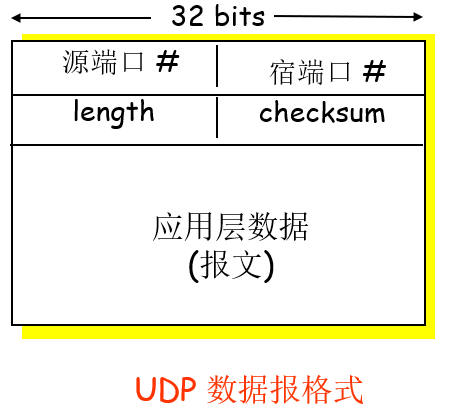

### 计算机网络体系结构

-   计算机网络各层协议的集合 是计算机网络及其部件所应完成的功能的精确定义
-   相互通信的计算机之间需要高度协调
-   分层 可以将大问题转换为小问题再依次解决 实例: 信件远距离传输
    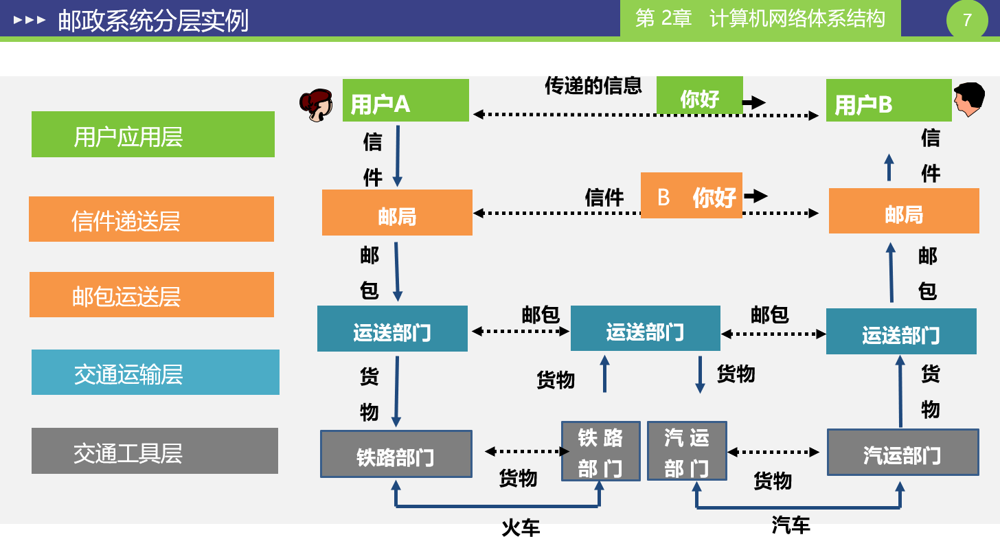
-   分层好处: 各层之间是独立的 灵活性好 结构上可分离 易于实现维护 能促进标准化工作 
    -   保证分层后通信完整 
    -   层与层之间定义接口 
    -   对每一层而言(不知道其他层结构,独立完成某任务,向上提供服务,向下使用服务)
-   网络协议层次接口和数据单元 了解
    -   同一层对等实体间交换信息的数据单元称为PDU 下层为上层提供服务时,需要通过层次间的服务访问点SAP(逻辑接口)
    -   数据单元: 
        -   服务数据单元(SDU) 
        -   协议控制单元(PCI,保证实体间可以进行互相交换) 
        -   接口控制信息(ICI)
        -   接口数据单元(IDU)
        -   协议数据单元(PDU)
            -   IDU = SDU + ICI
            -   PDU = SDU + PCI
                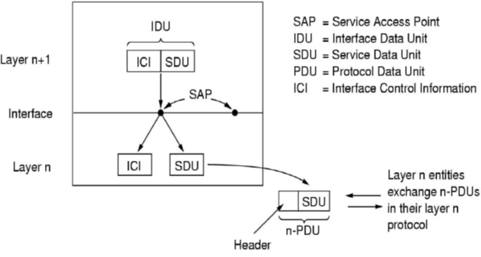
    -   实体: 表示任何可发送或接收信息的硬件或软件进程
    -   协议是控制两个对等实体进行通信的规则集合  (上下层讲服务,同层实体间讲协议 )
        -   协议的控制下,两个对等实体的通信使得本层可对上提供服务,可以使用下层提供的服务
        -   本层服务用户只能看见服务而看不见下面的协议 
        -   下面的协议对上面的服务用户是透明的
        -   协议是水平的 服务是垂直的
            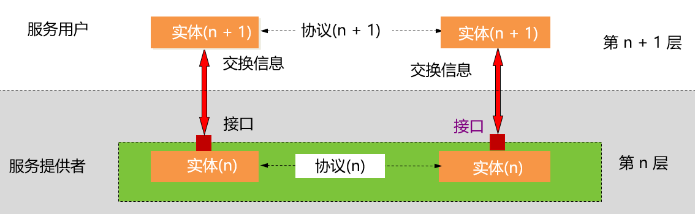
    -   体系结构的实现: 遵循这种体系结构的基础下,用何种方式(硬件/软件)完成这些功能问题

### OSI参考模型(理论标准,OSI并没有得到市场认可)

-   全称为开放系统互连参考模型
    -   只要遵循这个标准,一个系统就可以和位于世界上任何地方的遵循同一标准的其他系统进行通信
    -   协议完美而过于复杂,运行效率低
-   OSI协议分为七个层次
    -   对应层次: 应用层 表示层 会话层 传输层 网络层 数据链路层 物理层
    -   对应协议数据单元: A-报文 P-报文 S-报文 T-报文 分组 帧 位流
        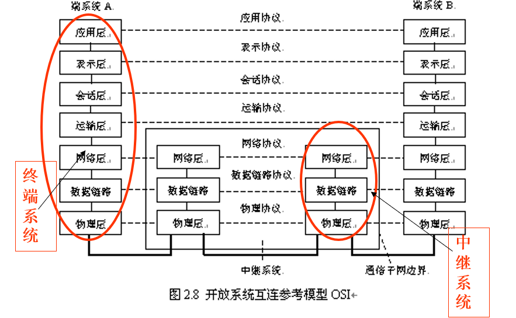

### TCP/IP模型(非国际标准,但是得到了最广泛的应用)

-   TCP/IP体系结构

    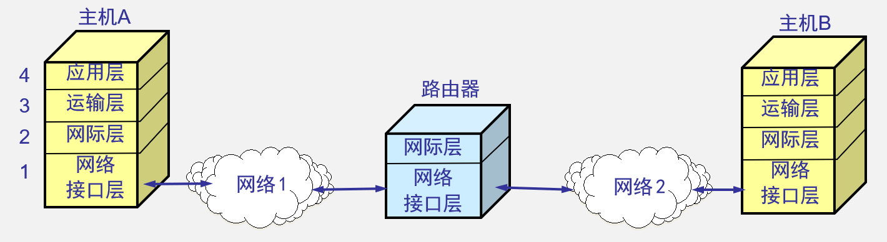

    -   路由器在转发分组时最高只用到网络层 没使用运输层和应用层

-   特点:

    -   是一个开放的网络协议族,免费使用
    -   做到与计算机系统无关 与网络设备无关 与底层通信子网平台无关
    -   提供统一的网络地址,用于标识网络中的一个连接
    -   传输层协议TCP提供可靠的P2P传输数据  可屏蔽通信子网差异 应用层协议内容丰富
        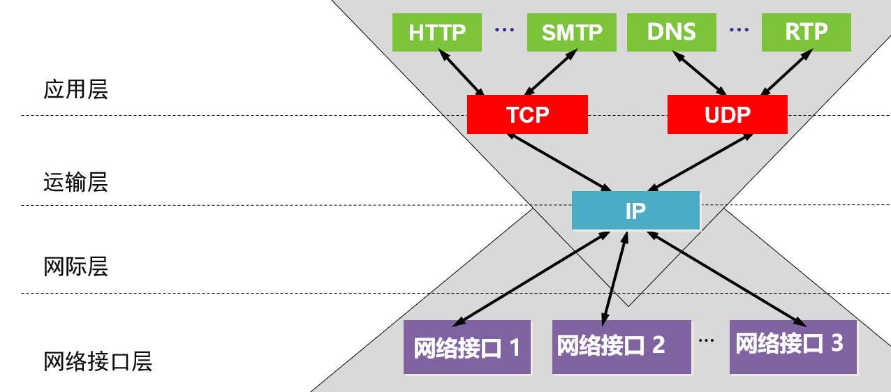

-   具体组网时的TCP/IP

    -   网络接口层协议: 网卡/网络适配器实现,需要安装网卡及其驱动
    -   IP层 TCP层协议: 包含在相应的操作系统中
    -   应用层协议: 包含在相应的应用程序中

-   TCP/IP是四层体系结构: 应用层 传输层 网际层 网络接口层 (为方便讲解分为五层)

    -   物理层: 如何在物理媒体上传输比特流
    -   数据链路层: 相邻节点间分组(帧)的传输 PPP,以太网
    -   网络层: 如何讲分组从源主机通过中间路由器传送到目的主机 IP,选路协议
    -   运输层: 提供不同主机上的应用之间的数据传输服务 TCP,UDP
    -   应用层: 如何通过应用程序进程间的交互来完成特定的网络应用 FTP,SMTP,STTP

-   传输方式:     发送端(逐层封装) 接收端(逐层解包) 

    -   应用进程数据先传送到应用层 加上应用层首部,成为应用层 PDU
    -   应用层PDU再传送到运输层 加上运输层首部,成为运输层报文
    -   运输层报文再传送到网络层 加上网络层首部,成为IP 数据报(或分组)
    -   IP数据报再传送到数据链路层 加上链路层首部和尾部,成为数据链路层的帧
    -   数据链路层帧传送到物理层 最下面的物理层把比特流传送到物理媒体设备 (通过光纤等设备)
    -   电信号(光信号)再物理媒体中出阿伯 从发送端物理层到接收端物理层
    -   接收端物理层接收到比特流,上交给数据链路层
    -   数据链路层剥去帧首部和帧尾部取出数据部分,上交给网络层
    -   网络层剥去首部,取出数据部分上交给运输层
    -   运输层剥去首部,取出数据部分上交给应用层
    -   应用层剥去首部,取出应用程序数据上交给应用进程
    -   最终接收端接收到发送端传送的数据

    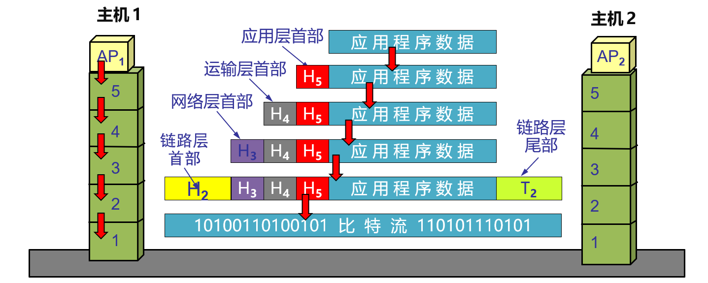

-   不同系统中对等层实体实际通信过程是垂直的,在发送端协议数据单元PDU经过从上层向下层的封装。到达对方后,再经由底层向上,每一层去掉协议头,称为分解(解包),此时相当于对等层彼此理解。

### IEEE 802局域网模型

-   只包含了两个层次: 数据链路层(又分为逻辑链路控制层LLC和介质访问控制MAC) 物理层
    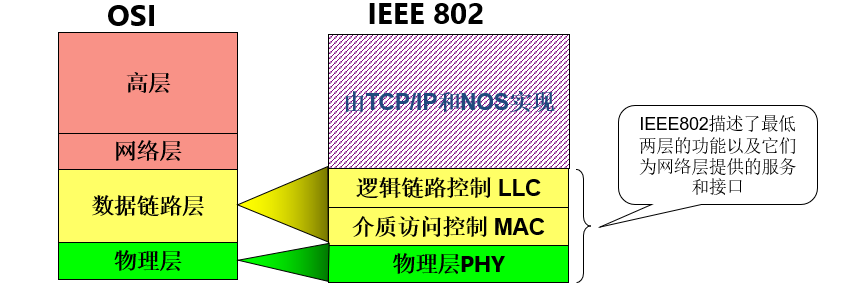
    -   LLC是一样的 MAC不一样 保证TCP/IP在不同方式传输介质上都可以实现
    -   目的:
        -   将功能中与硬件相关和与硬件无关的部分分开以适应不同的传输介质
        -   解决共享信道(如总线)的介质访问控制
-   IEEE802 LAN协议数据单元PDU示例
    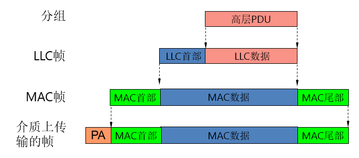
    -   PA是一段固定的代码,用于表示接下来有一个PDU到,请求做好准备

### 计算机网路实例

-   Internet因特网 是一个专用名词,它指当前全球最大的、开放的、由众多网络相互连接而成的特定计算机网络,采用 TCP/IP协议族作为通信的规则

-   Internet是一个由多层次因特网服务提供者 ISP 网络构成的松散结构 用户通过 ISP 接入到Internet网络

    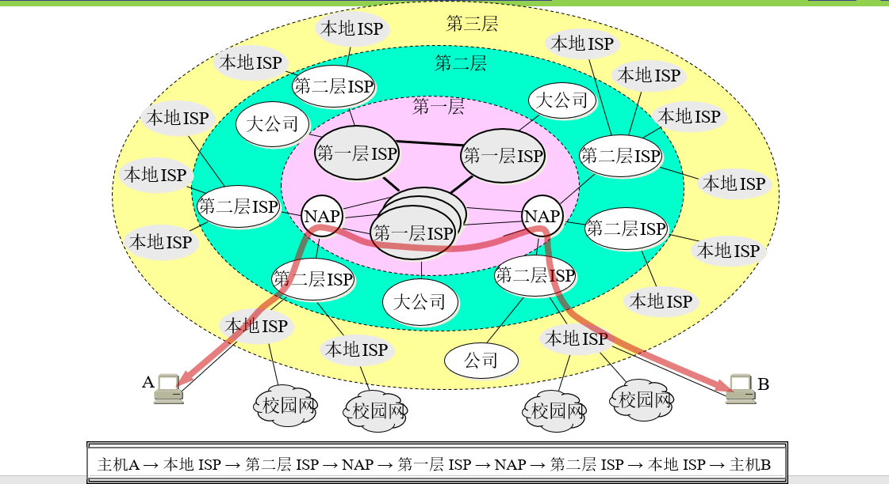

-   用户通过ISP进行上网 根据提供服务的覆盖面积大小,所拥有的 ]IP 地址数目的不同,ISP 分为不同的层次

    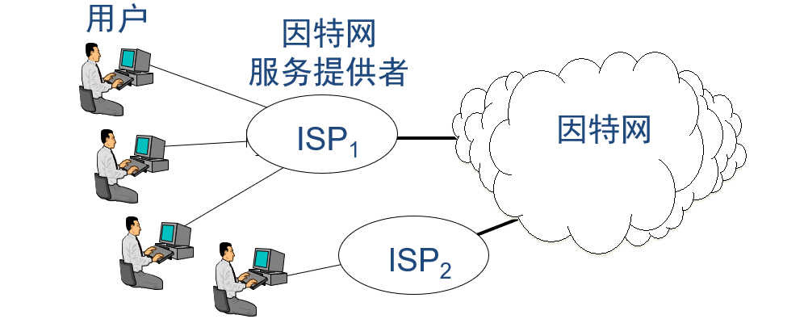

## 第三章 数据通信基础与物理层

### 目录

-   数据通信的基础知识
-   物理层下面的传输媒体
-   信道复用技术
-   数据编码技术
-   交换技术
-   交错控制技术
-   数字传输系统
-   物理层的基本概念
-   互联网接入技术

### 数据通信的基础知识

-   信息 数据 信号: 
    -   数据: 运送信息的实体
    -   信号: 数据的电气或电磁表现
    -    模拟的: 连续变化的
    -   数字的: 取值是离散的值
-   数据通信系统模型
    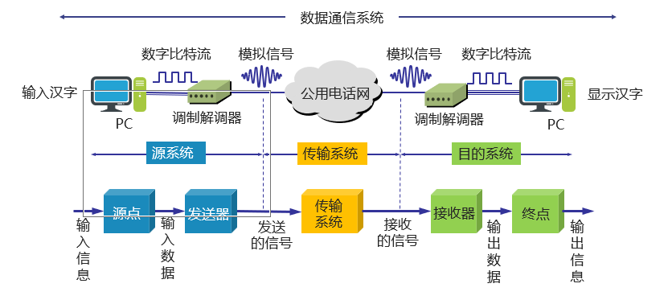
-   信道的极限容量
    -   任何实际的信道都不是理想的 在传输信号的时候会出现失真和多种干扰
    -   码元传输速率搞或距离远都会造成输出端失真严重
    -   提高办法:
        -   更好的传输媒体(介质) 使用先进的编码和调制技术
        -   不管怎么提高都是受限的且不能任意提高会出现较多差错
    -   奈氏准则  (W是理想低通信号的带宽 单位为Hz)
        -   理想低通信道最高码元速率 = 2W码元/秒
            -   每赫带宽的理想低通信道的最高码元传输速率是每秒2码元
                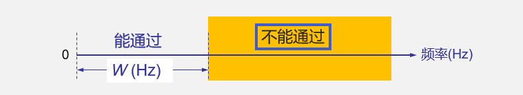
        -   理想带通特性信道的最高码元传输速率=W码元/秒
            -   每赫带宽的理想低通信道的组稿码元传输速率是每秒1码元
                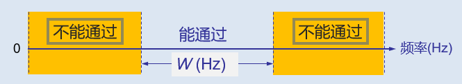
        -   实际信道所能传输最高码元速率远低于奈氏准则给出的上限数值
        -   如果要提高信息传输速率,可以采用有效的编码技术 使每个码元能携带更多信息量
        -   举例:
            -   带宽3kHz的理想低通信道,其最高码元传输速率为 6000 码元/秒.若每个码元能携带 3 bit 的信息量,则最高信息传输速率为 18000 bit/s
            -   可以将基带信号转换为不同的振幅表示不同的信号(例如,3bit需要用8种振幅调制)
    -   香农公式
        -   香农用信息论的理论推导出带宽受限且有高斯白噪声干扰的信道极限,无差错的信息传输速率
        -   信道的极限信号传输速率C表示为 *C* = *W* log2(1+*S*/*N*) b/s 
            -   W为信道的带宽(Hz) S为信道内所传信号的平均功率 N为信道内部的高斯噪声功率
        -   香农公式表明:
            -   信道的带宽或信道中的信噪比越大 则信息的极限传输速率就越高
            -   只要信息传输速率低于信道的极限信息传输速率 就一定能找到某种办法实现无差错传输
            -   如果信道带宽与信噪比没有上限(现实做不到) 则信道的极限传输速率C也没有上限
            -   实际信道上能够达到的信息传输速率比香农公式极限传输速率低很多
-   传输方式
    -   并行传输和串行传输
        -   并行传输是一次发送n个比特 发送端和接收端之间需要n条传输线路
        -   串行传输是一个比特一个比特一次发送 发送端和接收端只需要一条传输线路
    -   异步传输和同步传输
        -   同步指双方在时间基准上保持一致的过程
        -   异步传输是以字节为独立的传输单位 字节之间的时间间隔不是固定的 接收端仅在每个字节的起始处对字节内的比特实现同步
        -   同步传输以稳定的比特流的形式进行传输,要采取技术使收发双发的时钟保持同步(外同步或内同步)
    -   单工 半双工 全双工
        -   单向通信(单工通信) 只能有一个方向的通信而没有反方向的交互
        -   双向交替通信(半双工通信) 通信的双方都可以发送信息 但双方不能同时发送(同时接收)
        -   双向同时通信(全双工通信) 通信的双方可以同时发送和接收信息

### 物理层下面的传输媒体

-   电信领域下的电磁波频谱
    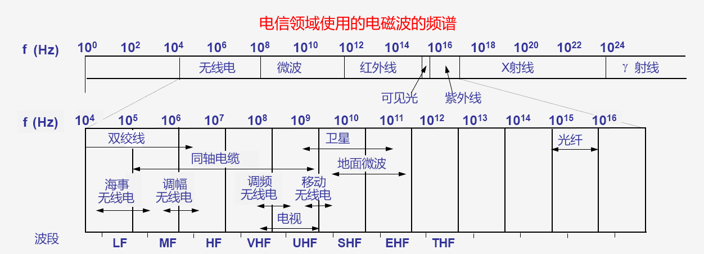
-   引导型传输媒体
    -   双绞线  (聚氯乙烯套层/绝缘层/铜线)
        -   屏蔽双绞线STP  无屏蔽双绞线UTP
    -   同轴电缆
        -   50Ω同轴电缆  70Ω同轴电缆
    -   光缆
        -   外护套 远供电源线 光纤及其包层 填充物 加强芯 包带层
        -   光纤的工作原理: 不断全反射
        -   分类:
            -   多模光纤: 输入输出脉冲有变化
            -   单模光纤: 输入输出脉冲没有变化
-   非引导型传输媒体
    -   无线传输所使用的频段很广
    -   短波通信主要靠电离层的反射 但是通信质量比较差
    -   微波在空间主要是直线传播  (地面微波接力通信 卫星通信)

### 信道复用技术

-   复用是通信技术中的基本概念
    -   使用复用技术可以使用共享信道
-   分类:
    -   频分复用 所有用户在同样的时间占用不同的带宽资源
        
    -   时分复用 所有用户在不同的时间占用同样的频带宽度
        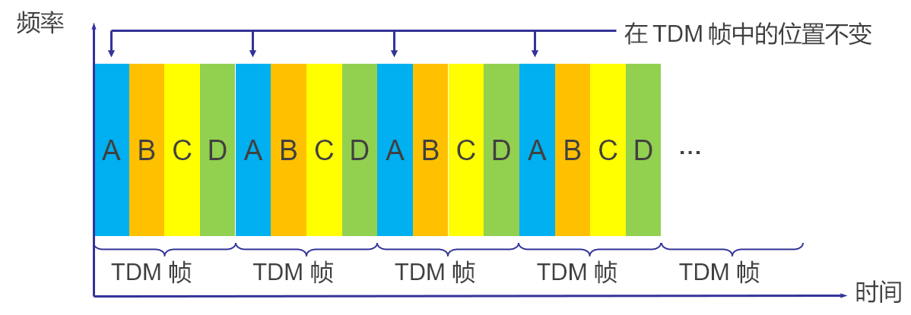
        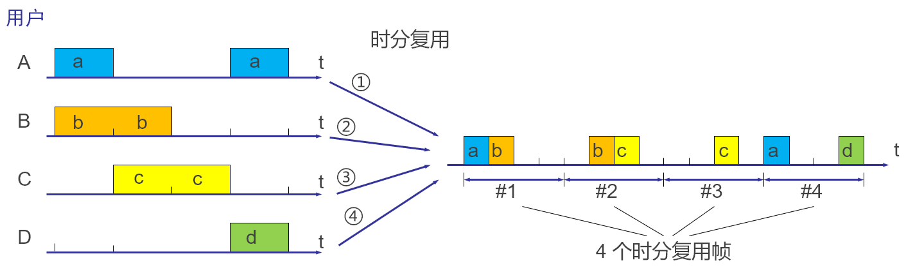
        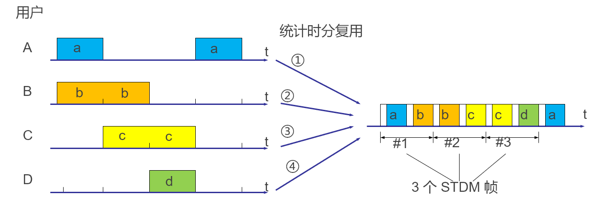
    -   波分复用 光的频分复用 需要合波器和分波器
        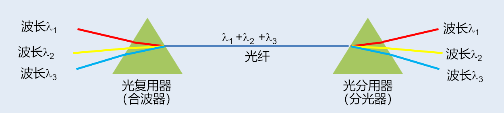
    -   码分复用CDM
        -   常用的名词是码分多址CDMA
        -   各用户使用经过特殊挑选的不同码型,因此不会相互干扰
        -   此系统发送信号有很强抗干扰能力 频谱类似白噪声不易被敌人发现
        -   每一个比特时间划分为m个短时间间隔 称为码片
        -   每一个站被指派一个唯一的m bit码片序列  
            -   发送比特1使用自己的码片序列 发送比特0使用其反码
            -   每一个站码片还需要互相正交
                -   码片序列正交: 向量的规格化内积都是0
                    
                -   任何一个码片向量和自己的规格化内积都是1
                -   一个码片的向量和该码片的反码的向量的规格化内积都是-1
                    
                -   发送/接收例子
                    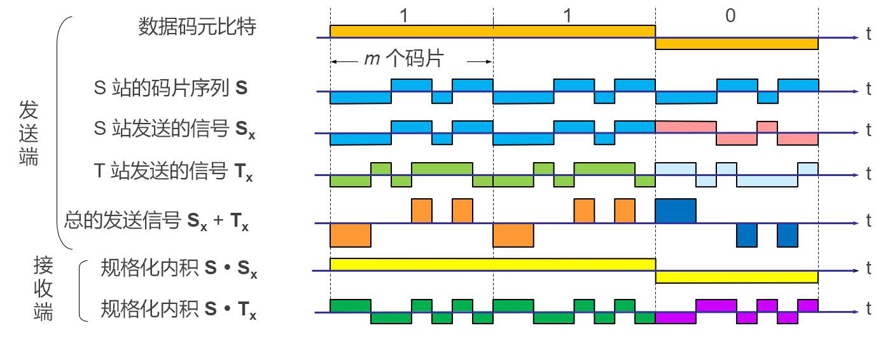
            -   在实用的系统中是使用伪随机码序列

### 数据编码技术

-   人们通常将数字数据转换为数字信号的过程称为编码, 将数字数据转换为模拟信号称为调制
-   常用编码方式:
    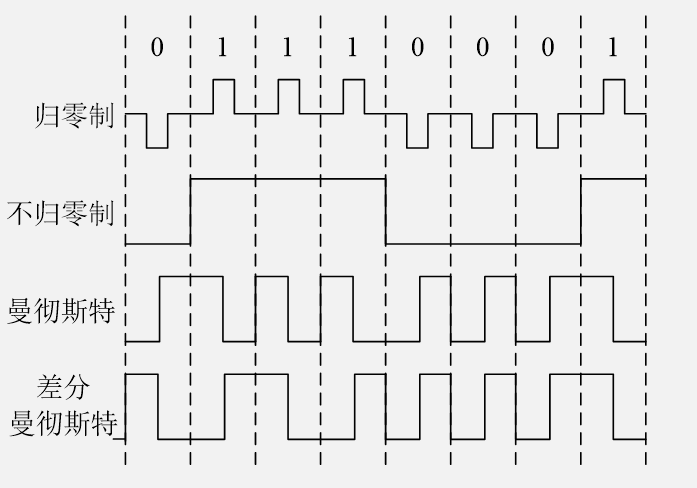
    -   归零制: 正脉冲表示1 负脉冲表示0
    -   不归零制: 正电平表示1 负电平表示0
    -   曼彻斯特编码: 位周期中心的上跳代表0 位周期中心的下跳代表0
    -   差分曼彻斯特编码: 在每一位的中心处始终都有跳变 未开始边界有跳变表示1 没有则为0
-   基带信号和带通信号
    -   矩形脉冲波形的数字信号包含从支流开始的低频分量 称为基带信号(基本频带信号)
    -   基带信号包含较多低频成分,许多信道并不能传输这种低频分量,需要对其进行调制
    -   带通信号(计网中叫做宽带信号) 把基带信号经过载波调制后,将信号频率调至高频段以便在信道中传输
-   基本调制方法:
    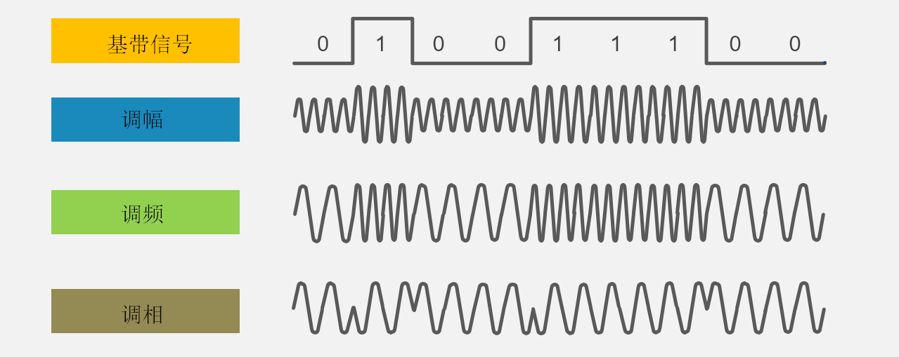
    -   调幅: 载波的振幅岁基带的数字信号变化 即幅移键控ASK
    -   调频: 载波的频率随基带的数字信号变化 即频移键控FSK
    -   调相: 载波的初始相位随基带数字信号变化 即相移键控PSK
-   PCM编码技术
    -   采样定理: 
        -   如果模拟信号最高频率为F 若以≥2F的采样频率进行采样,则从采样得到离散信号序列中就能完整恢复出原始信号
    -   要转换的模拟数据主要是电话语音信号 模拟信号在数字线路中进行传输必须先转换为数字信号
    -   PCM编码
        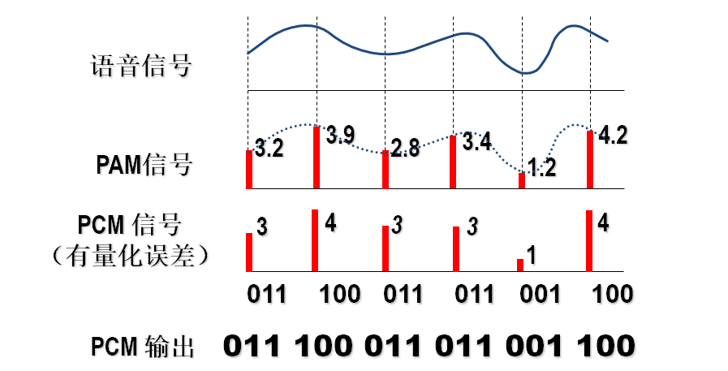
        -   采样: 按一定间隔对语音信号进行采样 模拟信号进行转化
        -   量化: 把每个样本舍入到接近的量化级别上 存在量化误差
        -   编码: 对每一个量化后的样本进行编码 编码后的信号则称为PCM(脉码调制)信号

### 交换技术

-   电路交换
    -   举例: 使用电话机通话 交换机(网络)完成全网交换任务
        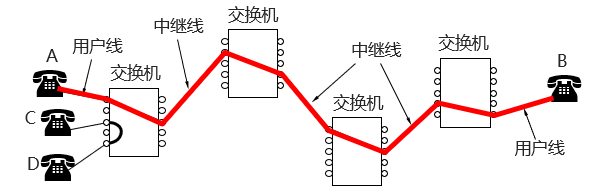
    -   "交换" 的含义就是转接 按照某种方式动态分配传输线路的资源
    -   电路交换必定是面向连接的
    -   电路交换的三个阶段
        -   建立连接 通信 释放连接
    -   电路交换传送数据效率低
        -   计算机数据具有突发性 导致通信线路利用率低
-   分组交换
    -   发送端 将较长的报文划分成较短的固定长度的数据段
    -   每一个数据段前加上首部构成分组(重点)
    -   分组交换网以"分组"作为数据传输单元
    -   依次把个分组发送到接收端(首部先到)
    -   每个分组首部含有地址等控制信息
    -   分组交换网的节点根据接收到的分组首部的地址信息,将分组转发到下一个节点交换机
    -   用这种存储转发方式 最后到达最终目的地
    -   接收端收到分组后剥去首部还原报文
    -   特点:
        -   高效: 动态分配传输带宽 对通信链路逐段占用
        -   灵活: 以分组为传送单位和查找路由
        -   迅速: 不必先建立连接就可以向其他主机发送分组
        -   可靠: 保证可靠的网络协议 分布式路由选择协议使网络有很好的生存性
    -   问题: 
        -   分组在阶段村拿出转发时需要排队 造成时延
        -   分组必须携带首部 造成一定的开销
        -   无法确保端到端需要的带宽,通信量大可能造成网络堵塞
-   存储转发(略)
-   三种交换的比较:
    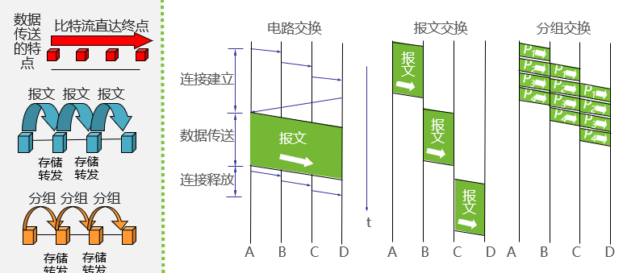

### 交错控制技术

-   产生差错原因
    -   在传输过程中会产生比特差错 一段时间内 传输错误的比特占总比特量的比值为误码率
    -   误码率和信噪比有很大关系
    -   信号在信道上传输会收到噪声干扰出现差错 不可避免
    -   噪声分为 内部噪声(链路/接口发热) 和 外部噪声(外部电磁信号)
-   差错检测原理
    -   D 由检验位保护的数据
    -   附加的数据块: EDC错误检测码 D按照某种差错控制规则计算得出
    -   不同的差错检测技术:
        -   奇偶校验
            -   一维奇偶校验 能检测出奇数位比特出错 检错概率为50%
        -   检查和(checksum)方法
            -   将数据段D看作k比特整数序列计算和
        -   循环冗余检测(也称 多项式编码)
            -   收发双方协商一个r+1位的生成多项式G
            -   发送方：要选择r位附加比特R，将它附加到D，使得产生的d+r二进制数恰好能被G整除。
            -   接收方：用G去除接收到的d+r二进制数。如果余数为非零，则表示出错。

### 物理层的基本概念

-   物理层协议主要确定传输媒体接口特性:
    -   机械特性: 指明接口的形状和尺寸等
    -   电器特性: 电缆各条线上电压的范围
    -   功能特性: 某线路上某一电平表示何种意义 
    -   规程特性: 不用功能可能事件出现顺序
-   标准举例:
    -   8.2.1 EIA-RS-232-D
        -   欸过电子工业协会EIA制定的物理层异步通信接口标准
            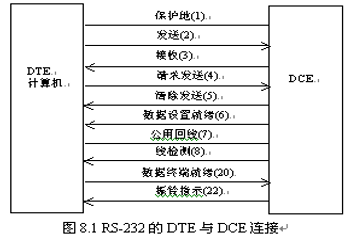

### 数字传输系统

-   PCM(脉冲编码调制)速率体制
    -   将模拟电话信号转化为64kbit/s的PCM数字脉冲信号
    -   为了充分利用高速传输线路带宽,通常将多路PCM信号用TDM方法汇集成时分复用帧,按照某固定复用结构进行长途传输
    -   具有两个互不兼容的PCM复用速率标准: 北美体制和欧洲体制.
    -   同步光纤网SONET 的各级时钟都来自一个非常精确的主时钟
        -   第一级同步传输信号STS-1的传输速率是51.84Mb/s
        -   ..

### 互联网接入技术(看PPT)

## 第四章 数据链路层

### 目录

-   数据链路层基础
-   点对点协议PPP
-   使用广播信道的数据链路层
-   共享式以太网
-   网桥和以太网交换机
-   以太网的演进
-   无线局域网

### 数据链路层基础

-   数据链路层基础
    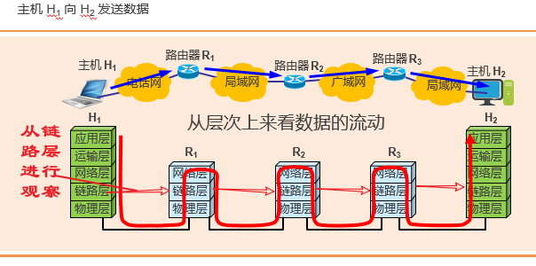
    -   链路和数据链路
        -   链路是一条点到点的物理线路段 中间没有其他交换节点
        -   是通路的一个组成部分
        -   数据链路是除了物理线路外,还必须又通信协议来控制这些数据的传输
        -   将实现协议的软硬件添加到链路上就构成了数据了数据链路
            -   常用方法: 使用适配器(网卡)实现协议的软硬件
            -   一般适配器都有数据链路层和物理层两层功能
        -   信道类型:
            -   点对点信道: 使用点对点通信方式
            -   广播信道: 使用一对多的广播信道方式,过程比较复杂,主机比较多,需要使用专用的共享信道协议协调主机的数据
    -   封装成帧
        -   数据链路层传输的是帧
            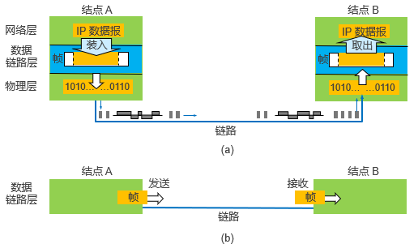
        -   在数据的前后分别增加首部和尾部 构成一个帧的界限
            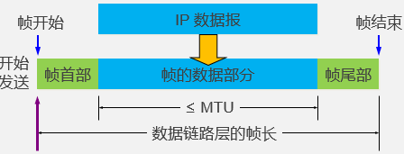
        -   首部和尾部的作用就是帧定界
            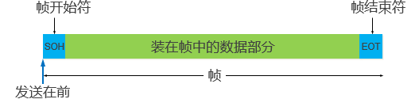
        -   透明传输
            
            -   解决透明传输的问题:
                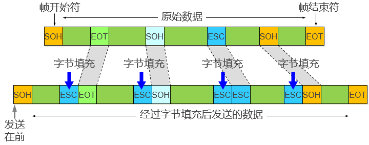
                -   发送端在SOH或EOT前面插入转义字符ESC(0x1B)
                -   字节填充或字符填充  接收端的数据链路层在将数据送往网络层之前删除插入的转义字符
                -   如果原文就有转义字符则在该字符前再添加一个转义字符 接受的时候删除前面那个转义字符
    -   差错检测
        -   在数据链路层传送的帧中,广泛采用了循环冗余检验CRC的检错技术
            -   如果得出的余数R为0则说明没有错 接受
            -   如果得出的余数不为0则说明有错 丢弃
            -   无法确定哪些差错位置
            -   只要经过严格挑选 使用位数足够多的除数P 则检测不到的概率就很小
            -   使用CRC检错技术后接受的帧默认正确,有错的帧便丢弃  如果要做到可靠传输则需要确认和重传机制
        -   在数据后面添加上冗余码称为帧检验序列FCS
        -   循环冗余检测CRC和帧检验序列FCS不一样
            -   CRC是一种检错方法 FCS是添加在数据后面的冗余码
            -   FCS可以使用CRC方法得出 但不是唯一方法
        -   可靠传输
            -   实现可靠传输需要付出代价 比如降低传输效率
            -   数据链路层根据实际情况决定是否需要可靠传输
            -   如果误码率低则可以使用上层的TCP来完成
            -   无线信道因为信道质量差 需要可靠传输

### 点对点协议PPP

-   PPP协议的特点
    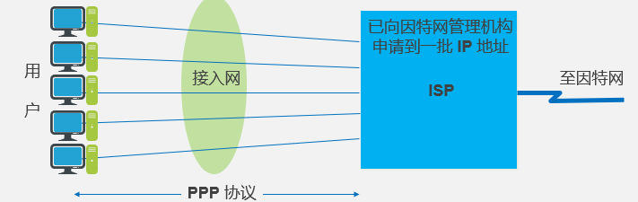
    -   全世界使用最多的点对点数据链路层协议为PPP协议
    -   使用电话线拨号上网就是使用PPP协议
-   PPP协议的特点
    -   简单(首要要求) 封装成帧 透明性 多网络协议 多链路类型 差错检测 检测连接状态
-   三个组成部分
    -   一个将 IP 数据报封装到串行链路的方法
    -   链路控制协议LCP
    -   网络控制协议NCP
-   PPP协议的帧格式
    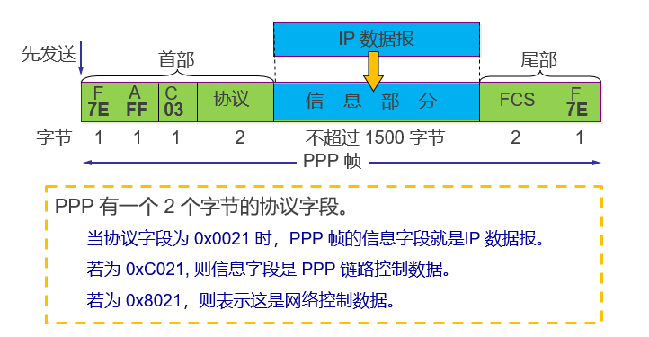
    -   标志字段F=0x7E
    -   地址字段0xFF(全1) 实际上没有用
    -   控制字段一般为0x03
    -   PPP协议面向字节 所以所有PPP协议都是整数字节
-   透明传输问题
    -   当PPP在同步链路传输时,规定采用硬件完成比特填充
    -   当PPP用于异步传输时,需要使用特殊字符填充法
        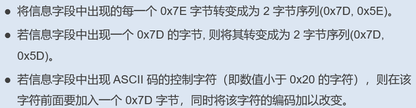
    -   0比特填充
        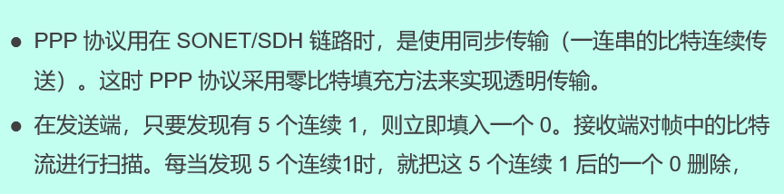
        
-   PPP工作状态
    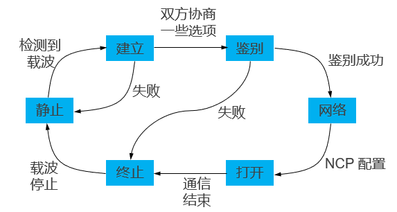
    -   当用户拨号接入ISP 路由器的调制解调器对拨号做出确认,建立物理连接  获取到一个随机的IP(NCP分配)
    -   PC向路由器发送一系列LCP分组(封装成多个PPP帧)
    -   这些分组及其相应选择一些PPP参数,和进行网络层配置 NCP给接入的PC机临时分配一个IP地址,使PC机成为因特网上的一个主机
    -   通信完毕 NCP释放网络层连接,收回IP地址 LCP释放数据链路层连接 最后断开物理层连接

### 使用广播信道的数据链路层

-   媒体接入控制
    -   静态划分信道
        -   频分多址 时分多址 码分多址
    -   动态媒体接入控制(多点接入)
        -   随机接入(如以太网) : 如何减少冲突 冲突后怎么办
        -   受控接入(如令牌环或轮询): 在集中或分布式控制下轮流接入
-   局域网
    -   概述
        -   网络为一个单位所有,地理范围和站点数目都有限
        -   最初只是为了连接单位内部计算机,方便访问各种硬件等资源
        -   现今局域网范围扩大 资源变多
    -   拓补结构
        -   星型 总线型 环形 树形 等..
    -   体系结构
        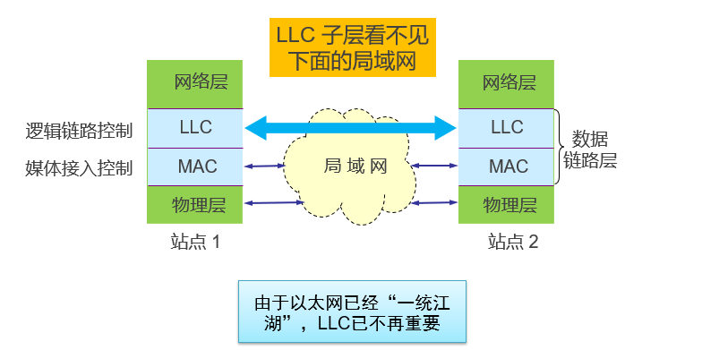
        -   两个子层: 
            -   逻辑链路控制LLC子层  媒体接入控制MAC子层 
            -   与接入到传输媒体有关的内容都放在 MAC子层，而 LLC 子层则与传输媒体无关，不管采用何种协议的局域网对 LLC 子层来说都是透明的 
    -   网络适配器
        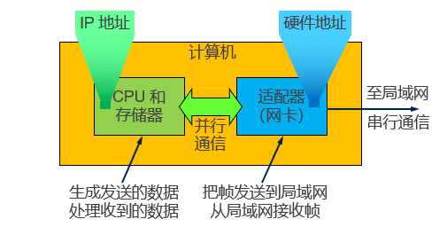
        -   网络接口板又称为通信适配器或网络接口卡  通常叫做网卡
        -   功能
            -   进行串行/并行直接按的转换
            -   对数据进行缓存
            -   在计算机的操作系统安装驱动程序
            -   实现对应的以太网协议
    -   MAC地址(EUI-48)
        -   在局域网中 硬件地址又称为物理地址(或者MAC地址) 不随位置变化而变化
        -   MAC地址是48位  (IPv4 32位 IPv6 128位)
        -   IEEE的注册管理机构负责向厂家分配地址字段的前三个字节(高24位) 
        -   后三个字节(低24位) 由厂家自行指派 称为扩展标识符
        -   适配器检查MAC地址
            -   适配器收到一个MAC帧首先使用硬件检查MAC帧中的MAC地址
                -   如果是发往本站即收下再处理
                -   如果不是发往本站则不进行处理
            -   发往本站的帧包含三种情况
                -   单播帧(点对点)  广播帧(点对全体)  多播帧(点对多)

### 共享式以太网

-   两个标准: 
    -   DIX Ethemet V2 / IEEE的8.2.3标准 因为区别小简称 以太网 具体应该偏向前者
-   CSMA/CD协议
    -   最初以太网将许多计算机都连接到一条总线上
        -   当初认为简单可靠, 总线上没有源器件
        -   以太网的广播方式发送
            -   总线上每一个计算机都能检测到其他计算机发送的数据信号
            -   只有对应首部一样计算机地址的计算机才接受数据 其他计算机不接受数据
            -   实现广播特性总线上实现点对点通信
        -   为了通信简便采取的措施
            -   采用灵活的无连接工作方式 即不必先建0立连接就直接发送数据
            -   对帧不进行编号 不要求对方发回确认
                -   理由:局域网信道质量好 出错概率小
        -   以太网提供的服务
            -   以太网尽可能努力交付 可能不是可靠的交付
            -   当目的站收到有错数据帧则进行丢弃 差错处理由高层决定
            -   高层判定出错,直接进行重传 以太网认为是一个新的数据帧
            -   发送数据使用曼彻斯特编码
                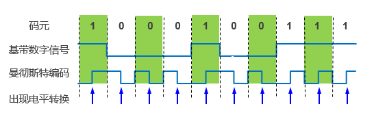
    -   载波监听多点接入/碰撞检测
        -   多点接入: 多计算机以多点接入的方式连接再一根总线上
        -   载波监听: 每一个站发送数据前检测总线上是否由其他计算机在发送数据 如果有,为避免冲突则暂时不发送
            -   使用电子技术检测总线上是否有其他计算机发送的信号
    -   碰撞检测
        -   计算机边发送数据边检测信道上信号电压的大小
        -   多个站发送数据 总线信号电压摆动值增加
        -   如果摆动超过一定范围 则证明有其他站点进行发送数据 表明发生碰撞
        -   碰撞即冲突 会使信号产生严重失真 变成无用帧
        -   发生碰撞时,需要立即停止发送数据 避免浪费资源 等待一段时间再检测发送
    -   电磁波在总线上的有限传播速率影响
        -   发送的时候也需要检测 电磁波有时延
        -   碰撞的结果就是两个帧都变无用
    -   传播时延对载波监听的影响
        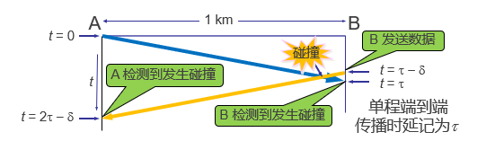
        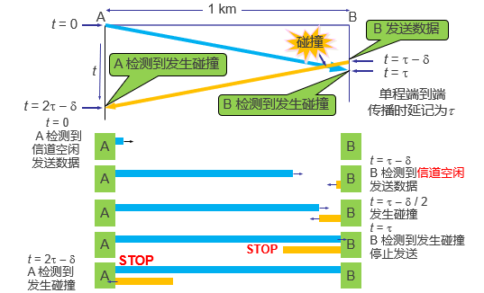
        -   争用期
            -   最先发送数据帧的站 在发送数据帧后最多经过2倍往返时延(争用期)就可以知道数据帧是否遭到碰撞
            -   这个两倍往返时延(2tao)就是争用期 或碰撞窗口
            -   经过两倍往返时延则没有检测碰撞 则说明这次发送没有碰撞
        -   以太网约定: 
            -   每一个帧都要大于64字节 否则检测不到碰撞(发送不足64字节则进行填充)
            -   以太网取51.2微妙为争用期长度
            -   对10Mb/s的以太网下 争用期内可以发送512bit即64字节
            -   在以太网发送数据时,若前64字节没有碰撞则后续数据就不会发生冲突
        -   二进制指数类型退避算法
            -   发生碰撞的站再停止发送数据后 要推迟(退避)一个随机事件才能发送数据
            -   重传16次仍不能成功则丢弃该帧并向上层报告
        -   强化碰撞:
            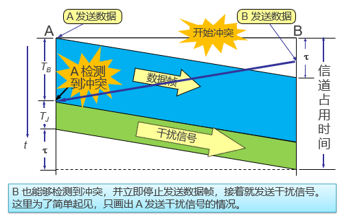
            -   当发送数据站一旦发生碰撞
                -   立即停止发送数据
                -   发送若干比特的认为干扰信号 让其他节点知道已经发生碰撞
        -   CSMA/CD协议不适合用于广域网
            -   使用CSMA/CD协议的以太网不能进行全双工通信 只能进行半双工通信
            -   发送数据的一小段时间内都有存在碰撞的可能性
            -   多个站点连接 则平均吞吐量会减小
            -   网络覆盖范围大 时延就大 争用期就大 发生碰撞概率越大 性能越差
-   共享式以太网信号利用率
    -   以太网信道被占用情况
        -   争用期长度为 2*t*，即端到端传播时延的两倍。检测到碰撞后不发送干扰信号。
        -   帧长为 *L* (bit)，数据发送速率为 *C* (b/s)，因而帧的发送时间为 *L*/*C* = *T*0 (s)。 
        -   一个帧从开始发送，经可能发生的碰撞后，将再重传数次，到发送成功且信道转为空闲(即再经过时间 *t* 使得信道上无信号在传播)时为止，是发送一帧所需的平均时间。
            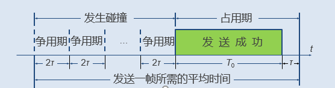
    -   信道利用率a
        -   发生碰撞会浪费资源 提出信道利用率
        -   定义为 以太网单程端到端时延与发送时间之比
        -   发送时间基本不变 因为帧固定
        -   理想化情况: 所有数据不发生碰撞 需要特殊调度算法 即总线一旦空闲就发送数据 极限信道利用率S = 1/(1+a)
    -   结论
        -   当网络覆盖范围越大，既端到端时延越大，信道极限利用率越低，即网络性能越差。
        -   另外，端到端时延越大或连接的站点越多，都会导致发生冲突的概率变大，网络性能还会进一步降低。
        -   共享式以太网只能作为一种局域网技术
-   使用集线器星型拓补
    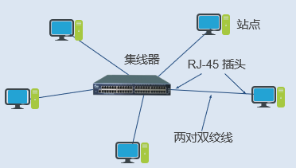
    -   传统以太网采用星形拓扑，在星形的中心则增加了一种可靠性非常高的设备，叫做集线器 内部是总线 工作在物理层 100m以下
    -   10BASE-T(10M/s BASE未调制 T双绞线)
        -   不用电缆而使用无屏蔽双绞线。每个站需要用两对双绞线，分别用于发送和接收。
        -   集线器使用了大规模集成电路芯片，因此这样的硬件设备的可靠性已大大提高了
    -   集线器使用使用电子器件模拟电缆线的工作 仍是一个总线网 共享逻辑上总线 采用广播方式 工作在物理层
-   以太网帧格式
    -   常用的以太网MAC帧格式有两种标准 ：
        -   DIX Ethernet V2 标准
        -   IEEE 的 802.3 标准
    -   最常用的 MAC 帧是以太网 V2 的格式。
    -   格式图示
        
    -   无效MAC帧
        -   ...P81
    -   帧最小间隔
        -   最小间隔是9.6微秒 相当于96bit发送的时间
        -   一个站在检测总线空闲后,还要等待9.6微秒才能再次发送数据
        -   帧间间隔用于接收方检测一个帧的结束 同时其他站点平等竞争发送数据

### 网桥和以太网交换机

-   在物理层扩展以太网
    -   主机使用光纤和一对光纤调制解调器连接到集线器
        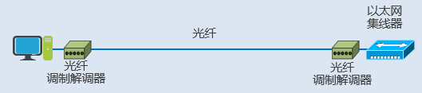
    -   独立碰撞域
        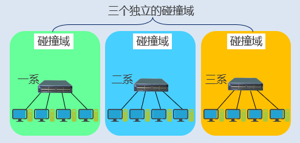
        -   会造成性能下降
    -   使用集线器组成更大以太网碰撞域
        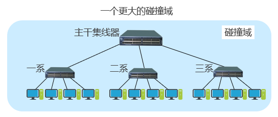
        -   优点
            -   使原来属于不同碰撞域的局域网上的计算机能够进行跨碰撞域的通信 扩大了局域网覆盖的地理范围。
        -   缺点
            -   总的吞吐量并未提高。
            -   如果不同的碰撞域使用不同的数据率，那么就不能用集线器将它们互连起来。 
            -   由于争用期的限制，并不能无限扩大地理覆盖范围
    -   网桥
        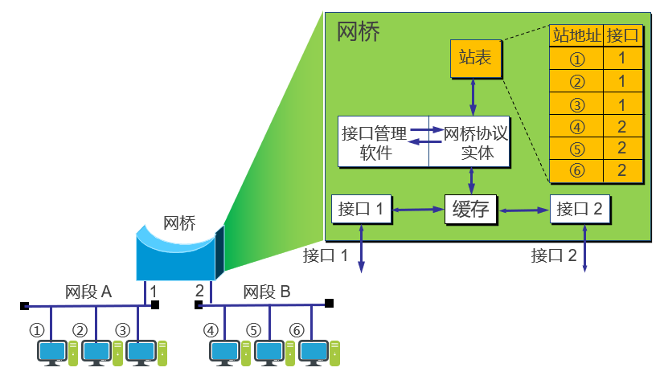
        -   使用网桥在数据链路层扩展以太网
        -   网桥工作在数据链路层 使用MAC帧的 目标地址对收到的帧进行准转发
        -   网桥有过滤帧的功能 网桥不会向所有接口转发此帧 它检查目标MAC地址,再确定转发到哪个接口
        -   实质就是对帧进行了存储转发
        -   经过网桥时,源地址不变 目的地址会改变
        -   优势
            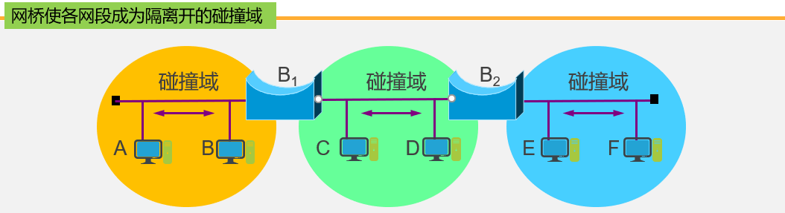
            -   形成了小碰撞域,速率更快
            -   过滤通信量
            -   扩大物理范围
            -   提高可靠性
            -   可以连接不同物理层 不同MAC 不同速率 的局域网
        -   不足
            -   存储转发增加时延
            -   再MAC子层没有流量控制功能
            -   具有有不同MAC子层的网桥桥接在一起时延更大
            -   网桥适合用户数不多的通信量和不大的局域网 否则可能会造成广播风暴(发一个不存在的地址的帧导致找不到而无限广播 使用路由器可以检测隔离网络风暴 路由器不会发送广播帧)
        -   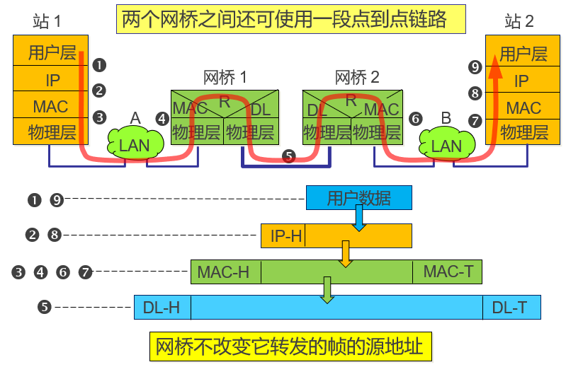
        -   网桥和集线器(或转发器)不同
            -   集线器在转发帧时不进行传输媒体检测
            -   在转发帧之前必须执行CSMA/CD算法 发生碰撞比如停止并退避
        -   透明网桥
            -   目前最多的网桥是透明网桥
            -   这个透明表示局域网上的站点并不知道所发送的帧将经过那几个网桥
            -   容易安装 但是网络资源利用不充分
            -   透明网桥是一个即插即用设备 标准为IEEE 802.1D 
        -   网桥自学习算法处理收到和建立转发表
            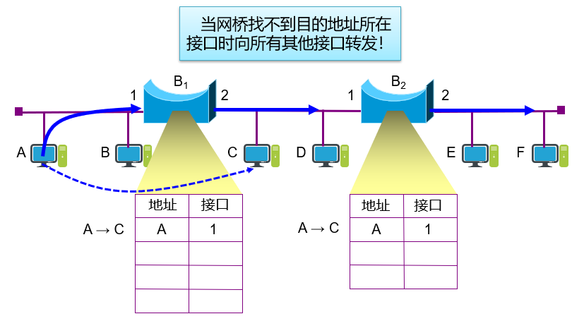
            -   在网桥的转发表中写入的信息除了地址和接口 还有帧进入该网桥的时间
            -   因为网络拓补结构的变化 站点可能更换适配器(改变站点地址) 以太网上的工作站并非总是通电
            -   记录到达网桥的时间登记 就可以保留拓补结构的最新状态信息
            -   步骤归纳
                -   先进行自学习 查找转发表中是否有匹配项 没有就进行学习 有就进行更新
                -   转发帧 查找转发表中是否与收到帧的目的地址有相匹配的项目
                    -   没有则进行广播
                    -   有则按照接口进行转发
                    -   如果转发表中的接口就是该帧继续如网桥接口 应该丢弃该帧
            -   生成树协议 避免帧在网络中兜圈子
                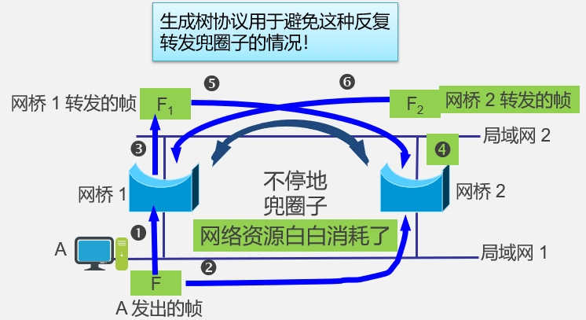
                -   互联在一起的网桥彼此通信找出原来网络拓补的一个子集 子集里,设备存在回路,逻辑上不存在回路
                -   网桥会关闭不在生成树上的那些接口确保不存在回路
                -   生成树上的根网桥每隔一段时间要对生成树的拓补进行更新
            -   源路由网桥
                -   源路由(source route)网桥在发送帧时将详细的路由信息放在帧的首部中。
                -   源站以广播方式向欲通信的目的站发送一个发现帧，每个发现帧都记录所经过的路由。
                -   发现帧到达目的站时就沿各自的路由返回源站。源站在得知这些路由后，从所有可能的路由中选择出一个最佳路由。凡从该源站向该目的站发送的帧的首部，都必须携带源站所确定的这一路由信息。  
            -   以太网交换机
                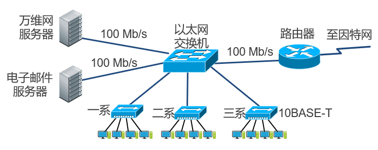
                -   交换式集线器 可以明显提高局域网网络性能
                -   交换式集线器常称为以太网交换机(switch)或第二层交换机（表明此交换机工作在数据链路层）。
                -   以太网交换机通常都有十几个接口。因此，以太网交换机实质上就是一个多接口的网桥，可见交换机工作在数据链路层
                -   特点
                    -   以太网交换机的每个接口都直接与主机相连，并且一般都工作在全双工方式。
                    -   交换机能同时连通许多对的接口，使每一对相互通信的主机都能像独占通信媒体那样，进行无碰撞地传输数据。 
                    -   以太网交换机由于使用了专用的交换结构芯片，其交换速率较高。  
                    -   交换机之间不会碰撞
                    -   独占传输媒体的带宽
                        -   集线器带宽共用,每个端口分到指定速率的n分之一 交换机端口速率就是指定速率
            -   虚拟局域网
                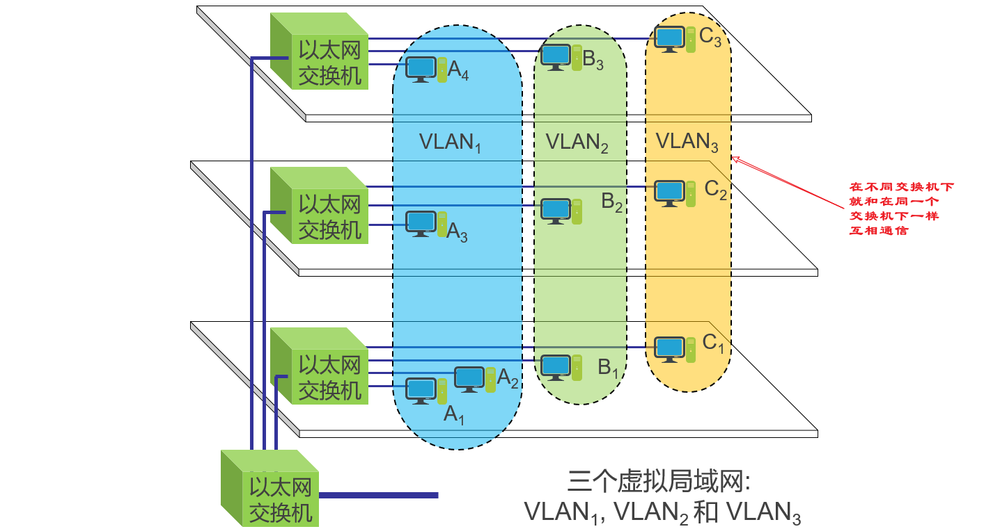
                -   交换机可以很方便地实现虚拟局域网。
                -   管理员可以将连接在交换机上的站点按需要划分为多个与物理位置无关的逻辑组，每个逻辑组就是一个VLAN。
                -   属于同一VLAN的站点之间可以直接进行通信，而不属于同一VLAN的站点之间不能直接通信
                -   连接在同一交换机上的两个站点可以属于不同的VLAN，而属于VLAN中的两个站点可能连接在不同的交换机上。
                -   交换见直连需要指定为trunk模式
                -   优点
                    -   简化网络管理。当站点从一个工作组迁移到另一个工作组时，仅需调整VLAN配置即可。'
                    -   '控制广播风暴。VLAN将大的局域网分隔成多个独立的广播域。 可以限制广播帧的传播避免性能恶化
                    -   增强网络的安全性。便于管理员根据用户的安全需要隔离VLAN间的通信。
                -   虚拟网协议
                    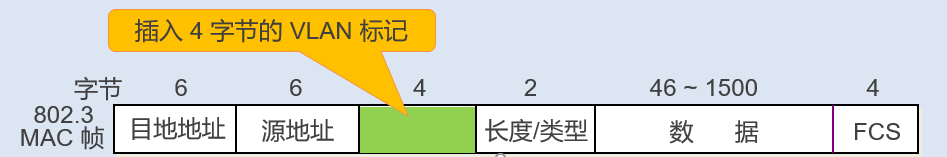
                    -   虚拟局域网协议允许在以太网的帧格式中插入一个 4 字节的标识符，称为 VLAN 标记(tag)，用来指明发送该帧的工作站属于哪一个虚拟局域网。
                    -   802.1Q标准虽然修改了以太网的帧格式，但对所有用户站点是完全透明的，802.1Q标记帧仅在交换机间各VLAN复用的Trunk链路上使用。

### 以太网的演进 (略)

### 无线局域网

-   无线局域网组成
    -   有固定设施的无线局域网
    -   最有名 IEEE 802.11
        -   实际上802.11既支持有固定基础设施的网络，也支持无固定基础设施的网络，但使用最多的是它的有固定基础设施的组网方式
        -   凡使用802.11系列协议的局域网又称为Wi-Fi（Wireless Fidelity，即无线保真度）
-   与接入点AP进行关联
    -   如果要加入基本服务集BSS 需要和接入点AP获得连接 连接后就形成了一个虚拟线路
    -   只有关联的 AP 才向这个移动站发送数据帧，而这个移动站也只有通过关联的 AP 才能向其他站点发送数据
-   关联方法
    -   被动扫描，即移动站等待接收接入站周期性发出的信标帧(beacon frame)。 信标帧中包含有若干系统参数（如服务集标识符 SSID 以及支持的速率等）。
    -   主动扫描，即移动站主动发出探测请求帧(probe request frame)，然后等待从 AP 发回的探测响应帧(probe response frame)
-   热点hot spot 热点/热区
-   移动自组网 自组网络
    -   自组网络是没有固定基础设施（即没有 AP）的无线局域网。这种网络由一些处于平等状态的移动站之间相互通信组成的临时网络
-   802.11 的物理层有以下几种实现方法：
    -   直接序列扩频 DSSS
    -   正交频分复用 OFDM 
    -   跳频扩频 FHSS （已很少用）
    -   红外线 IR （已很少用）
-    802.11 的MAC协议
    -   CSMA/CS协议
        -   无线局域网不能简单地搬用 CSMA/CD 协议。对于无线信道，接收信号强度往往会远远小于发送信号强度。如要在无线局域网的适配器上实现碰撞检测，对硬件的要求非常高,即使我们能够实现碰撞检测的功能，并且当我们在发送数据时检测到信道是空闲的，在接收端仍然有可能发生碰撞（隐蔽站问题）
    -   只能使用CSMA改进的协议(CSMA/CA),在原基础上增加一个碰撞避免(CA)的功能,还增加使用停止等待协议
-   帧间间隔
    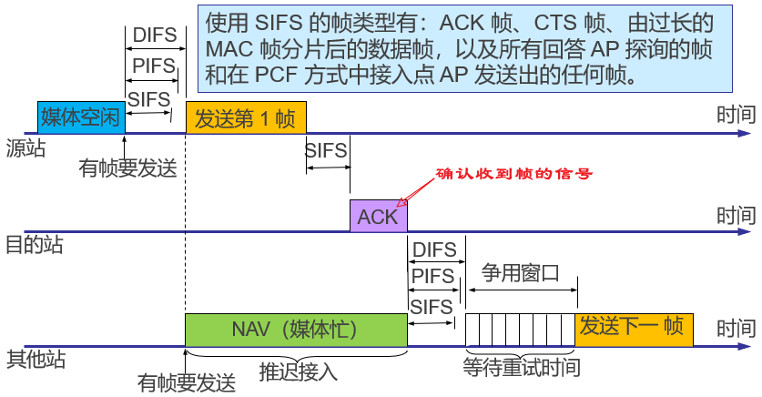
    -   所有的站在完成发送后，必须再等待一段很短的时间（继续监听）才能发送下一帧。这段时间的通称是帧间间隔 IFS (InterFrame Space)。
    -   帧间间隔长度取决于该站欲发送的帧的类型。高优先级帧需要等待的时间较短，因此可优先获得发送权。
    -   目的是为了减少碰撞的机会
    -   SIF 短帧间间隔 / PIF 点协调功能帧间间隔 / DIF 分布协调功能帧间间隔   时间依次增加
    -   为什么发送之前还需要等待: 考虑可能其他信道有更加高优先级的帧需要发送
-   P152-158
-   信号预约
    -   允许要发送数据的站对信道进行预约
    -   携带预约帧 没有具体信号 但是包括源地址,目的地址和持续时间
    -   为了避免冲突而非发生后再解决
-   发送帧
    
    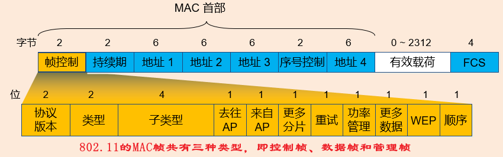
-   其他无线网络
    -   在个人工作地方把属于个人使用的电子设备用无线技术连接起来自组网络，不需要使用接入点 AP。
    -   整个网络的范围大约在 10 m 左右。
    -   蓝牙 (Bluetooth) 系统（802.15）
    -   超宽带UWB (Ultra-Wide Band)（802.15.3）
    -   无线城域网 WMAN(802.16)
        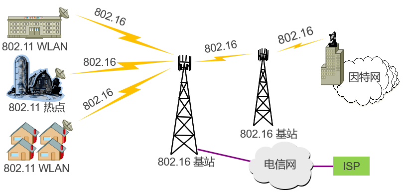

## 第五章 网络层和网络互联

-   重点内容:
    -   虚拟互联网的概念
    -   IP地址与物理地址之间的关系
    -   传统分类的IP地址 和无分类域间路由选择CIDR
    -   路由器选择协议的工作原理

#### 网络层概述

-   分组转发和路由选择
    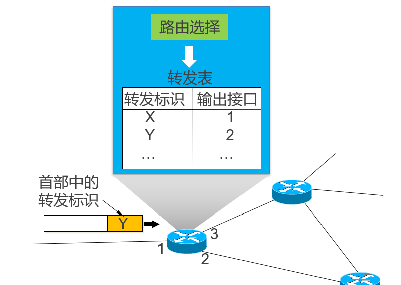
-   网络层提供的两种服务
    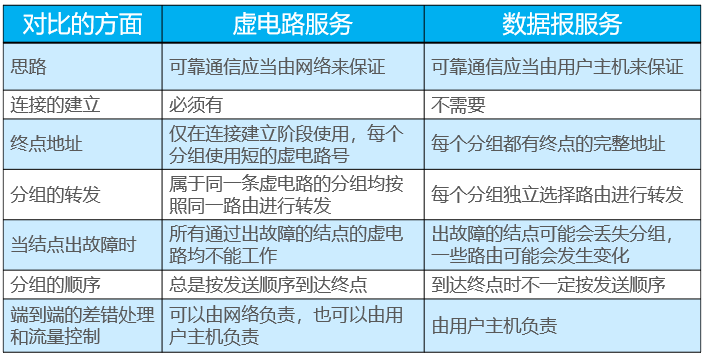
    -   面向连接和无连接 两种服务
    -   电信网的成功经验让网络负责可靠交付
        -   面向连接的通信方式
        -   建立虚电路 保证双方通信所需的一切资源
            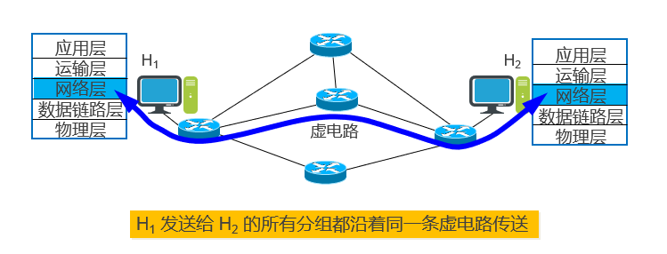
            -   虚电路表示这只是一条逻辑上的连接，分组都沿着这条逻辑连接按照存储转发方式传送，而并不是真正建立了一条物理连接。
            -   请注意，电路交换的电话通信是先建立了一条真正的连接。因此分组交换的虚连接和电路交换的连接只是类似，但并不完全一样。 
        -   如果再使用可靠传输的网络协议,就可以使所发送分组无差错按序到达终点
-   因特网的设计思路
    -   网络层向上只提供简单灵活的、无连接的、尽最大努力交付的数据报服务。 所以可能出现无序/丢包等情况
    -   网络在发送分组时不需要先建立连接。每一个分组（即 IP 数据报）独立发送，与其前后的分组无关（不进行编号）。
    -   网络层不提供服务质量的承诺。即所传送的分组可能出错、丢失、重复和失序（不按序到达终点），当然也不保证分组传送的时限。
        -   通过高层传输协议保证
-   数据报服务
    -   携带目的站点和源站点信息 通过路由进行路由选择
        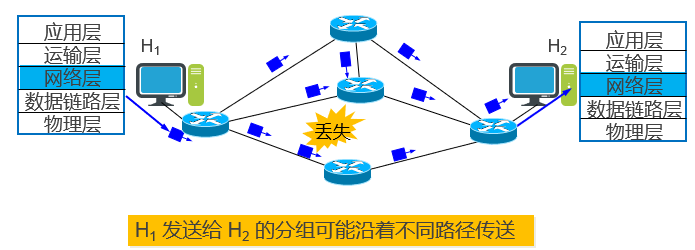
-   虚电路网络
    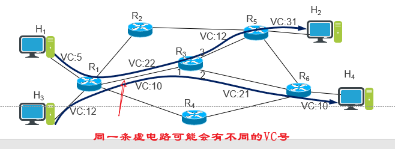
    -   源和目的主机之间的路径（即一系列链路和路由器）；
    -   VC号，沿着该路径的每段链路一个号码；
    -   沿着该路径的每台路由器（即虚电路交换机，这里我们统一使用路由器这一名称）中的转发表表项。
    -   中间路由转发分组必须使用新的VC号代替原来的VC号
        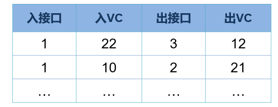 

#### 网际协议IP

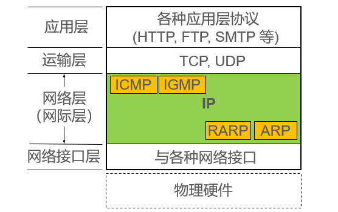

-   网际协议 IP 是 TCP/IP 体系中两个最主要的协议之一 
-   配合IP协议还有另外几个协议
    -   地址解析协议 ARP
    -   逆地址解析协议 RARP 
    -   网际控制报文协议 ICMP  
    -   网际组管理协议 IGMP  
-   异构网络互联
    -   需要解决多种问题
-   互联需要多类设备进行互联 中间设备
    -   转发器
    -   网桥 桥接器
    -   路由器
    -   网关
-   互联网与虚拟互联网
    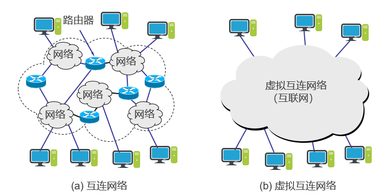
    -   看起来像一个统一的网络
    -   使用 IP 协议的虚拟互连网络可简称为 IP 网。
    -   使用虚拟互连网络的好处是：当互联网上的主机进行通信时，就好像在一个网络上通信一样，而看不见互连的各具体的网络异构细节。 
         
        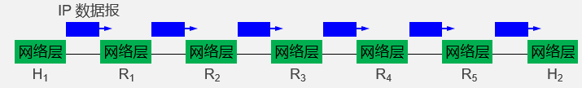
-   IP地址
    -   IP 地址就是给每个连接在因特网上的主机（或路由器）分配一个在全世界范围是唯一的 32 位的标识符
    -   IP 地址现在由因特网名字与号码指派公司ICANN (Internet Corporation for Assigned Names and Numbers)进行分配 
    -   编址方式
        -   分类编址。这是最基本的编址方法，在 1981 年就通过了相应的标准协议。
            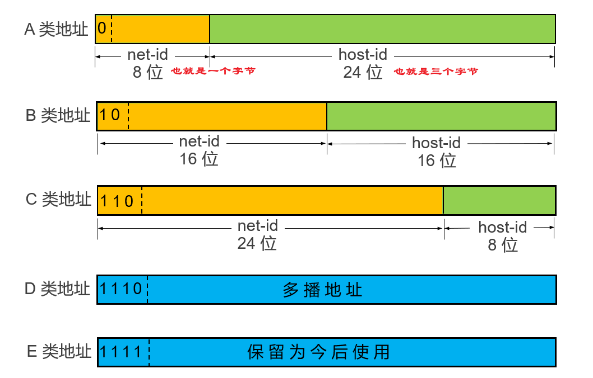
            
            -   net-id 网络号 标志该主机连接到的网络 host-id 主机号标志该主机
            -   IP 地址 ::= { <网络号>, <主机号>}    (其中::表示定义为)
        -   划分子网。这是对最基本的编址方法的改进，其标准[RFC 950]在 1985 年通过。
            -   从 1985 年起在 IP 地址中又增加了一个“子网号字段”，使两级的 IP 地址变成为三级的 IP 地址
            -   单位对内划分子网 对外仍然表现为没有划分子网的网络
            -   从主机号借用若干个位作为子网号 subnet-id，而主机号 host-id 也就相应减少了若干个位
            -   IP地址 ::= {<网络号>, <子网号>, <主机号>}    
        -   无分类编址。这是目前因特网所使用的编址方法。1993 年提出后很快就得到推广应用。
            -   应对IP地址可能会分配完的问题 使用子网掩码  变长子网掩码 VLSM可进一步提高 IP 地址资源的利用率
            -   在VLSM基础上又进一步研究出无分类编址方法，它的正式名字是无分类域间路由选择 CIDR 
            -   取消了IP地址分类,更加有效分配IP地址 使用前缀来代替网络号和子网号 IP地址从三级编址回到两极编址
            -   IP地址 ::= {<网络前缀>, <主机号>}      
            -   使用子网掩码(subnet mask)可以找出 IP 地址中的网络部分(网络前缀)
                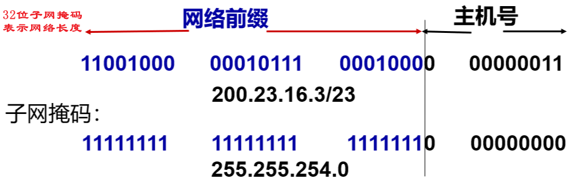
            -   CIDR记法 还有其他记法
                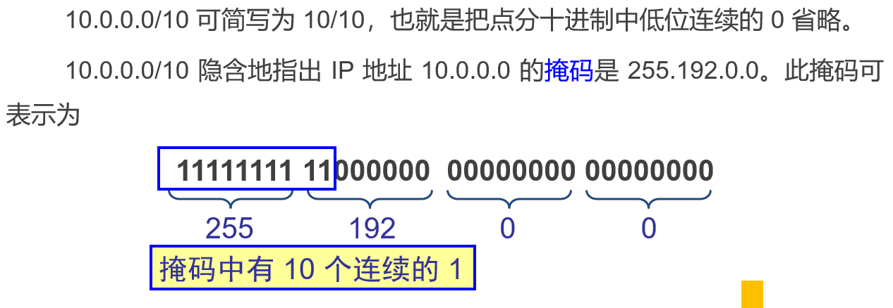
            -   默认掩码
                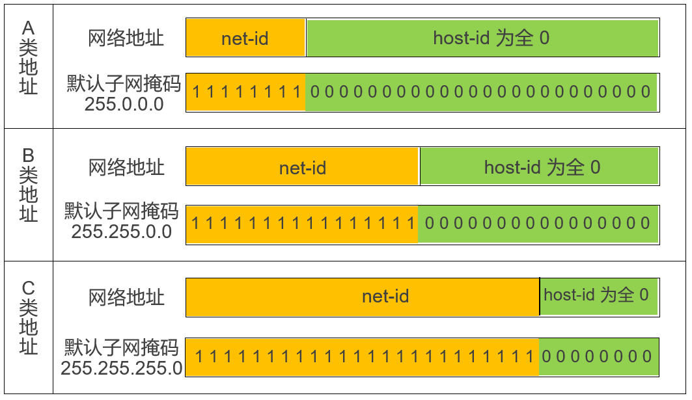
            -   题目
                -   已知IP和掩码求网络地址
                    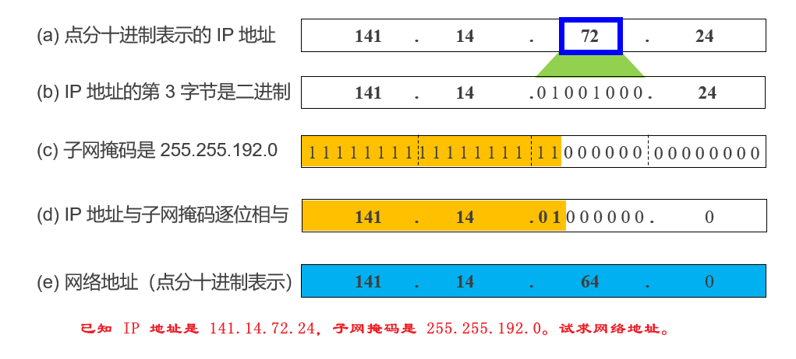
                -   求最大地址和最小地址
                    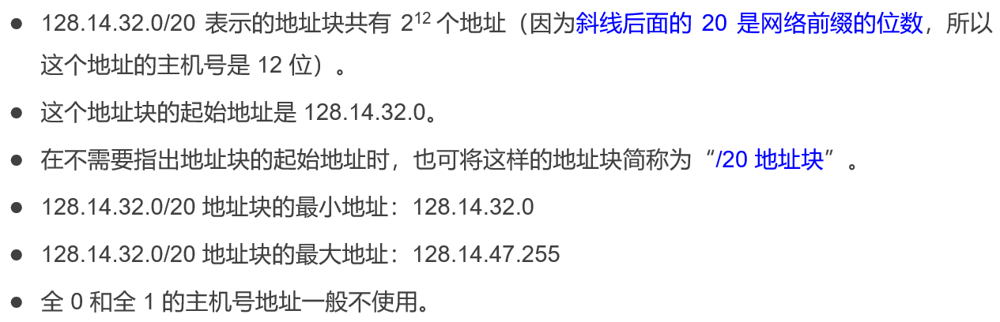
                    -   本题中前缀都是一样的 主机号12位 从全0到全1即位最小和最大地址
                -   划分举例
                    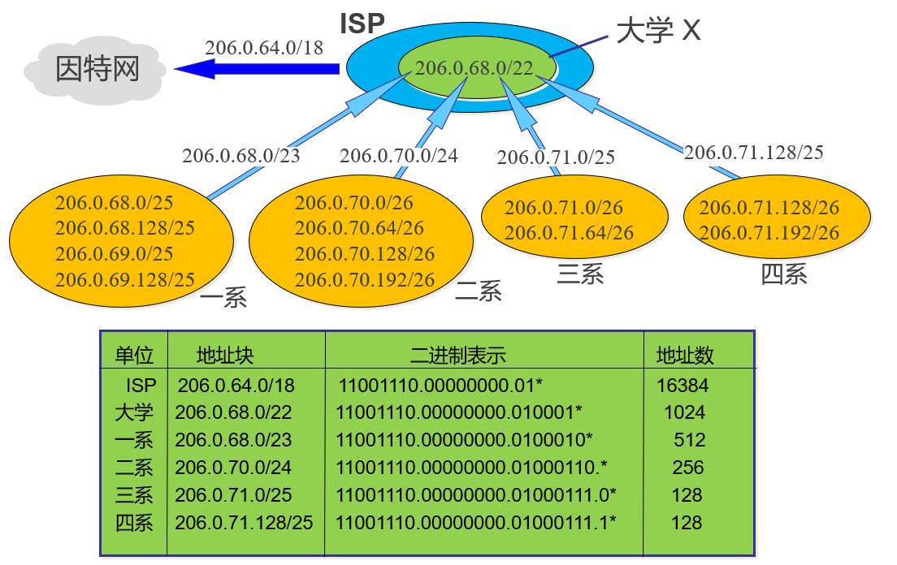
            -   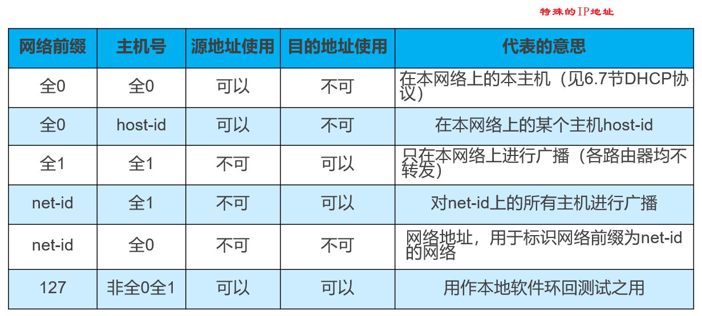
-   互联网中的IP地址
    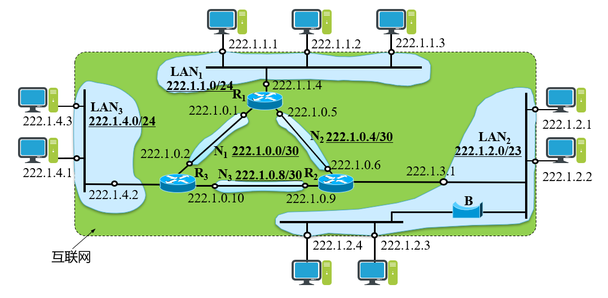
    -   由路由器互连起来的每个网络有一个唯一的网络前缀（由IP地址和子网掩码共同确定）。主机号为全0的IP地址常表示该网络的网络地址
    -   各网络的子网掩码可以不同，即网络前缀的长度可以不同，因此各自的地址空间大小也不相同。
    -   连接在同一个网络上的主机或路由器的IP地址的网络前缀必须与该网络的网络前缀一样。
    -   用网桥（它只在链路层工作）互连的网段仍然是一个网络，只能有一个网络地址或网络前缀
    -   主机号全为0和全为1的IP地址有特殊用途（后面将要介绍），不能分配给主机或路由器使用
    -   当两个路由器直接相连时（例如通过一条租用线路），在连线两端的接口处，可以分配也可以不分配IP地址。
-   物理地址(也称为硬件地址)
    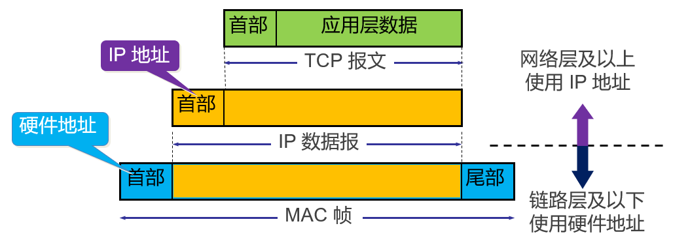
    
    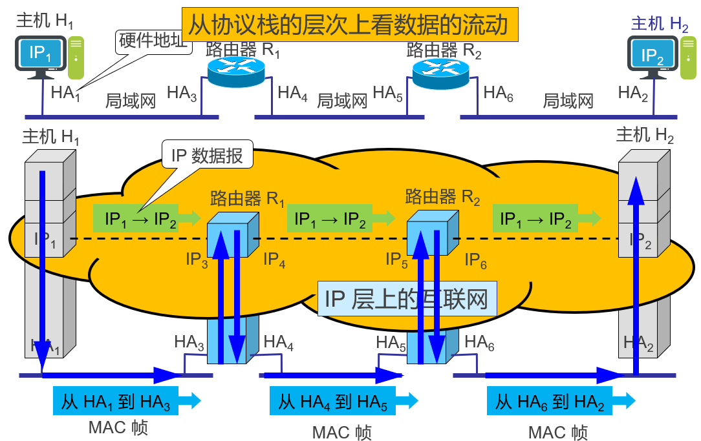
    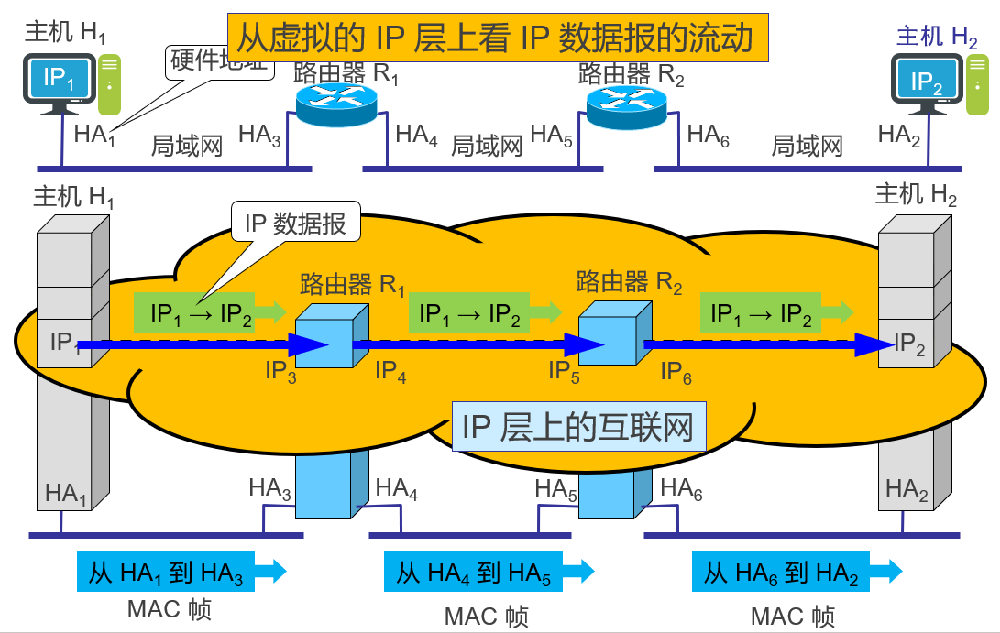
    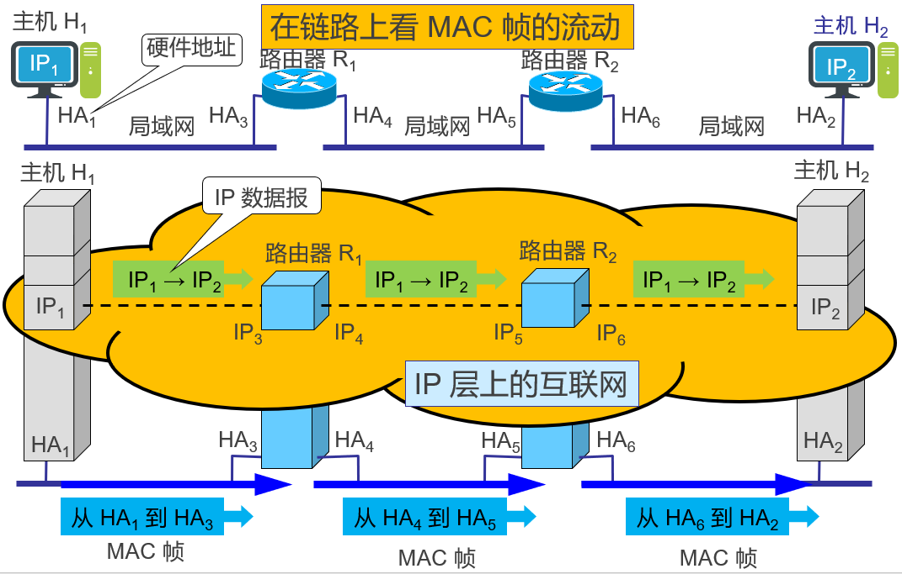
    -   在 IP 层抽象的互联网上只能看到 IP 数据报图中的 IP1**→**IP2 表示从源地址 IP1 到目的地址 IP2 两个路由器的 IP 地址并不出现在 IP 数据报的首部中 
    -   路由器只根据目的站的 IP 地址的网络号进行路由选择 
    -   在具体的物理网络的链路层 只能看见 MAC 帧而看不见 IP 数据报 
    -   IP层抽象的互联网屏蔽了下层很复杂的细节 在抽象的网络层上讨论问题，就能够使用统一的、抽象的 IP 地址研究主机和主机或主机和路由器之间的通信
-   地址解析ARP
    -   IP地址 -> ARP ->  物理地址
        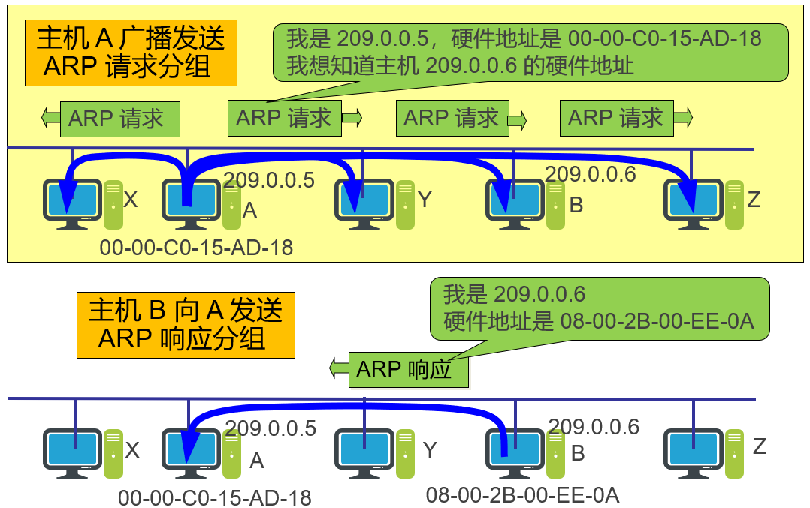
        -   每一个主机都设有一个 ARP 高速缓存(ARP cache)，里面有所在的局域网上的各主机和路由器的 IP 地址到硬件地址的映射表
            -   为了减少网络上的通信量，主机 A 在发送其 ARP 请求分组时，就将自己的 IP 地址到硬件地址的映射写入 ARP 请求分组
            -   当主机 B 收到 A 的 ARP 请求分组时，就将主机 A 的这一地址映射写入主机 B 自己的 ARP 高速缓存中。便于日后传输
            -   为保持新鲜性,每隔一段时间就会更新ARP表
        -   会遇到的问题
            -   ARP 是解决同一个局域网上的主机或路由器的 IP 地址和硬件地址的映射问题。
            -   如果所要找的主机和源主机不在同一个局域网上，那么就要通过 ARP 找到一个位于本局域网上的某个路由器的硬件地址，然后把分组发送给这个路由器，让这个路由器把分组转发给下一个网络。剩下的工作就由下一个网络来做。
            -   从IP地址到硬件地址的解析是自动进行的，主机的用户对这种地址解析过程是不知道的。
            -   当主机或路由器要和本网络上的另一个已知 IP 地址的主机或路由器进行通信，ARP 协议就会自动地将该 IP 地址解析为链路层所需要的硬件地址
            -   不可能直接通过硬件地址进行通信: 使网络上主机能相互通信并进行复杂通信几乎不可能
    -   物理地址 -> RARP -> IP地址
-   IP数据报
    -   IP数据报格式
        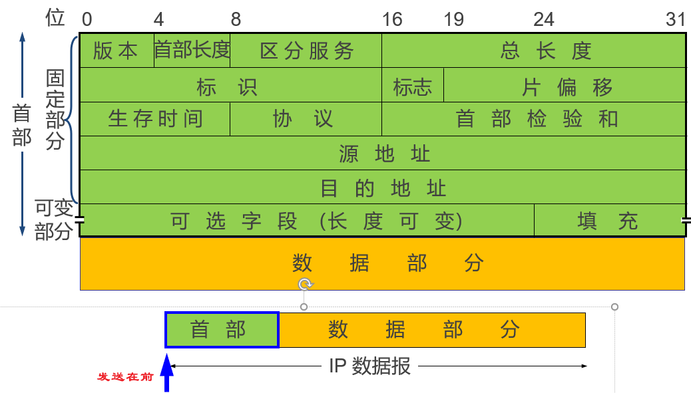
        -   由首部和数据两部分组成
        -   首部的前一部分是固定长度，共 20 字节，是所有 IP 数据报必须具有的
        -   在首部的固定部分的后面是一些可选字段，其长度是可变的 可以有其他功能(很少使用)
    -   IP数据报分片
        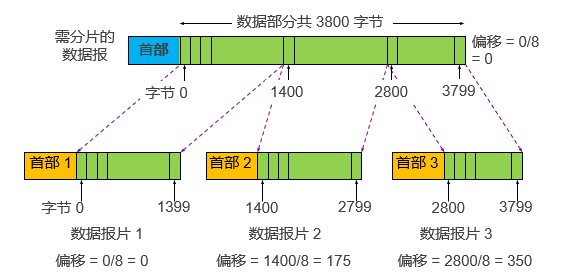
        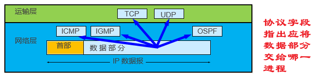
    -   IP数据报发送过程
        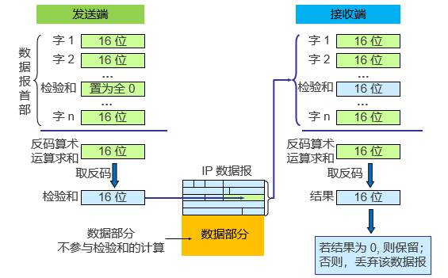
    -   IP数据报转发
        -   每一个A类网络通过几个路由器连接在一起,每一个网络上都可能有许多主机
        -   使用主机号制作路由表过于庞大 使用主机的网络地址来制作路由表,则能大大简化
-   路由
    -   路由表
        -   主要组成: 网络地址,子网掩码,下一跳,接口
            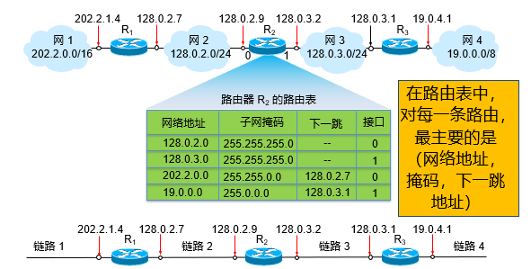
        -   查找路由表
            -   根据目的网络地址确定下一跳路由器
            -   IP最终一定能找到目的主机所在的目标网络上的路由器 中间可能通过多次间接交付
            -   只要到达最后一个路由,才试图向目的主机进行交付
        -   默认路由
            -   表示: 网络前缀0.0.0.0/0表示
            -   举例
                
                -   若目的网络不是N1或N2,则一律选择默认路由,把数据报先间接交付路由器R1,让R1转发下一个路由器
            -   路由器可以采用默认路由以减少路由表所占空间和搜索所占时间
            -   此转发方式在单网络仅很少的对外连接很有用 如果一个小网络和英特网连接这样最合适
        -   主机间发送数据过程 举例
            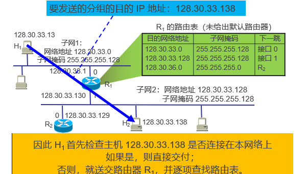
            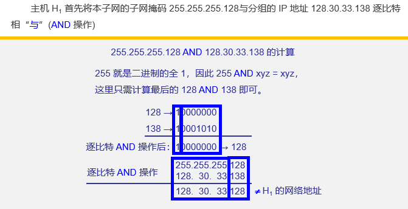
            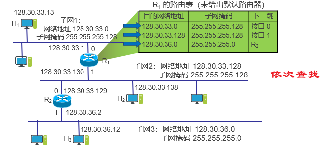
            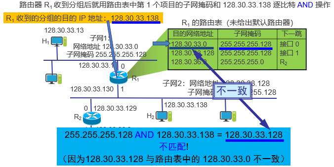
            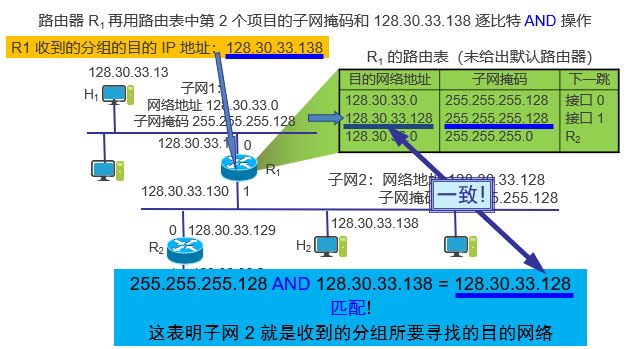
-   IP数据报转发流程
    1.  从收到的数据报首部提取目标IP地址
    2.  判断是否可以直接交付,如果可以则直接交付,转发任务结束,否则执行间接交付
    3.  对路由表中每一行(目的地址,掩码,下一跳,接口),使用其中的掩码和目标IP地址进行按位与操作,结果与改行网络地址匹配则传送数据到下一跳路由器,否则执行判断是否存在默认路由
    4.  判断路由表中是否存在一个默认路由,将数据传送给默认路由 否则报错
-   路由聚合
    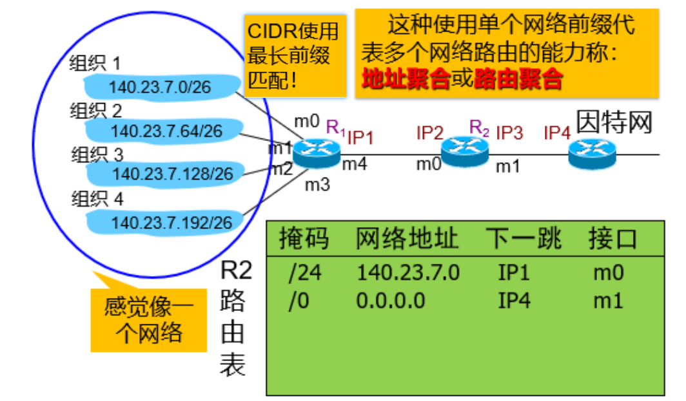
    -   在外看起来像一个网络
-   最长前缀匹配
    -   使用CIDR,查找路由表可能会得到不止一个匹配结果 应从匹配项中选出最长网络前缀的路由
    -   网络前缀越长,其地址块越小,因而路由越具体 最长前缀匹配又称最长匹配/最佳匹配
-   特定主机路由
    -   这种路由是为特定的目的主机指明一个路由 前缀为:特定主机IP/32的表项
    -   能够使管理人员更加方便控制,测试网络,保持高安全性
-   CIDR(无类别域间路由)
    -   特点
        -   消除传统分A/B/C类地址以及划分子网的概念,更有效分配IPv4地址空间
        -   使用不定长网络前缀代替分类地址中的网络号和子网号
        -   形式上二级编址,其实可以实现多级编址
        -   等级结构的CIDR地址块分配便于实现路由聚合

#### 网际控制报文协议ICMP

-   介绍
    -   为提高IP数据报交付成功的机会,忘记曾使用网际控制报文协议ICMP
    -   ICMP允许主机或路由器报告差错情况和提供有关异常报告情况
    -   ICMP为IP层协议,不是高层协议
    -   ICMP报文作为IP层数据报的数据　加上数据报的首部组成IP数据报进行发送
        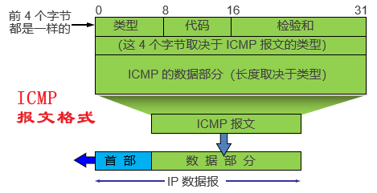
    -   ICMP报文的前4个字节是统一的格式,共有三个字段(类型,代码,检验和) 
-   分类: 与ICMP报文的后4个字节有关
    -   ICMP差错报告报文
        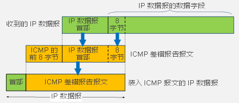
        -   来源: 改变路由/重定向 参数问题 超时 源点抑制 终点不可达
        -   不发送ICMP差错报文的几种情况
            -   对ICMP差错报告报文不在发送ICMP差错报告报文
            -   对第一个分片的数据报片的所有后续数据不发送ICMP差错报告报文
            -   对具有多播地址或特殊地址(127.0.0.1等)的数据 不发送ICMP差错报告报文
    -   ICMP询问报文
        -   回送请求和回答报文
        -   时间戳请求和回答报文
    -   不再使用的ICMP报文
        -   信息请求与回答报文 掩码地址请求和回答报文 路由器询问和通告报文
-   应用:
    -   ping命令 测试两个主机之间的连通性 使用ICMP回送请求与回送回答报文
    -   ping命令直接使用网络层ICMP,没有通过运输层的TCP或UDP
    -   tracert 查看转发路由

#### 因特网的路由器选择协议

-   基本概念

    -   理想路由算法
        -   算法必须正确完整,计算上应简单,能适应通信量和网络拓补的变化(自适应性)
        -   算法应该稳定,公平,最佳
    -   最佳路由
        -   不存在绝对最佳路由算法 只是特定条件相对合理的选择 应该尽可能接近理想算法
        -   最佳路由选择 难题
            -   是网络中所有节点共同协调工作的结果
            -   路由选择环境不断变化,且无法预知
            -   静态路由选择策略--非自适应路由选择,简单,开销小,不能及时适应网络状态变化
            -   动态路由选择策略--自适应路由选择,能够更好适应网络状态变化,实现相对复杂,开销相对大
    -   分层次的路由选择协议 (英特网)
        -   因特网规模大,路由间交换路由信息容易造成通信链路饱和
        -   自治系统(AS)
            -   在单一的技术管理下的一组路由器,使用一种AS内部路由选择协议和共同度量AS内/间的路由
            -   一个AS对其他AS表现出的是一个单一和一致的路由选择策略 (独立性)
            -   AS之间的路由选择也叫域间路由选择,AS内部路由选择叫做域内路由选择
    -   英特网两大路由选择协议
        -   内部网关协议 IGP 在一个AS内部使用的路由选择协议 例如RIP和OSPF协议
        -   外部网关协议 EGP 源主机和目标主机不处于同一AS中,需要AS间传输数据 例如BGP-4
-   内部网关协议

    -   工作原理

        -   路由信息协议RIP使内部网关协议IGP中最先得到广泛使用的协议

        -   RIP使一种分布式基于距离向量的路由选择协议

        -   RIP协议要求网络中每一个路由器都要维护它自己到其他每一个目的网路的距离记录

            -   距离的概念
                -   路由器直连网络定义距离1
                -   路由器到非直连网络距离使经过路由器数+1
                -   好的RIP协议应该距离尽量短 最多只能包含15个路由器 再多便判定为不可达
                -   RIP适用于小型互联网 不能在两个网络之间同时使用多条路由

        -   RIP协议的要点

            -   仅和相邻路由器交换信息
            -   交换信息是当前本路由器所知道的所有信息,即自己的路由表
            -   按照固定的时间间隔交换路由信息 为加快协议收敛速度,当网络拓补结构发生变化,路由器触发更新
    -   路由器交换信息遇到网络错误
                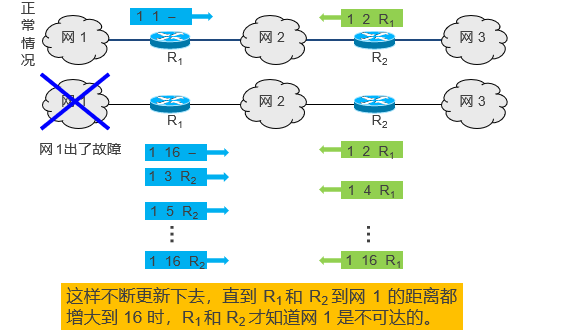

-   内部网关协议(OSPF)
    -   基本特点
        -   开放 不受某一家厂商控制 而是公开发表
        -   最短路径优先 使用最短路径算法SPF
        -   OSPF是分布式的链路状态协议
    -   要点
        -   向本自治系统所有路由发送共信息,使用红泛法
        -   发送的信息就是与本路由相邻的所有路由器的链路状态(路由知道的部分信息)
        -   只有当链路状态发生变化的时候路由器才用红泛法向所有路由发送信息

#### 路由器工作原理

#### VPN与NAT

#### 移动IP

#### 下一代网际协议IPv6

## 第六章 运输层

### 运输层协议概述

-   运输层向它上面的应用层提供通信服务 属于面向通信部分的最高层 也是用户功能最底层
    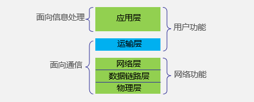
-   运输层位相互通信的应用提供逻辑通信
    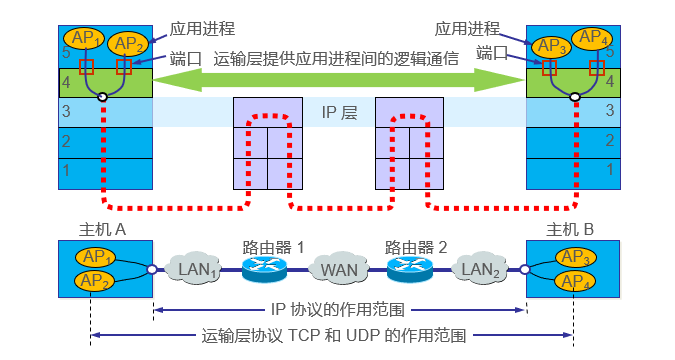
-   应用进程之间的通信
    -   主机之间通讯其实是应用通信 端到端通信
    -   运输层重要功能: 复用和分用
-   运输层协议和网络层协议区别
    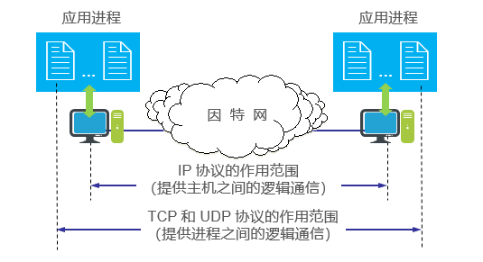
-   运输层主要功能
    -   运输层为应用进程之间提供端到端的逻辑通信（但网络层是为主机之间提供逻辑通信）。
    -   运输层还要对收到的报文进行差错检测。
    -   运输层可选功能 (可靠数据传输 流量控制 拥塞控制)
-   分类
    -   UDP协议 用户数据报协议 传输单元:tcp报文段
        -   在传送数据之前不需要先建立连接
        -   对方的运输层在收到 UDP 报文后，不需要给出任何确认
        -   高效
    -   TCP协议 传输控制协议 传输单元:UDP报文/用户数据段
        -   TCP 要提供可靠的、面向连接的运输服务，因此不可避免地增加了许多的开销
        -   不提供多播 只允许点对点
    -   更多区别
        -   IP 数据报要经过互连网中许多路由器的存储转发，但 UDP 用户数据报是在运输层的端到端抽象的逻辑信道中传送的。
        -   TCP 报文段是在运输层抽象的端到端逻辑信道中传送，这种信道是可靠的全双工信道。但这样的信道却不知道究竟经过了哪些路由器，而这些路由器也根本不知道上面的运输层是否建立了 TCP 连接
-   运输层的复用和分用
    -   复用  在发送方不同的应用进程都可以使用同一个运输层协议传送数据(加上首部)
    -   分用  接收方的运输层在剥去报文的首部后能够把这些数据正确交付到目的应用进程
    -   将数据准确给应用需要给予一个明确标志 也就是端口号
    -   端口
        -   也就是运输层地址 标志应用层的进程
            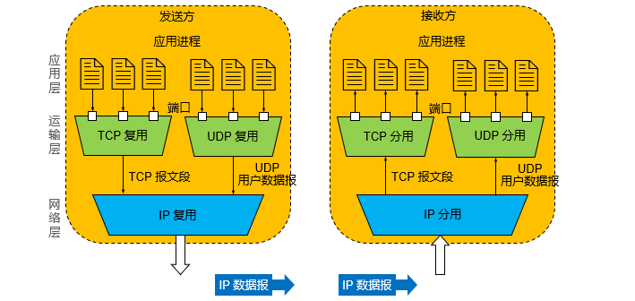
        -   端口用一个16位端口号进行标志 (0-2^16)
        -   只有本地意义,在因特网中各计算机相同端口没有意义 TCP和UDP端口号也没有必然联系
        -   分类
            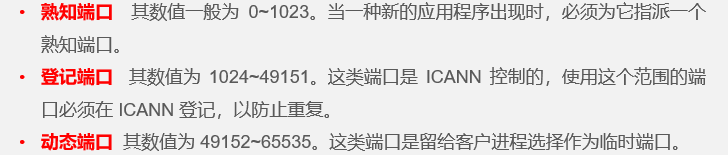

### 用户数据报协议UDP

-   在IP数据报服务中增加了很少功能(端口和差错检测)
-   提供不可靠交付,具有一定优点
    -   发送前不需要建立连接(TCP需要连接)
    -   不需要维持复杂的链接状态表
    -   只有8字节的首部开销(TCP20字节)
    -   不受网络拥塞 源主机发送速率不会降低
-   特点
    -   无连接 发送数据之前不需要连接 减小发送时延
    -   不保证可靠交付,不受拥塞控制 (可以适当改进减少丢失)
    -   在流媒体等方面应用很重要 
    -   面向报文 不再分为若干个分组发送
    -   支持一对一,一对多,多对多交互通信
-   UDP首部格式
    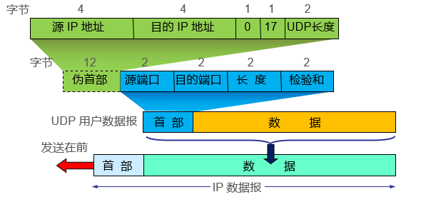
-   多路分用模型
    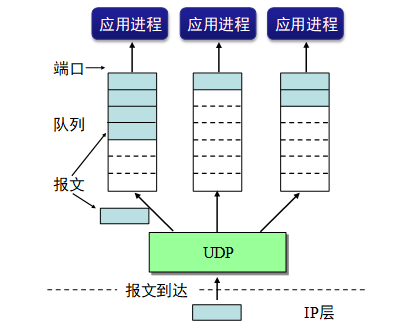
    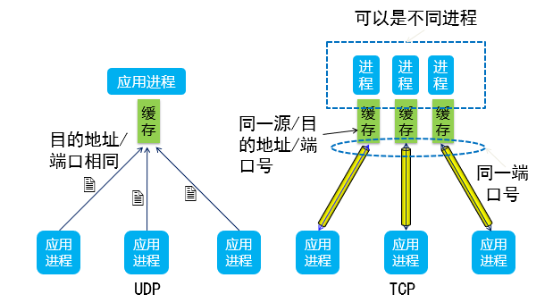

### 传输控制协议TCP

-   面向连接的运输层协议 需要连接
-   每一个TCP连接只有两个端点(点对点)
    -   连接作为最基本的抽象 两个点确定 TCP 连接 ::= {(IP1: port1), (IP2: port2)}
-   TCP提供可靠性交付 提供全双工通信 面向字节流
-   是一个虚连接并不属于物理连接
-   发送/接收进程将报文先放到缓冲区 大小不限 TCP数据块从缓冲区获取,处理或发送 
-   面向流概念
    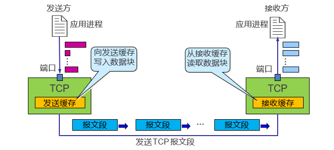
-   报文段结构
    -   分为首部和数据两部分  功能体现在首部各字段的作用 前20字节固定 后4N各字节按需添加
        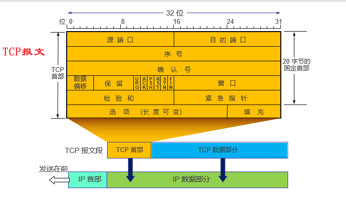
        -   选项部分长度可变,最大报文段数据字段长度MSS 即告诉对方缓存最大多少
    -   TCP在IP的不可靠情况下尽可能实现一种可靠数据传输服务 保证数据无差错传输
    -   P50

### 拥塞控制

