# 软件工程 复习提纲

-   什么是软件 什么是软件工程

    -   软件是计算机系统中与硬件相互依存的另一部分。它包括程序、数据及其相关文档的完整集合。
    -   软件特点: 一种逻辑产品 无磨损老化 比较难维护 主要脑力劳动但是没有脱离手工开发模式 成本昂贵
    -   软件工程是用工程科学和数学的原则与方法来定义、开发、维护计算机软件的有关技术和管理方法。

-   什么是需求分析 需求分析方法有哪几种

    -   分析目标系统必须做什么 确定系统必须完成的工作
    -   需求分析方法: 面向结构分析法 面向对象分析法 快速原型分析法

-   软件开发的角色以及工作
    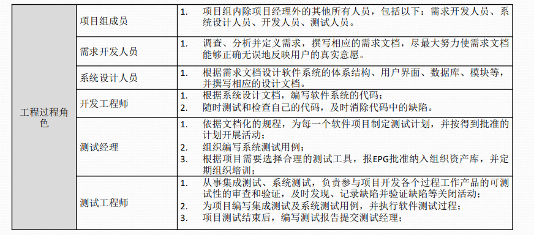

-   可行性研究: 经济可行性, 环境可行性, 技术可行性, 人

    -   经济可行性: 估计项目的成本和效益 分析项目在经济上是否合理
    -   环境可行性: 分析系统开发的全部过程中可能出现和涉及的资源/市场/风险 (市场和政策)

-   软件工程方法学包含哪几种方法

    -   结构化方法、面向对象方法和形式化方法

-   生存周期模型 三个周期九个阶段 [顺序不能出错]

    -   软件从定义、存在到消亡持续的整个时期 叫软件的生存周期（Software Life Cycle ）
    -   3个时期：软件定义、软件开发、软件运行维护
    -   9个阶段：问题定义、可行性研究、需求分析、概要设计、详细设计、编码和单元测试、综合测试、软件维护、 退役

-   整个生命周期如何管理 [按顺序解答]
    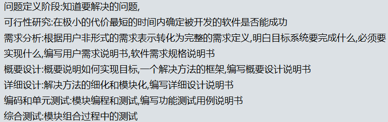

-   有几种模型 [增量模型 演化模型特点]

    -   增量模型 
        -   先完成一个系统子集开发 再按照同样步骤开发其他功能,直到满足需求
        -   系统需要一开始就做好构想
            
    -   瀑布模型 (又叫"软件生存周期模型")
        -   理想瀑布模型 上一阶段变换结果是下一阶段的输入 因果关系 联系紧密
            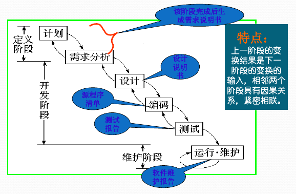
        -   实际瀑布模型
            
    -   演化模型 针对事先不能完整定义需求的软件开发
        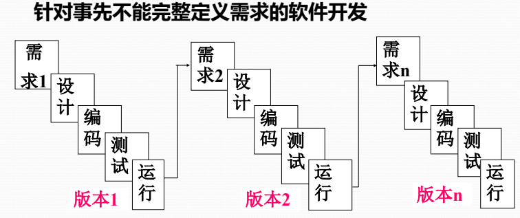
    -   快速原型模型
        

-   配置管理版本控制软件git的命令 [要熟悉]

    -   git pull  拉取更新
    -   git add -A  添加文件
    -   git commit -m "xxx"  提交文件
    -   git push  上传更新
    -   git diff xxxxx xxxxx  比较更新
    -   git branch  显示本地分支 [ -a 显示远程分支, -d 分支名 合并到主干后删除分支, -D 分支名 强制删除分支]
    -   git branch 分支名  创建分支
    -   git checkout 分支名  切换分支 [-b 若分支不存在则创建]
    -   git merge 分支名  合并分支
    -   git revert HEAD  撤销前一次commit
    -   git stash  存入暂存区 [pop 从暂存区取出]

-   CMMI五级成熟度模型
    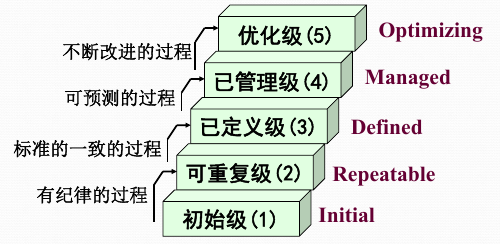

-   软件估算 Delphi分析法 UCP分析法

    -   软件估算是指根据软件的开发内容、开发工具、开 发人员等因素对需求调研、程序设计、编码、测试 等整个开发过程所花费的时间及工作量做的预测。

    -   常用的估算方法 

        -   三点统计方法

        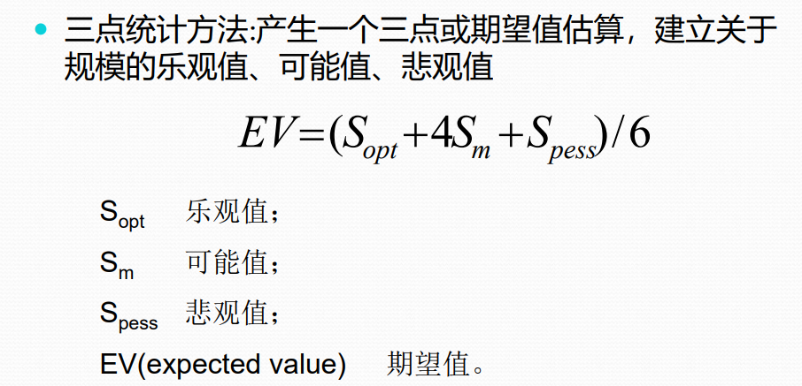

        -   面向规模的估算LOC法 
        -   类比法
            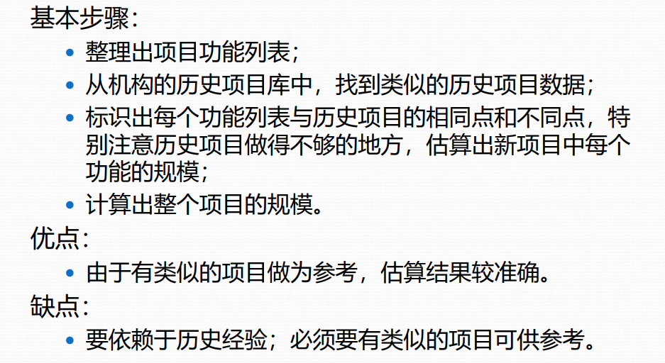
            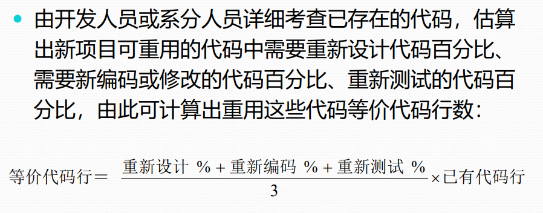
        -   面向功能的估算方法FP法
        -   Delphi估算法
        -   面向用例的估算UCP估算法
            
        -   基于过程的估算
            -   自顶向下法
            -   自底向上法

    -   Delphi法
        
        
        
        
        

    -   UCP法
        
        
        
        
        

-   概要设计完成什么工作

    -   回答 "系统应该如何实现" 的问题  完成模块分解即每个模块的功能说明

-   系统设计(详细设计)以及UML, 什么是静态模型 什么是动态模型 什么是SPI

    -   SPI 软件过程改进

-   什么是软件测试 软件测试方法 测试包含哪些部分 [从单元测试开始罗列]

    -   软件测试是为了发现错误而执行程序的过程
    -   测试方法: 静态测试(人工测试方法 计算机辅助静态分析方法) 动态测试(白盒测试方法 黑盒测试方法)
        -   静态测试: 基本特征是在对软件进行分析、检查和审阅，不实际运行被测试的软件
        -   动态测试: 
    -   包含部分
        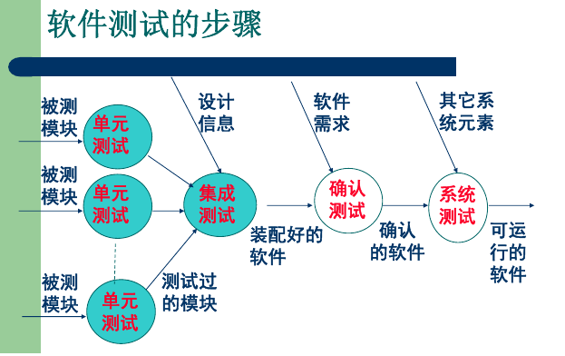

-   测试依据 (准测,就是怎么算测试好了)

    -   有效达到最终目的
    -   列举的所有数据都是准确的
    -   提供的方法使测试高效运行
    -   提供明确测试目标 测试策略 具体步骤以及测试标准
    -   强调重点 也重视基本覆盖率
    -   测试方案充分利用资源并可行
    -   测试安排又一定灵活性

-   测试完上线部署

-   维保包含哪些工作

    -   纠错性维护
    -   完善性维护
    -   适应性维护
    -   预防性维护

-   敏捷开发 [什么是SCRUM冲刺 什么是站立会议]

    -   什么是Scrum  Scrum是迭代式增量软件开发过程，通常用于敏捷软件开发
        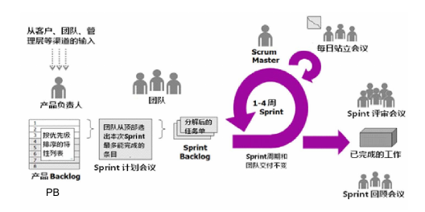
    -   什么是冲刺
        -   Sprint 冲刺周期 通常是一个小目标的实现周期
        -   User Story 用户故事 小目标本身
        -   Task 由用户故事划分的具体开发任务
        -   Backlog 需求积压列表 小目标列表 分为冲刺列表和产品列表
        -   Daily Meeting 站立会议
        -   Sprint review meeting 冲刺评审会议
        -   Sprint burn down 燃尽图 记录当前周需求完成进度
        -   Release 开发周期完成 项目发布可用新版本
    -   什么是站立会议
        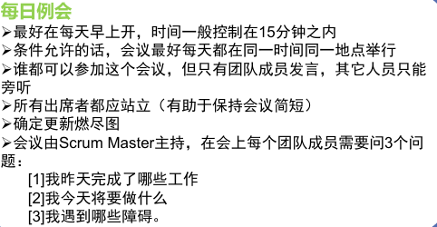
    -   

-   猪和鸡的故事 [鸡属于哪些人 猪属于哪些人]
    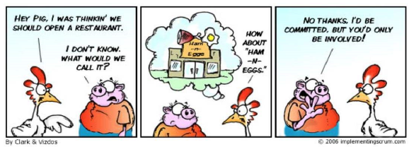

    -   “猪”是在Scrum过程中全身投入项目的各种角色，他们在项目中承担实际工作。
        “鸡”并不是实际Scrum过程的一部分，但是必须考虑他们

-   敏捷开发关键角色 [流程 五个事件]

    -   关键角色
        -   产品负责人
        -   团队
        -   Scrum Master
    -   流程: 根据图描述
    -   五个事件:Sprint Sprint计划会议 每日Sprint站会 Spring评审会议 Spring回顾会议

-   敏捷开发估算 [扑克牌方法]

    -   先给出一个标准故事点的定义,拿出一个规模不太大,描述清楚,得到本团队标准故事点
    -   每一个冲刺开始前,对挤压项/需求进行梳理时,由产品负责人对积压项进行阐述,团队对需求理解达成一致,采用类似扑克牌估算方式,给出自己估算值 一共20张
    -   大家一起两处估算结果,其中最大值和最小值分别解释一下自己给出该值的原因,并进行下一轮估算,直到对该积压项大小估算一致(近似)为止

